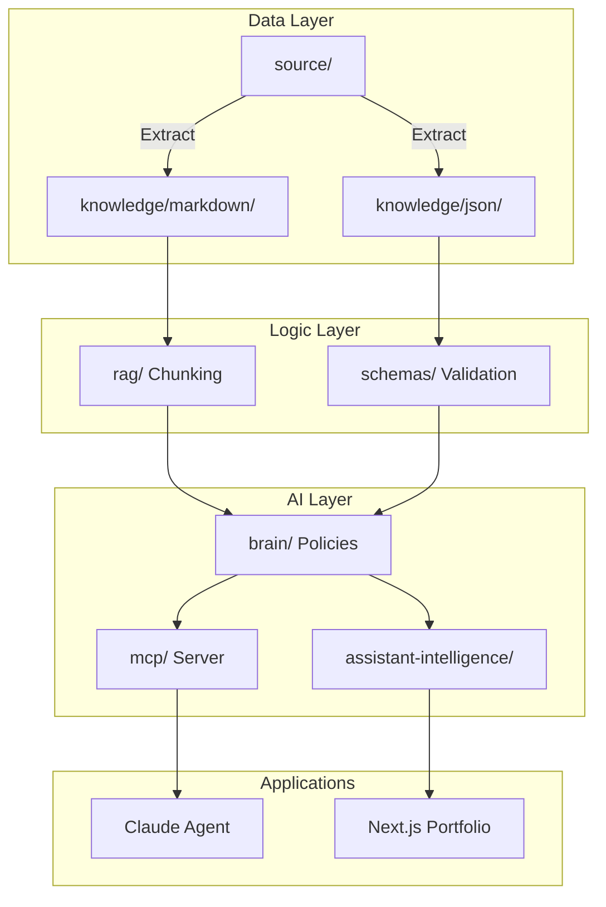

# Antigravity Enterprise Knowledge Platform

This repository serves as the definitive, machine-readable "Brain" for Musharraf Aziz.
It is an Enterprise Knowledge Graph designed to power Portfolio Websites, RAG pipelines, and MCP autonomous agents.

## Repository Philosophy
1. **Immutable Evidence:** All raw files are stored in `source/`.
2. **Canonical Knowledge:** The structured text resides in `knowledge/`.
3. **The Constitution:** The AI behavior is governed by `brain/`.
4. **Validation:** Every change is validated against JSON Schemas in `schemas/`.

## Architecture Flow

## Folder Tree
- `assets/` - Diagrams, logos, architecture
- `automation/` - Sync & extraction scripts
- `brain/` - The Constitution (Policies)
- `evaluation/` - QA, DeepEval, Hallucination testing
- `governance/` - Repository guardrails
- `knowledge/` - Markdown narratives and JSON graphs
- `mcp/` - Model Context Protocol server configuration
- `prompts/` - Original interaction prompts
- `rag/` - Chunking, embedding, retrieval strategies
- `schemas/` - Draft 2020-12 validation structures
- `source/` - Immutable root files

## Update Workflow
Please refer to `governance/` for specific workflows.
