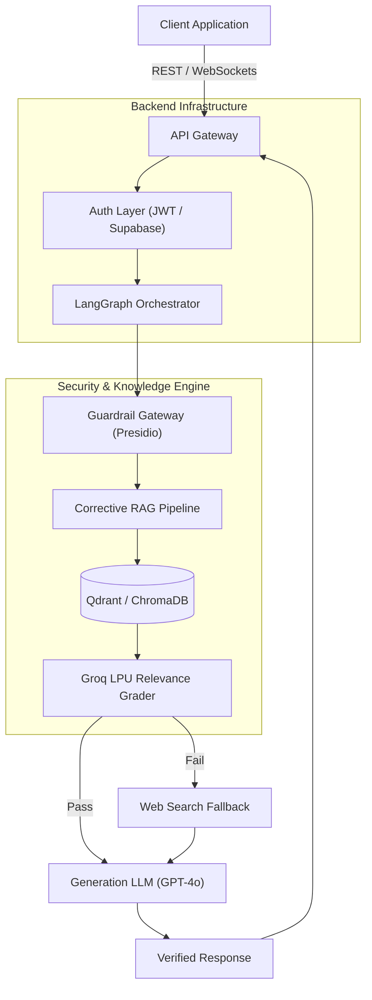
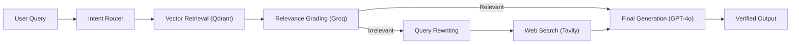
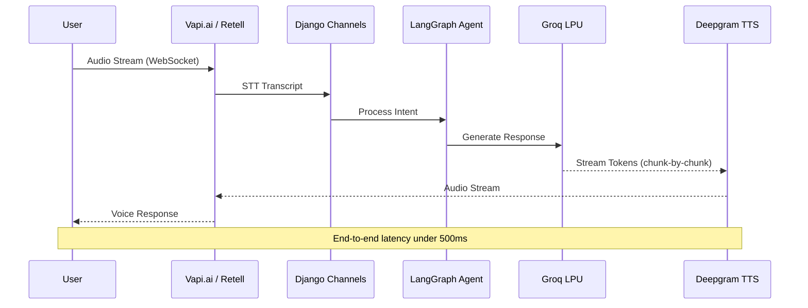
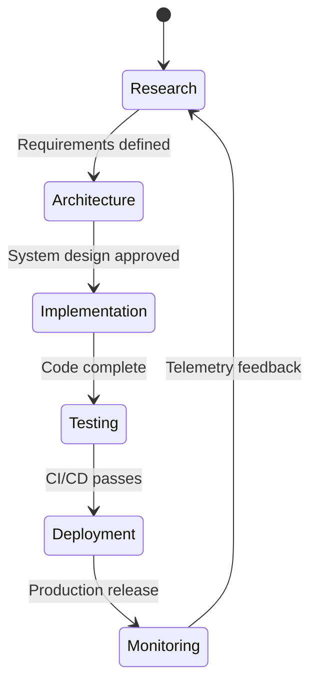

# Engr. Musharraf Aziz

**AI Engineer · Enterprise Backend Architect · Registered Engineer (PEC)**

Lahore / Kasur, Pakistan · Open to Staff/Principal Roles & Enterprise Consulting

*I architect deterministic AI systems and high-throughput backend infrastructure.*
*Zero hallucinations. Sub-second latency. Production-grade reliability.*

---

## About

Registered Engineer (PEC) with a B.Sc. in Electrical Engineering from COMSATS University and a published research paper in MDPI Sustainability (IF 3.125). I transitioned from hardware systems engineering into AI and backend architecture, carrying with me the discipline of embedded constraints: strict tolerances, zero margin for failure, and deterministic outputs.

I do not build thin API wrappers over foundation models. I engineer multi-layered AI pipelines with built-in evaluation, automatic correction, and enforceable guardrails. My production systems have maintained zero hallucinations across 1,000+ daily clinical queries for over 12 consecutive months in a hospital environment, while my backend infrastructure has handled 500,000+ monthly visitors at 99.95% uptime.

My work spans Healthcare AI, FinTech, E-Commerce, Telecommunications, and Renewable Energy. Each domain sharpened a different engineering muscle: healthcare demanded absolute correctness, fintech demanded extreme throughput, e-commerce demanded scale under pressure, telecom demanded operational resilience, and solar demanded hardware-software integration from first principles.

---

## Core Expertise

- **AI Engineering & LLM Orchestration** — Multi-agent architectures using LangGraph and LangChain for stateful, cyclic reasoning workflows with deterministic output enforcement.
- **Enterprise Backend & Scalable APIs** — Asynchronous microservices with FastAPI, Django, and Next.js engineered for sub-100ms response times under heavy concurrent load.
- **Advanced RAG & Knowledge Systems** — Corrective RAG (CRAG) pipelines with hybrid retrieval (dense + BM25 sparse), semantic chunking, and automated relevance grading to eliminate hallucinations.
- **Voice AI & Real-Time Systems** — WebSocket-first architectures achieving sub-500ms end-to-end latency for conversational AI with barge-in handling and live database queries.
- **AI Security & Compliance** — PII/PHI redaction using Microsoft Presidio and spaCy NLP, prompt injection defense, and HIPAA-principled data pipelines.
- **Workflow Automation** — Highly parallelized n8n execution graphs (16-node branching) for cross-departmental operational synchronization.

---

## Engineering Philosophy

1. **Determinism over probability.** LLMs are probabilistic by nature; my job is to make their outputs deterministic through evaluation pipelines, structured output schemas, and Corrective RAG. If a system cannot be tested, it cannot be trusted.
2. **Latency is a feature.** Every millisecond matters. I use Groq LPUs for intermediate grading (180ms), Celery workers for offloading heavy inference, and WebSocket streaming to begin TTS generation before the LLM finishes its sentence.
3. **Security is architecture, not a layer.** Row-Level Security in Supabase, NLP-based PII redaction before data leaves the network, zero-trust API boundaries. Security is designed in, not bolted on.
4. **Observable by default.** Structured JSON logging, CI/CD regression testing with DeepEval (Faithfulness, Answer Relevance), and SLA-grade monitoring. If it runs in production, it must be measurable.
5. **Architecture outlasts tools.** Frameworks change; well-designed system boundaries do not. I choose REST vs WebSockets, PostgreSQL vs Qdrant, and SSG vs RSC based on the problem's constraints, not market trends.

---

<strong>Tech Stack</strong>

 

| Category | Technologies |
| :--- | :--- |
| **Languages** | Python, TypeScript, JavaScript, SQL |
| **Backend** | FastAPI, Django, Node.js, Express |
| **Frontend** | Next.js 15 (App Router), React, Tailwind CSS, Three.js |
| **AI / ML** | LangGraph, LangChain, Groq, OpenAI, Llama 3, PyTorch, DeepEval |
| **Databases** | PostgreSQL, Supabase, Qdrant, ChromaDB, Redis, MySQL, SQLite |
| **Infrastructure** | Docker, Vercel, Cloudflare Workers, Railway, GitHub Actions |
| **Automation** | n8n, Celery, Make.com, Microsoft Presidio |
| **Protocols** | REST, WebSockets, WebRTC, MCP (Model Context Protocol), JSON-RPC |

---

## System Architecture

### Deterministic Enterprise AI Stack

---

## Featured Projects

### [Self-Healing RAG Pipeline](https://github.com/engrmaziz/Self-Healing-RAG-Pipeline)
**Domain:** Enterprise AI / Retrieval-Augmented Generation
**Problem:** Standard RAG systems hallucinate when vector retrieval returns irrelevant documents. In regulated industries, a confidently wrong answer is worse than no answer.
**Architecture:** LangChain DAG implementing Corrective RAG (CRAG). Qdrant for hybrid retrieval (dense + BM25). Groq LPU grades relevance in 180ms; failures trigger automated query rewriting and web-search fallback via Tavily.
**Stack:** FastAPI, Qdrant, LangChain, Groq (Llama 3), OpenAI (GPT-4o)
**Impact:** Drove hallucination rates to zero through multi-hop evaluation before generation, establishing the architecture later deployed at Allama Iqbal Hospital.

### [LLM Guardrail Gateway](https://github.com/engrmaziz/LLM-GUARDRAIL-GATEWAY)
**Domain:** AI Security / Healthcare Compliance
**Problem:** Hospitals need LLMs to summarize patient data, but sending raw medical records to external APIs violates HIPAA and GDPR.
**Architecture:** FastAPI reverse proxy intercepting all outbound LLM requests. Microsoft Presidio (backed by spaCy NER) detects and redacts 18+ PII/PHI entity types. Optional re-identification maps placeholders back on the secure internal network.
**Stack:** FastAPI, Microsoft Presidio, spaCy, Docker, Nginx
**Impact:** Enabled HIPAA-principled LLM adoption in a clinical environment. Custom Presidio recognizers handle Pakistani medical ID formats with near-zero false positives.

### [VoiceRAG Core v1](https://github.com/engrmaziz/voice-rag)
**Domain:** Enterprise Voice AI
**Problem:** Text-based LLM APIs introduce 1.5+ second latency, destroying conversational trust in automated customer triage.
**Architecture:** WebSocket-first Django backend using Django Channels (ASGI). Integrates Vapi.ai/Retell AI telephony with a LangGraph state machine. LLM tokens stream directly to Deepgram TTS chunk-by-chunk, enabling audio generation before sentence completion.
**Stack:** Django, Django Channels, WebSockets, LangGraph, Groq LPU (Llama 3)
**Impact:** Achieved sub-500ms end-to-end response latency with deterministic barge-in handling, enabling real-time interruption and live database queries during active calls.

### Corrective RAG Pipeline Flow

### [AegisFlow](https://github.com/engrmaziz/AegisFlow)
**Domain:** FinTech SaaS
**Problem:** Financial institutions require sub-second dashboard latency while running heavy PyTorch inference for fraud detection without blocking API threads.
**Architecture:** Decoupled microservices. Next.js App Router frontend, asynchronous FastAPI backend. PyTorch anomaly detection models served via dedicated Celery worker pools with Redis task queues. PostgreSQL with Row-Level Security.
**Stack:** Next.js, FastAPI, PyTorch, PostgreSQL, Redis, Docker, GitHub Actions
**Impact:** Sub-100ms API response times maintained under load. PCI-DSS compliant architecture with OAuth2/JWT authentication and granular RBAC.

### [Git Archaeologist MCP Server](https://github.com/engrmaziz/git-archaeologist-mcp)
**Domain:** AI Developer Tools / Open Source
**Problem:** AI assistants lack context about codebase history and structure. Developers waste tokens manually pasting diffs and file trees.
**Architecture:** TypeScript Node.js process implementing the Model Context Protocol (MCP) specification. Communicates with AI clients (Claude Desktop) via JSON-RPC over stdio. Executes read-only git commands with strict argument parsing to prevent arbitrary code execution.
**Stack:** TypeScript, Node.js, MCP, JSON-RPC
**Impact:** Published to NPM registry. Enables AI assistants to natively search git history, run git blame, and analyze repository structure without manual context injection.

---

### Voice AI Communication Flow

---

<strong>Professional Experience</strong>

 

### AI Engineer & Operations Manager
**Allama Iqbal Hospital Kasur** · Aug 2024 – Present

Architected and deployed clinical RAG systems and an LLM Guardrail Gateway for a major regional hospital. Engineered a Corrective RAG workflow using LangGraph with DeepEval CI/CD regression testing (Faithfulness scoring on 500+ golden queries per deployment). Integrated Microsoft Presidio for automated PHI/PII redaction. Managed digital operations across 10+ hospital departments using parallelized n8n automation workflows.

**Key metrics:** Zero hallucinations across 1,000+ daily queries for 12+ months. 18% efficiency gain in administrative workflows. High Performance Excellence Award (Jun 2025).

---

### Software Engineer & IT Manager
**NovaSole Pakistan** · Dec 2023 – Aug 2024

Led full-stack engineering for a high-traffic e-commerce platform. Built a Next.js SSG storefront optimized for Core Web Vitals and a Node.js data synchronization pipeline maintaining real-time inventory consistency across three sales channels. Managed database indexing strategies to prevent locks during seasonal traffic spikes.

**Key metrics:** 500,000+ monthly visitors. 98%+ data accuracy across channels. 10M+ PKR monthly revenue. Near-zero cart abandonment from logistics automation.

---

### Team Lead, Technical Assistance Center
**Transworld Home (ISP)** · Mar 2022 – Nov 2022

Managed a 14-person TAC team overseeing 50,000+ active ISP connections in Lahore. Restructured escalation workflows to slash fault resolution times. Enforced strict SLA monitoring and uptime protocols.

**Key metrics:** 99.95% network uptime. 98% SLA resolution rate. 18% reduction in fault resolution time. Employee of the Month and Workplace Commitment Award.

---

### Development Lifecycle

---

## Certifications

| Credential | Provider |
| :--- | :--- |
| **Google AI Professional Certificate** (7 courses) | Google / Coursera |
| **AI Fluency: Framework & Foundations** | Anthropic |
| **PyTorch & Deep Learning for Decision Makers** (LFS116) | Linux Foundation |
| **McKinsey Forward Program** | McKinsey & Company |
| **Registered Electrical Engineer** | Pakistan Engineering Council (PEC) |
| **RE101: Fundamental Math for Solar** | Solar Energy International |

---

## Publication

> Arshad J., **Aziz M.**, et al. *"Implementation of a LoRaWAN Based Smart Agriculture Decision Support System for Optimum Crop Yield."* **MDPI Sustainability**, 2022; 14(2):827. Impact Factor: 3.125. [DOI: 10.3390/su14020827](https://doi.org/10.3390/su14020827)

**Award:** Top Innovative FYP of the Year (2021) — IGNITE & Higher Education Commission of Pakistan.

---

## Current Focus

Deepening enterprise RAG architectures with parent-child chunking strategies and metadata-filtered hybrid retrieval. Exploring on-device AI inference for latency-critical edge deployments. Building autonomous, self-correcting AI agents using LangGraph's cyclic state machines. Expanding into event-driven architectures (Kafka) and Infrastructure as Code (Terraform) for large-scale distributed AI systems.

---

## GitHub Statistics

---

## Contact

| Channel | Link |
| :--- | :--- |
| **LinkedIn** | [linkedin.com/in/musharrafazizq](https://linkedin.com/in/musharrafazizq) |
| **Portfolio** | [maziz.me](https://maziz.me) |
| **GitHub** | [github.com/engrmaziz](https://github.com/engrmaziz) |
| **Email** | [io@maziz.me](mailto:io@maziz.me) |

 

**Open to AI Engineering roles, Enterprise AI consulting, and architecture advisory engagements.**

*If you are building production AI systems that must not fail, let's talk.*

