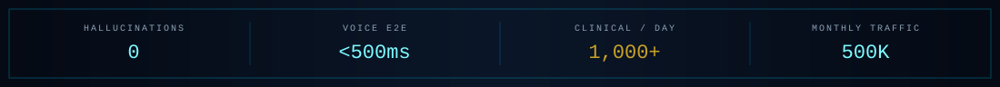
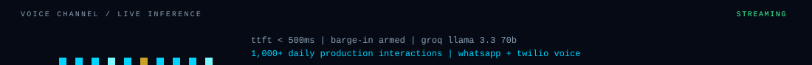
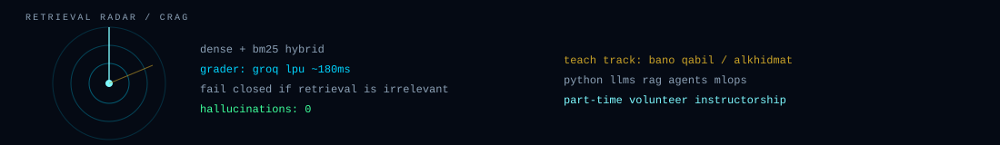
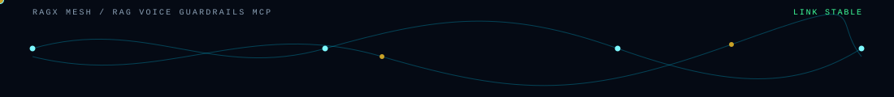
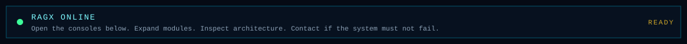
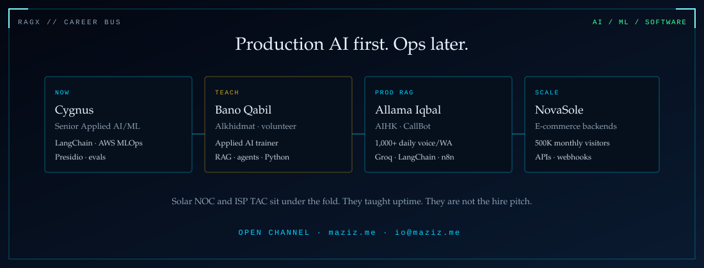
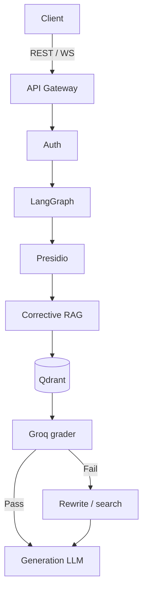
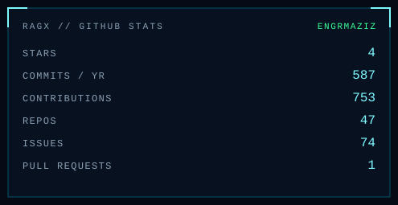
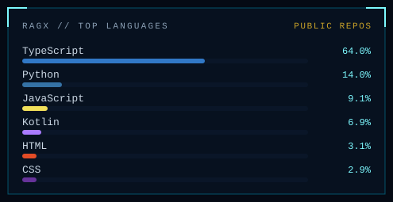
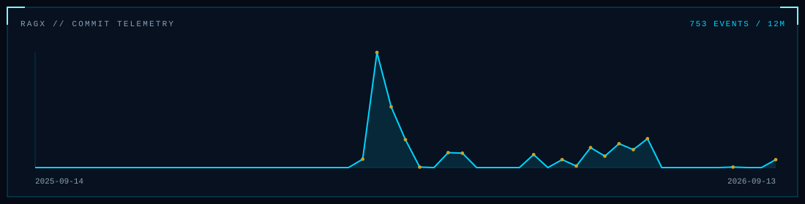

<div align="center">



[](https://maziz.me)










[](https://www.python.org/)
[](https://fastapi.tiangolo.com/)
[](https://nextjs.org/)
[](https://www.typescriptlang.org/)
[](https://www.postgresql.org/)
[](https://www.docker.com/)
[](https://www.langchain.com/langgraph)
[](https://groq.com/)
[](https://openai.com/)
[](https://github.com/engrmaziz/Self-Healing-RAG-Pipeline)

[](https://maziz.me)
[](https://linkedin.com/in/musharrafazizq)
[](mailto:io@maziz.me)







</div>

<details>
<summary><strong><code>▶ ragx --status</code></strong></summary>
<br>

```
identity .... Engr. Musharraf Aziz (PEC)
role ........ Senior Applied AI Engineer · Cygnus Technologies
teach ....... Bano Qabil / Alkhidmat (volunteer)
shipped ..... Allama Iqbal Hospital voice/WhatsApp RAG · 1,000+/day
scale ....... NovaSole 500,000+ monthly visitors
voice.e2e ... <500ms   hallucinations ... 0
STATUS ...... OPERATIONAL
```

</details>

<details>
<summary><strong><code>▶ inspect --stack</code></strong></summary>
<br>

Python · TypeScript · FastAPI · Next.js · LangGraph · Groq · PostgreSQL · Qdrant · Docker · n8n · Presidio

</details>

<details>
<summary><strong><code>▶ inspect --architecture</code></strong></summary>
<br>


```mermaid
graph TD
    Client["Client"] -->|"REST / WS"| Gateway["API Gateway"]
    Gateway --> Auth["Auth"]
    Auth --> Orchestrator["LangGraph"]
    Orchestrator --> Guardrail["Presidio"]
    Guardrail --> CRAG["Corrective RAG"]
    CRAG --> VectorDB[("Qdrant")]
    VectorDB --> Grader["Groq grader"]
    Grader -- Pass --> LLM["Generation LLM"]
    Grader -- Fail --> Fallback["Rewrite / search"]
    Fallback --> LLM
```

</details>

<details>
<summary><strong><code>▶ log.open --projects</code></strong></summary>
<br>

- [Self-Healing RAG](https://github.com/engrmaziz/Self-Healing-RAG-Pipeline) — CRAG, hybrid retrieval, zero hallucination gate
- [LLM Guardrail Gateway](https://github.com/engrmaziz/LLM-GUARDRAIL-GATEWAY) — Presidio PII proxy
- [VoiceRAG](https://github.com/engrmaziz/voice-rag) — sub-500ms telephony agents
- [AegisFlow](https://github.com/engrmaziz/AegisFlow) — FinTech orchestration
- [Git Archaeologist](https://github.com/engrmaziz/git-archaeologist-mcp) — MCP git context

</details>

<details>
<summary><strong><code>▶ log.open --career</code></strong></summary>
<br>

**Cygnus Technologies** — Senior Applied AI/ML Engineer (Jul 2026 – Present)  
**Bano Qabil / Alkhidmat** — Applied AI trainer, volunteer (Aug 2026 – Present)  
**Allama Iqbal Hospital** — AI Engineer & Operations Manager (Aug 2024 – Jul 2026) · 1,000+ daily RAG interactions  
**NovaSole** — Automation Engineer (Dec 2023 – Aug 2024) · 500k+ monthly visitors

</details>

---

<div align="center">








**Open to AI/ML roles and enterprise builds.** [maziz.me](https://maziz.me) · [io@maziz.me](mailto:io@maziz.me)

</div>
