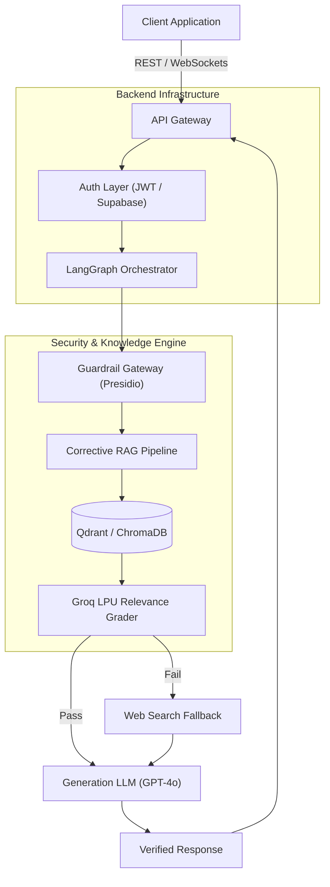
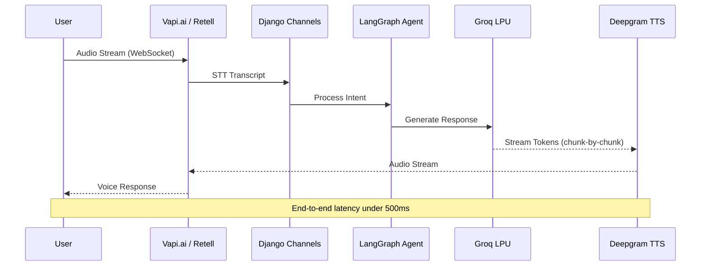
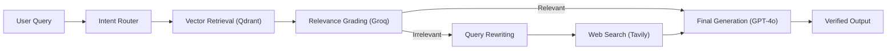
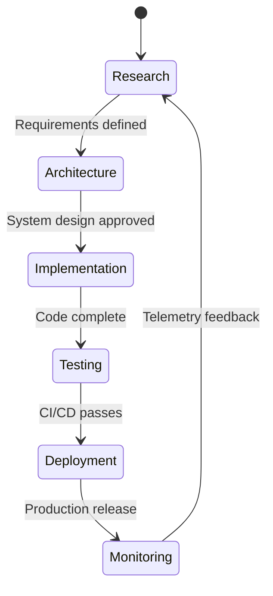

<div align="center">


[](https://maziz.me)


[](https://www.python.org/)
[](https://fastapi.tiangolo.com/)
[](https://nextjs.org/)
[](https://www.typescriptlang.org/)
[](https://www.postgresql.org/)
[](https://www.docker.com/)
[](https://www.langchain.com/langgraph)
[](https://groq.com/)
[](https://openai.com/)
[](https://github.com/engrmaziz/Self-Healing-RAG-Pipeline)

[](https://maziz.me)
[](https://linkedin.com/in/musharrafazizq)
[](mailto:io@maziz.me)


</div>

<details>
<summary><strong><code>▶ ragx --status</code></strong> · live systems check</summary>
<br>

```
RAGX v3.1.0-prod
────────────────────────────────────────────────────────
identity ............. Engr. Musharraf Aziz (PEC)
role ................. Senior Applied AI Engineer
assistant ............ RAGX
teach ................ Bano Qabil / Alkhidmat (part-time volunteer)
location ............. Lahore, Pakistan
availability ......... AI/ML roles + enterprise consulting
────────────────────────────────────────────────────────
guardrails ........... Microsoft Presidio + spaCy NER
retrieval ............ hybrid dense + BM25 (CRAG)
voice.e2e ............ <500ms with barge-in
hallucinations ....... 0 (graded before generation)
agent.load ........... 1,000+ interactions / day
commerce.scale ....... 500,000+ monthly visitors
────────────────────────────────────────────────────────
STATUS ............... OPERATIONAL
```


</details>

---

## About

Registered Engineer (PEC) with a B.S. (Hons.) in Electrical Engineering from COMSATS University and a published research paper in MDPI Sustainability (IF 3.125). I transitioned from hardware systems engineering into applied AI, carrying with me the discipline of embedded constraints: strict tolerances, zero margin for failure, and deterministic outputs.

I do not build thin API wrappers over foundation models. I engineer end-to-end AI systems covering ETL, RAG, LLM applications, and MLOps. Production agents have handled 1,000+ daily voice and WhatsApp interactions; e-commerce automation at NovaSole supported 500,000+ monthly visitors. I also teach applied AI part-time at Bano Qabil Pakistan (Alkhidmat Foundation).

My work spans Applied AI, backend systems, FinTech, E-Commerce, Telecommunications, and Renewable Energy. Each domain sharpened a different engineering muscle: applied AI demanded production MLOps, operations platforms demanded absolute correctness, fintech demanded extreme throughput, e-commerce demanded scale under pressure, telecom demanded operational resilience, and solar demanded hardware-software integration from first principles.

---

## Core Expertise

- **AI Engineering & LLM Orchestration** — Multi-agent architectures using LangGraph and LangChain for stateful, cyclic reasoning workflows with deterministic output enforcement.
- **Enterprise Backend & Scalable APIs** — Asynchronous microservices with FastAPI, Django, and Next.js engineered for sub-100ms response times under heavy concurrent load.
- **Advanced RAG & Knowledge Systems** — Corrective RAG (CRAG) pipelines with hybrid retrieval (dense + BM25 sparse), semantic chunking, and automated relevance grading to eliminate hallucinations.
- **Voice AI & Real-Time Systems** — WebSocket-first architectures achieving sub-500ms end-to-end latency for conversational AI with barge-in handling and live database queries.
- **AI Security & Compliance** — PII/PHI redaction using Microsoft Presidio and spaCy NLP, prompt injection defense, and HIPAA-principled data pipelines.
- **Workflow Automation** — Highly parallelized n8n execution graphs (16-node branching) for cross-departmental operational synchronization.

---

## Engineering Philosophy

1. **Determinism over probability.** LLMs are probabilistic by nature; my job is to make their outputs deterministic through evaluation pipelines, structured output schemas, and Corrective RAG. If a system cannot be tested, it cannot be trusted.
2. **Latency is a feature.** Every millisecond matters. I use Groq LPUs for intermediate grading (180ms), Celery workers for offloading heavy inference, and WebSocket streaming to begin TTS generation before the LLM finishes its sentence.
3. **Security is architecture, not a layer.** Row-Level Security in Supabase, NLP-based PII redaction before data leaves the network, zero-trust API boundaries. Security is designed in, not bolted on.
4. **Observable by default.** Structured JSON logging, CI/CD regression testing with DeepEval (Faithfulness, Answer Relevance), and SLA-grade monitoring. If it runs in production, it must be measurable.
5. **Architecture outlasts tools.** Frameworks change; well-designed system boundaries do not. I choose REST vs WebSockets, PostgreSQL vs Qdrant, and SSG vs RSC based on the problem's constraints, not market trends.

---

<details>
<summary><strong><code>▶ sys.load --stack</code></strong> · deploy systems</summary>
<br>

| Category | Technologies |
| :--- | :--- |
| **Languages** | Python, TypeScript, JavaScript, SQL |
| **Backend** | FastAPI, Django, Node.js, Express |
| **Frontend** | Next.js 15 (App Router), React, Tailwind CSS, Three.js |
| **AI / ML** | LangGraph, LangChain, Groq, OpenAI, Llama 3, PyTorch, DeepEval |
| **Databases** | PostgreSQL, Supabase, Qdrant, ChromaDB, Redis, MySQL, SQLite |
| **Infrastructure** | Docker, Vercel, Cloudflare Workers, Railway, GitHub Actions |
| **Automation** | n8n, Celery, Make.com, Microsoft Presidio |
| **Protocols** | REST, WebSockets, WebRTC, MCP (Model Context Protocol), JSON-RPC |

</details>

---

## System Architecture

### Deterministic Enterprise AI Stack


```mermaid
graph TD
    Client["Client Application"] -->|"REST / WebSockets"| Gateway["API Gateway"]

    subgraph Backend["Backend Infrastructure"]
        Gateway --> Auth["Auth Layer (JWT / Supabase)"]
        Auth --> Orchestrator["LangGraph Orchestrator"]
    end

    subgraph Security["Security & Knowledge Engine"]
        Orchestrator --> Guardrail["Guardrail Gateway (Presidio)"]
        Guardrail --> CRAG["Corrective RAG Pipeline"]
        CRAG --> VectorDB[("Qdrant / ChromaDB")]
        VectorDB --> Grader["Groq LPU Relevance Grader"]
    end

    Grader -- "Pass" --> LLM["Generation LLM (GPT-4o)"]
    Grader -- "Fail" --> Fallback["Web Search Fallback"]
    Fallback --> LLM
    LLM --> Response["Verified Response"]
    Response --> Gateway
```

<details>
<summary><strong><code>▶ inspect --protocol voice</code></strong> · sub-500ms communication path</summary>
<br>


```mermaid
sequenceDiagram
    participant User
    participant Telephony as Vapi.ai / Retell
    participant Backend as Django Channels
    participant Agent as LangGraph Agent
    participant LLM as Groq LPU
    participant TTS as Deepgram TTS

    User->>Telephony: Audio Stream (WebSocket)
    Telephony->>Backend: STT Transcript
    Backend->>Agent: Process Intent
    Agent->>LLM: Generate Response
    LLM-->>TTS: Stream Tokens (chunk-by-chunk)
    TTS-->>Telephony: Audio Stream
    Telephony-->>User: Voice Response
    Note over User,TTS: End-to-end latency under 500ms
```

</details>

<details>
<summary><strong><code>▶ inspect --pipeline crag</code></strong> · hallucination gate</summary>
<br>


```mermaid
flowchart LR
    Query["User Query"] --> Router["Intent Router"]
    Router --> Retrieve["Vector Retrieval (Qdrant)"]
    Retrieve --> Grade["Relevance Grading (Groq)"]
    Grade -- "Relevant" --> Generate["Final Generation (GPT-4o)"]
    Grade -- "Irrelevant" --> Rewrite["Query Rewriting"]
    Rewrite --> WebSearch["Web Search (Tavily)"]
    WebSearch --> Generate
    Generate --> Output["Verified Output"]
```

</details>

---

## Featured Projects

### [Self-Healing RAG Pipeline](https://github.com/engrmaziz/Self-Healing-RAG-Pipeline)
**Domain:** Enterprise AI / Retrieval-Augmented Generation
**Problem:** Standard RAG systems hallucinate when vector retrieval returns irrelevant documents. In regulated industries, a confidently wrong answer is worse than no answer.
**Architecture:** LangChain DAG implementing Corrective RAG (CRAG). Qdrant for hybrid retrieval (dense + BM25). Groq LPU grades relevance in 180ms; failures trigger automated query rewriting and web-search fallback via Tavily.
**Stack:** FastAPI, Qdrant, LangChain, Groq (Llama 3), OpenAI (GPT-4o)
**Impact:** Drove hallucination rates to zero through multi-hop evaluation before generation, establishing the architecture later deployed at Allama Iqbal Hospital.

### [LLM Guardrail Gateway](https://github.com/engrmaziz/LLM-GUARDRAIL-GATEWAY)
**Domain:** AI Security / Healthcare Compliance
**Problem:** Hospitals need LLMs to summarize patient data, but sending raw medical records to external APIs violates HIPAA and GDPR.
**Architecture:** FastAPI reverse proxy intercepting all outbound LLM requests. Microsoft Presidio (backed by spaCy NER) detects and redacts 18+ PII/PHI entity types. Optional re-identification maps placeholders back on the secure internal network.
**Stack:** FastAPI, Microsoft Presidio, spaCy, Docker, Nginx
**Impact:** Enabled HIPAA-principled LLM adoption in a production environment. Custom Presidio recognizers handle local ID formats with near-zero false positives.

### [VoiceRAG Core v1](https://github.com/engrmaziz/voice-rag)
**Domain:** Enterprise Voice AI
**Problem:** Text-based LLM APIs introduce 1.5+ second latency, destroying conversational trust in automated customer triage.
**Architecture:** WebSocket-first Django backend using Django Channels (ASGI). Integrates Vapi.ai/Retell AI telephony with a LangGraph state machine. LLM tokens stream directly to Deepgram TTS chunk-by-chunk, enabling audio generation before sentence completion.
**Stack:** Django, Django Channels, WebSockets, LangGraph, Groq LPU (Llama 3)
**Impact:** Achieved sub-500ms end-to-end response latency with deterministic barge-in handling, enabling real-time interruption and live database queries during active calls.

### [AegisFlow](https://github.com/engrmaziz/AegisFlow)
**Domain:** FinTech SaaS
**Problem:** Financial institutions require sub-second dashboard latency while running heavy PyTorch inference for fraud detection without blocking API threads.
**Architecture:** Decoupled microservices. Next.js App Router frontend, asynchronous FastAPI backend. PyTorch anomaly detection models served via dedicated Celery worker pools with Redis task queues. PostgreSQL with Row-Level Security.
**Stack:** Next.js, FastAPI, PyTorch, PostgreSQL, Redis, Docker, GitHub Actions
**Impact:** Sub-100ms API response times maintained under load. PCI-DSS compliant architecture with OAuth2/JWT authentication and granular RBAC.

### [Git Archaeologist MCP Server](https://github.com/engrmaziz/git-archaeologist-mcp)
**Domain:** AI Developer Tools / Open Source
**Problem:** AI assistants lack context about codebase history and structure. Developers waste tokens manually pasting diffs and file trees.
**Architecture:** TypeScript Node.js process implementing the Model Context Protocol (MCP) specification. Communicates with AI clients (Claude Desktop) via JSON-RPC over stdio. Executes read-only git commands with strict argument parsing to prevent arbitrary code execution.
**Stack:** TypeScript, Node.js, MCP, JSON-RPC
**Impact:** Published to NPM registry. Enables AI assistants to natively search git history, run git blame, and analyze repository structure without manual context injection.

---

<details>
<summary><strong><code>▶ log.open --career</code></strong> · professional experience</summary>
<br>

### Senior Applied AI/ML Engineer
**Cygnus Technologies** · Jul 2026 – Present

Designing and deploying end-to-end AI and machine learning solutions for large-scale data processing, analytics, and intelligent automation. Building scalable ETL pipelines, fine-tuning custom ML/LLM/RAG applications, deploying on AWS with MLOps coverage, extending Presidio PII redaction, and shipping hallucination-detection evals against golden datasets.

---

### Trainer, Applied Artificial Intelligence
**Bano Qabil Pakistan (Alkhidmat Foundation initiative)** · Aug 2026 – Present · Part-time volunteer

Deliver hands-on training in applied AI, machine learning, and generative AI. Curriculum covers Python, LLMs, prompt engineering, RAG, AI agents, embeddings, vector databases, and MLOps fundamentals through project work.

---

### AI Engineer & Operations Manager
**Allama Iqbal Hospital, Kasur** · Aug 2024 – Jul 2026

Designed and deployed an agentic AI CallBot on Llama 3.3 70B (Groq) over WhatsApp and Twilio, with a LangChain RAG pipeline handling 1,000+ daily production interactions. Built agent workflows connected to APIs, internal databases, and messaging platforms via a 16-node n8n system. Published a Model Context Protocol server for structured tool-based access to external systems. Hardened the agent with fallback handling and Presidio PII redaction before any data reached the LLM.

**Key metrics:** 1,000+ daily production interactions. High Performance Excellence Award (Jun 2025).

---

### Automation Engineer & IT Manager
**NovaSole Pakistan** · Dec 2023 – Aug 2024

Built automated workflows connecting an e-commerce platform serving 500,000+ monthly visitors with payment processors and inventory systems across three sales channels, using REST APIs and webhook-based triggers. Built data pipelines and automated synchronisation logic, eliminating a previously manual daily reconciliation process.

**Key metrics:** 500,000+ monthly visitors. 98%+ data accuracy across channels.

---

### Team Lead, Quality Assurance & NOC Development
**Ihsan Solar Energy Pvt. Ltd.** · Dec 2022 – Dec 2023

Built monitoring and alerting logic for a Network Operations Center, using operational data to improve fault detection across 400+ kW installed capacity. Led a QA team of 4 and introduced structured testing and data-driven analysis practices.

**Key metrics:** 25% reduction in operational faults. Productivity Leader Award (Jul 2023).

---

### Team Lead, Technical Assistance Center
**Transworld Home (ISP)** · Mar 2022 – Nov 2022

Led a 14-person TAC team achieving 98% issue resolution within SLA across 50,000+ active connections, using performance data to identify recurring issues. Trained and mentored 10+ technical staff.

**Key metrics:** 98% SLA resolution. 18% reduction in fault resolution time.

</details>

---

<details>
<summary><strong><code>▶ inspect --lifecycle</code></strong> · delivery state machine</summary>
<br>


```mermaid
stateDiagram-v2
    [*] --> Research
    Research --> Architecture : Requirements defined
    Architecture --> Implementation : System design approved
    Implementation --> Testing : Code complete
    Testing --> Deployment : CI/CD passes
    Deployment --> Monitoring : Production release
    Monitoring --> Research : Telemetry feedback
```

</details>

---

## Certifications

| Credential | Provider |
| :--- | :--- |
| **Google AI Professional Certificate** (7 courses) | Google / Coursera |
| **AI Fluency: Framework & Foundations** | Anthropic |
| **PyTorch & Deep Learning for Decision Makers** (LFS116) | Linux Foundation |
| **McKinsey Forward Program** | McKinsey & Company |
| **Registered Electrical Engineer** | Pakistan Engineering Council (PEC) |
| **RE101: Fundamental Math for Solar** | Solar Energy International |

---

## Publication

> Arshad J., **Aziz M.**, et al. *"Implementation of a LoRaWAN Based Smart Agriculture Decision Support System for Optimum Crop Yield."* **MDPI Sustainability**, 2022; 14(2):827. Impact Factor: 3.125. [DOI: 10.3390/su14020827](https://doi.org/10.3390/su14020827)

**Award:** Top Innovative FYP of the Year (2021) — IGNITE & Higher Education Commission of Pakistan.

---

## Current Focus

Deepening enterprise RAG architectures with parent-child chunking strategies and metadata-filtered hybrid retrieval. Exploring on-device AI inference for latency-critical edge deployments. Building autonomous, self-correcting AI agents using LangGraph's cyclic state machines. Expanding into event-driven architectures (Kafka) and Infrastructure as Code (Terraform) for large-scale distributed AI systems.

---

## Telemetry

<div align="center">


</div>

<details>
<summary><strong><code>▶ telemetry --snake</code></strong> · contribution radar (generates after first Actions run)</summary>
<br>

<div align="center">


</div>

</details>

---

## Contact

| Channel | Link |
| :--- | :--- |
| **LinkedIn** | [linkedin.com/in/musharrafazizq](https://linkedin.com/in/musharrafazizq) |
| **Portfolio** | [maziz.me](https://maziz.me) |
| **GitHub** | [github.com/engrmaziz](https://github.com/engrmaziz) |
| **Email** | [io@maziz.me](mailto:io@maziz.me) |

<div align="center">


**Open to AI Engineering roles, Enterprise AI consulting, and architecture advisory engagements.**

*If you are building production AI systems that must not fail, let's talk.*

</div>
