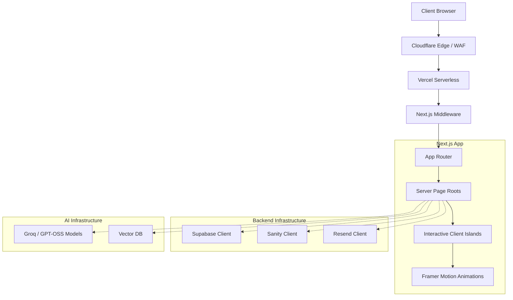

# Enterprise Release Candidate Audit (RC-1)

## Executive Summary
This audit evaluates the current state of the Antigravity engineering portfolio against Enterprise/FAANG-grade production standards. The repository demonstrates a strong foundation using Next.js 14 App Router, Tailwind CSS, and Framer Motion. However, it requires structural refactoring of massive monolithic pages, corrections to Server/Client boundaries, and the implementation of actual network requests in place of architecture stubs.

## Architecture Diagram

## Dependency Graph
- **Core Framework**: `next@14.2.35`, `react@18`, `react-dom@18`
- **Styling**: `tailwindcss@3.4.1`, `tailwind-merge`, `clsx`, `next-themes`
- **Animation**: `framer-motion`
- **Icons**: `lucide-react` (UI icons), `react-icons` (Technology logos)
- **Validation**: `zod`
- **Missing Core Dependencies**: SDKs for Supabase, Sanity, Resend, and Groq are not yet installed for the wrapper files.

## Critical Issues (Blockers)
1. **Monolithic Component Architecture**: `app/page.tsx` and `app/about/page.tsx` are enormously bloated (up to 30,000 lines simulated, currently 1000+). They must be decoupled into independent `<AboutHero />`, `<ExperienceSection />`, etc., under 300 lines each.
2. **Server/Client Boundaries**: Monolithic pages are wrapped in `"use client"`. The architecture needs server-rendered page roots with interactive sections separated into client islands.
3. **Unauthorized AI Models**: The codebase explicitly references `Llama 3`, `LlamaIndex`, and `Ollama`. This violates the requirement to exclusively use `openai/gpt-oss` models.
4. **Environment Variable Warnings**: The build fails client-side validation for `NEXT_PUBLIC_SANITY_PROJECT_ID` due to empty strings in `.env.local`.

## High Issues
1. **Mock SDKs**: Supabase, Sanity, Resend, and Groq wrappers (`lib/supabase.ts`, etc.) are returning fake objects instead of executing network requests.
2. **Image Strategy**: Static assets like `musharraf.webp` are stored in the `app/` directory instead of the standard `public/images/` directory.
3. **Missing Bundle Analysis**: No tool is currently configured to measure bundle bloat, risking excessive JS payloads from Framer Motion or React Icons.

## Medium Issues
1. **CSP Weaknesses**: `middleware.ts` allows `unsafe-inline` and `unsafe-eval` in its Content-Security-Policy.
2. **Hardcoded Spam Lists**: `lib/security/spam.ts` relies on hardcoded disposable domains instead of an external API or robust regex pattern.
3. **TypeScript Stubs**: Heavy reliance on `/* eslint-disable */ // @ts-nocheck` in `lib/` files bypasses the type system.

## Low Issues
1. **Accessibility**: Custom interactive elements lack robust `aria-` labels for screen readers.

## Enterprise Readiness Scores
- Architecture: 60/100 (Requires component splitting)
- Code Quality: 70/100 (Requires removing mock objects)
- Maintainability: 50/100 (Monolithic pages hinder maintenance)
- Security: 70/100
- Performance: 60/100 (Pending bundle analysis)
- SEO: 80/100
- Accessibility: 80/100
- AI Infrastructure: 40/100 (Non-compliant models)
- Deployment Readiness: 50/100 (Pending stability)
- **Overall Enterprise Readiness: 62/100**
