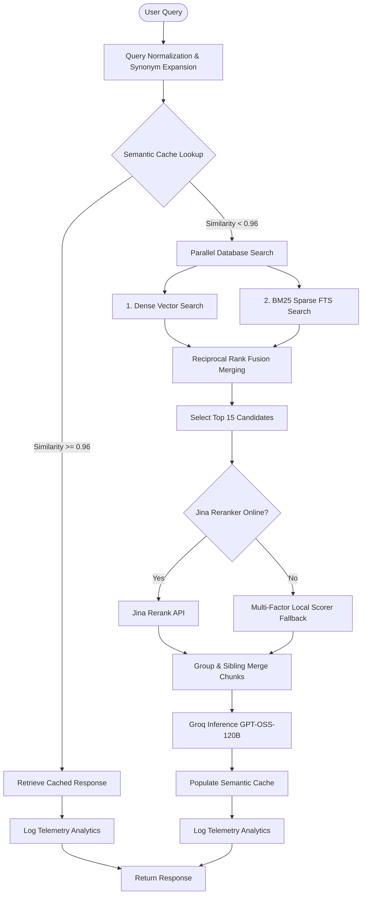

# Enterprise RAG System Architecture

This document describes the design, implementation, and execution flow of the production-grade Retrieval-Augmented Generation (RAG) system running on the portfolio platform.

---

## Architecture Diagram

---

## 1. Multi-Stage Ingestion Pipeline

The ingestion crawler processes local knowledge bases incrementally to minimize Jina AI token usage.

*   **Path Scanner**: Recursively crawls `workspace/knowledge-base/markdown/` identifying `.md`, `.mdx`, and `.txt` files.
*   **Unicode Normalization**: Cleans characters using the `NFKC` standard.
*   **Incremental Checksums**: Generates a **SHA-256** hash of raw files. Checks Supabase `public.documents`; if the checksum matches, the file is skipped. If a stale checksum is found, the old indices are cascade-purged and re-indexed.
*   **Document Parsing**: Resolves frontmatter variables (title, author, tags, keywords) and computes file metadata (size, mime type, estimated reading time, URL frontend routing paths).

---

## 2. Layout-Aware Semantic Chunker

Our chunker operates at the element-level rather than doing naive line splits.

1.  **Block Parser**: Parses markdown into structural elements:
    *   **YAML Frontmatter** (indivisible)
    *   **Code Blocks** & JSON Snippets (indivisible)
    *   **Mermaid Diagrams** (indivisible)
    *   **Markdown Tables** (indivisible)
    *   **Headings** (structural delimiters)
    *   **Text Blocks** (split-friendly paragraphs)
2.  **Adaptive Packing**: Groups elements into chunks targeting a **800 token** limit with **120 token** overlap. Code blocks, tables, and Mermaid charts are kept 100% contiguous and never broken across chunks.
3.  **Heading Hierarchy**: Extracts nearest header (`heading`) and parent header (`parent_heading`) for each chunk, preserving local context.

---

## 3. Matryoshka Vector Representation (1024 Dimensions)

The embeddings are generated using the state-of-the-art **Jina Embeddings v4** model.

*   **API Specification**: We call Jina's API with `dimensions: 1024` parameters.
*   **Matryoshka Truncation**: Leveraging Matryoshka Representation Learning (MRL), Jina v4 truncates the default 2048-dimensional vector to 1024 with minimal loss in accuracy.
*   **Database Constraints**: Resolves pgvector's strict HNSW index constraint of 2000 dimensions, allowing rapid semantic retrieval via standard pgvector HNSW cosine operators.

---

## 4. Retrieval Pipeline & Fusion (RRF)

*   **Query Normalization**: Standardizes punctuation, lowercases query.
*   **Synonym Query Expansion**: Translates technical terms into related keywords (e.g. `voicerag` -> `telephony, asterisk, voice assistant, call agent`).
*   **Dense Search**: Queries `public.match_chunks` via HNSW vector index.
*   **Sparse Search**: Queries `document_chunks` using `websearch_to_tsquery` GIN text indexes.
*   **Reciprocal Rank Fusion (RRF)**: Merges dense and sparse candidates:
    $$\text{RRF Score} = \frac{1}{60 + \text{Rank}_{\text{Dense}}} + \frac{1}{60 + \text{Rank}_{\text{Sparse}}}$$
    The top 15 candidate matches are selected.

---

## 5. Reranking Systems

*   **Jina Rerank API**: Sends query and candidate chunks to `jina-reranker-v2-base-multilingual` endpoint.
*   **Local Fallback Scorer**: If the API call fails or key is missing, it falls back to:
    $$\text{Score} = \text{Cosine Similarity} \times 0.6 + \text{Weighted Lexical Match} \times 0.4$$
    Lexical weights are computed dynamically based on query term length (favoring technical terms).

---

## 6. Context Builder & Memory

*   **Context Optimization**: Groups chunks by parent document, sorts by sequence, and merges adjacent contiguous chunks (consecutive indices) to eliminate overlap redundancy and restore natural reading flow.
*   **Token Budget**: Enforces a strict budget of **6,000 to 8,000 tokens** (via `RAG_MAX_CONTEXT_TOKENS` configuration).
*   **Conversational Memory**: For conversations, the API takes the last 6 messages, rewrites the user query incorporating historical constraints via LLM, and retrieves contextual documents based on the refined query.

---

## 7. Caching & Telemetry

*   **Semantic Cache**: Queries in `public.rag_cache` are matched against the query vector using cosine similarity (threshold `0.96`). If hit, the cached response is served in `< 50ms`.
*   **Telemetry Logs**: Every query saves execution metrics in `public.rag_logs` (latency, tokens, costs, clicks, model names, feedback) to drive system analytics.
