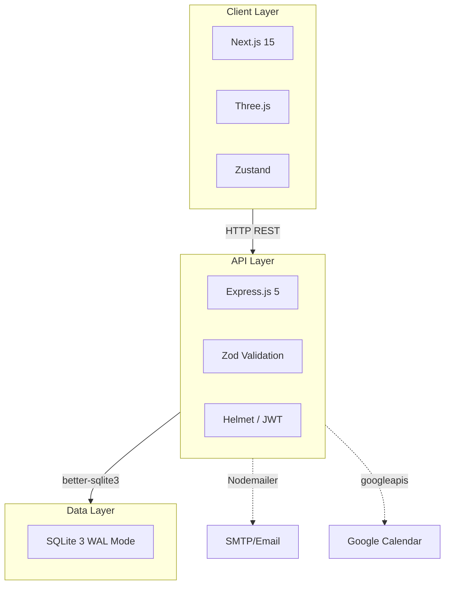

# dentl2

**Source Code:** [GitHub Repository](https://github.com/engrmaziz/dentl2)
## Executive Summary
dentl2 is a specialized SaaS platform designed for dental clinics. It provides a comprehensive suite of tools for patient management, appointment scheduling, and interactive 3D dental charting utilizing WebGL technologies.

## Problem Statement & Business Context
Dental clinics rely heavily on visual charting to track patient histories. Existing software often relies on static 2D images, making it difficult to record complex procedures. Furthermore, legacy systems are often siloed, lacking modern API integrations for SMS reminders or online booking.

## Objectives
- Integrate interactive 3D rendering directly into the browser for dental charting.
- Provide a robust, secure backend for managing sensitive patient data.
- Ensure the application is lightweight and fast enough to run on standard clinic hardware.

## Key Features
- **Public Website**: Next.js App Router featuring 3D animated banners (Three.js), service showcase, and interactive appointment booking.
- **Admin Dashboard**: Secure panel for managing appointments, doctors, and patient inquiries.
- **Blog & Gallery CMS**: Full CRUD system with draft/publish workflows and featured image management.
- **Automated Comms**: Google Calendar sync and SMTP email reminders for appointments.

## Solution Architecture

### High-Level Architecture
A Next.js frontend serving as the interactive dashboard, coupled with a lightweight Node.js/Express backend API. The 3D charting is handled client-side using Three.js, offloading rendering work to the user's GPU to keep server costs negligible.

### System Components
- **Frontend:** Next.js 15, React 19, Tailwind CSS 4.
- **State & Animations:** Zustand, GSAP, Framer Motion, Lenis.
- **3D Engine:** Three.js (for rendering interactive teeth models).
- **Backend:** Node.js, Express.js 5, TypeScript.
- **Database:** SQLite 3 (WAL mode) via `better-sqlite3`.

## Technology Stack

| Layer | Technology |
|-------|-----------|
| **Frontend** | Next.js 15, React 19, Tailwind CSS 4 |
| **Backend** | Express.js 5, TypeScript |
| **Database** | SQLite 3 |
| **Animations** | GSAP, Framer Motion, Three.js |
| **Integrations** | Google Calendar, Nodemailer |

## Database Design
SQLite 3 configured in WAL (Write-Ahead Logging) mode for high concurrency.
- `appointments`: Patient bookings linked to doctors with Google event IDs.
- `doctors`: Doctor profiles and JSON availability schedules.
- `admin_users`: Admin accounts with hashed passwords and roles.
- `blog_posts` & `gallery_images`: CMS tables for content management.

## Project Structure
- `app/`: Next.js frontend pages and proxy API routes.
- `components/three/`: Custom Three.js 3D WebGL components.
- `server/src/controllers/`: Express.js business logic.
- `server/src/db/`: SQLite database initialization and migrations.

## Security
- **Authentication**: JWT tokens signed with `JWT_SECRET`; `bcrypt` password hashing.
- **Input Validation**: All request bodies strictly validated with Zod schemas.
- **Security Headers & Rate Limiting**: Helmet.js for CSP/HSTS, and Express rate limiting on auth endpoints.

## Deployment
Frontend deployed on Vercel utilizing optimized Edge routing. Backend hosted as a containerized Node.js service, mounting a persistent volume for the SQLite `DB_PATH` and image `UPLOAD_DIR`.

## Challenges & Lessons Learned
- **Challenge:** Rendering high-fidelity 3D models in the browser without causing memory leaks or UI stuttering.
- **Solution:** Optimized the Three.js geometry, implemented frustum culling, and ensured all WebGL contexts were properly disposed of when the React component unmounted.

## Recruiter Summary
Showcases the ability to integrate specialized, complex frontend technologies (Three.js/WebGL) into standard enterprise SaaS frameworks (Next.js), while maintaining a clean, easily deployable backend architecture.

## Interview Questions
- "How did you prevent memory leaks when integrating Three.js within a React/Next.js component lifecycle?"
- "Why choose SQLite for the backend, and how would you migrate it if a client needed horizontal scaling?"

