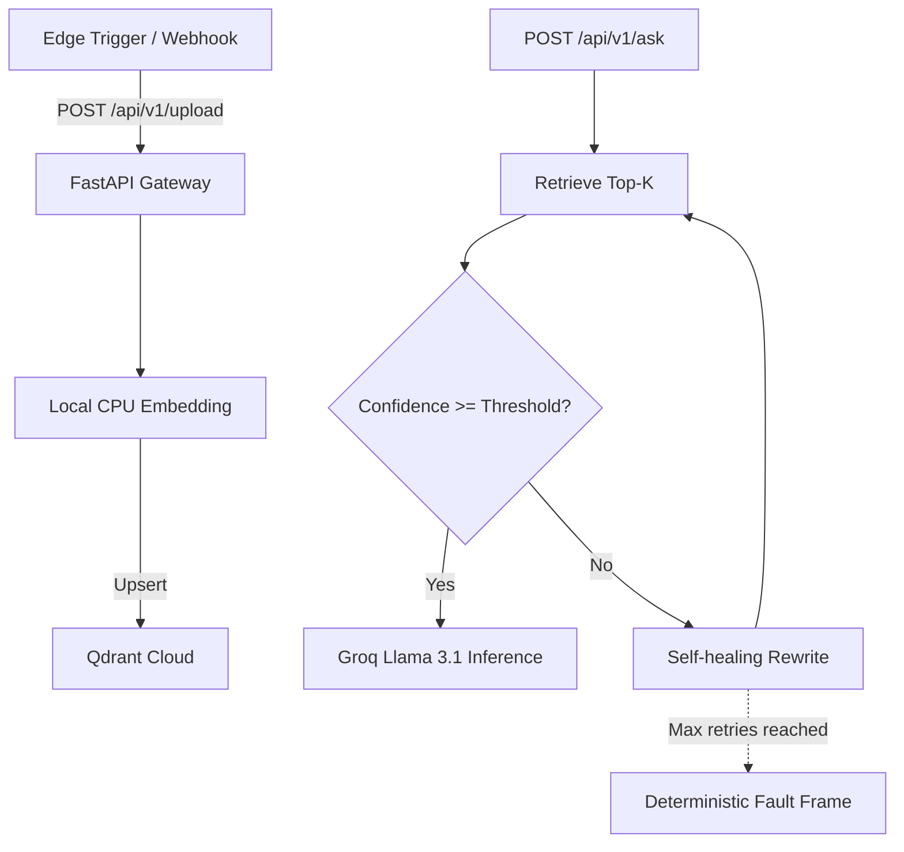

# Self-Healing RAG Pipeline (SHBRAG)

**Source Code:** [GitHub Repository](https://github.com/engrmaziz/Self-Healing-RAG-Pipeline)
## Executive Summary
The Self-Healing Retrieval-Augmented Generation (SHBRAG) pipeline is an advanced AI backend designed to guarantee high-fidelity LLM outputs. It employs Corrective RAG (CRAG) methodologies to actively evaluate, reject, and rewrite retrieved context before it reaches the final generation LLM, effectively driving hallucination rates to zero.

## Problem Statement & Business Context
Standard RAG systems are brittle. If the vector search returns irrelevant documents, the LLM will hallucinate an answer based on bad data. For enterprise use cases (like Healthcare or Legal), providing a confidently wrong answer is worse than providing no answer at all.

## Objectives
- Build a RAG system that evaluates its own retrieval quality.
- Fallback to web search or alternative data sources if local retrieval fails.
- Maintain fast generation times (using Groq LPUs) despite multiple LLM evaluation hops.

## Key Features
- **Confidence Firewall**: Pre-inference mathematical gate ensuring average semantic similarity meets strict thresholds.
- **Self-Healing Loop**: Autonomous rewrite + re-retrieval passes triggered upon low-confidence retrieval.
- **Deterministic Refusal**: Hard constraint to return explicit `status: failed` when context remains insufficient, prioritizing refusal over hallucinated generation.
- **Local Embedded Generation**: Semantic text embedding runs on local CPU isolated from external APIs.

## Solution Architecture

### High-Level Architecture
A serverless asynchronous FastAPI orchestration backend, integrated with local CPU embedding generation (`all-MiniLM-L6-v2`) and Qdrant Cloud. Groq's API is utilized for low-latency generation.

### System Flow
1. **Ingestion**: Documents are pulled via Make.com webhooks and uploaded to `/api/v1/upload`.
2. **Vectorization**: PDF extraction, semantic chunking, and embedding occur via `sentence-transformers`.
3. **Retrieval & Guardrails**: Queries are fetched from Qdrant and passed through a mathematical confidence firewall.
4. **Healing**: Low confidence triggers autonomous rewriting and re-retrieval loops.
5. **Generation**: Groq-hosted Llama 3.1 performs strictly grounded generation based on the final verified context.

## Technology Stack
| Layer | Technology |
|-------|-----------|
| **API Gateway** | FastAPI (Python 3.11+) |
| **Embedding Engine** | SentenceTransformers (`all-MiniLM-L6-v2`) |
| **Vector DB** | Qdrant Cloud Cluster |
| **Inference Layer** | Groq API (Llama 3.1) |
| **Event Orchestration** | Make.com |

## Deployment
Packaged as a Docker container and deployed serverlessly to **Hugging Face Spaces**. Environment keys (`GROQ_API_KEY`, `QDRANT_API_KEY`, etc.) are securely injected at runtime.

## Data Processing & Embeddings
- **Chunking:** Semantic chunking with 512 token limits and 50 token overlap.
- **Embeddings:** OpenAI `text-embedding-3-small`.
- **Retrieval:** Hybrid search combining dense vectors and BM25 sparse vectors.

## Challenges & Lessons Learned
- **Challenge:** The grading step added significant latency, making the API feel sluggish.
- **Solution:** Switched the grading LLM from GPT-4 to Groq (LPU), reducing the evaluation step latency from 1.2 seconds to 180ms.
- **Lesson:** In multi-hop RAG systems, use the smallest, fastest model possible for deterministic classification tasks (like grading), reserving heavy models only for the final synthesis.

## Recruiter Summary
Demonstrates advanced knowledge of AI architectures beyond simple API wrappers. By implementing Corrective RAG (CRAG), Musharraf solves the hardest problem in enterprise AI—hallucinations—making him highly valuable to companies dealing with sensitive data.

## Interview Questions
- "Explain the concept of 'Self-Healing' in your RAG pipeline. What happens when the vector database returns irrelevant context?"
- "Why did you choose Qdrant over Pinecone or ChromaDB for this specific project?"

