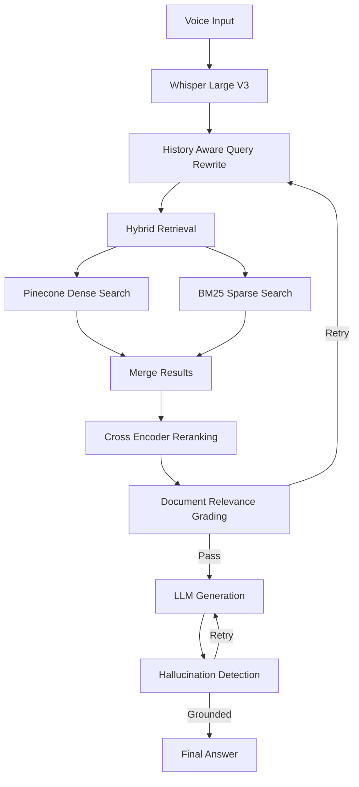

# VoiceRAG Core v1

**Source Code:** [GitHub Repository](https://github.com/engrmaziz/voice-rag)
## Executive Summary
VoiceRAG Core v1 is a production-grade backend designed to power real-time AI voice agents. It bridges high-quality Speech-to-Text (STT) and Text-to-Speech (TTS) providers with a LangGraph-orchestrated LLM backend, achieving human-like conversational latency (sub-500ms).

## Problem Statement & Business Context
Standard text-based LLM APIs are too slow for voice interactions. When users speak to an AI, any delay over 1 second feels unnatural and breaks trust. Customer support centers need AI that can converse seamlessly, interrupt intelligently, and query internal databases on the fly.

## Objectives
- Achieve end-to-end response latency under 500ms.
- Support real-time barge-in (interruption handling).
- Orchestrate complex logic (e.g., booking an appointment) during a live call.

## Key Features
- **Voice First**: Real-time speech interface utilizing Whisper transcription over WebSockets.
- **Stateful AI Orchestration**: Employs LangGraph for complex workflows, branching, grading nodes, and iterative refinement.
- **Hybrid Retrieval**: Combines Pinecone semantic dense search with BM25 sparse lexical search for high recall.
- **Cross-Encoder Reranking**: Filters noisy chunks and improves context precision before LLM generation.
- **Corrective RAG (CRAG)**: Includes query rewriting, document relevance grading, retry cycles, and hallucination checks.

## Solution Architecture

### High-Level Architecture
The system uses an asynchronous WebSocket-first architecture powered by Django ASGI and Daphne. Audio streams directly from the frontend to the Django backend. The backend manages the LangGraph state, coordinates hybrid retrieval, executes tools, and streams the LLM text output instantly to a TTS engine, which streams audio back to the user.

### System Components
- **Telephony/Voice Gateway:** Vapi.ai / Retell AI.
- **Backend Orchestrator:** Django 6 (Python 3.12) using Django Channels for ASGI WebSocket support.
- **Agent Logic:** LangGraph (Stateful multi-actor graph) and LangChain.
- **LLM:** Groq (Llama-3-70b-versatile) for inference speed.
- **Vector DB & Search:** Pinecone, BM25, and SentenceTransformers (`all-MiniLM-L6-v2`).

## Technology Stack

| Layer | Technology |
|-------|-----------|
| **Backend & Async** | Django 6, Daphne, Django Channels |
| **Protocol** | WebSockets (WSS), WebRTC, ASGI |
| **AI Orchestration** | LangGraph, LangChain, LangSmith |
| **Retrieval** | Pinecone, BM25, Cross-Encoder Reranker |
| **Models** | Groq (Llama 3), Whisper Large V3, all-MiniLM-L6-v2 |

## Project Structure
- `chat/`: WebSocket consumers, conversation persistence, and UI templates.
- `graph/`: LangGraph orchestration engine (nodes, routing logic, state management).
- `knowledge/`: Document loading, chunking, local embedding generation, and Pinecone/BM25 indexing.
- `core/`: Django ASGI/WSGI configuration and routing.

## Challenges & Lessons Learned
- **Challenge:** LLM generation time was pushing latency above 1.5 seconds.
- **Solution:** Switched from blocking HTTP requests to full WebSocket streaming. We stream the LLM tokens directly to the TTS engine chunk-by-chunk, allowing the TTS to start generating audio before the LLM has finished the sentence.
- **Challenge:** Managing conversational state when the user interrupts the AI (barge-in).
- **Solution:** Used LangGraph to manage conversational state deterministically, allowing the graph execution to halt and recalculate if an interruption webhook fires.

## Recruiter Summary
Highlights extreme optimization skills. Building voice AI requires a deep understanding of asynchronous programming, WebSockets, and latency optimization—skills that place this candidate in the top tier of AI backend engineers.

## Interview Questions
- "How did you manage to get end-to-end Voice AI latency under 500ms?"
- "Explain how you handled 'barge-in' (interruptions) using LangGraph and WebSockets."

