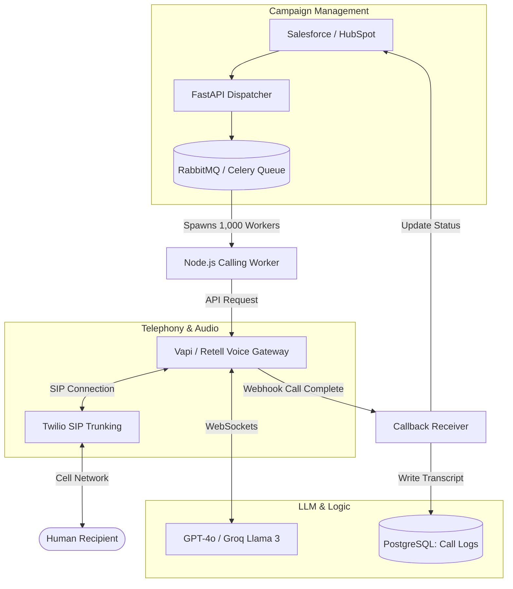

## JSON-LD Schema

```json
{
  "@context": "https://schema.org",
  "@type": "Service",
  "name": "AI Call Agent Software",
  "provider": {
    "@type": "Organization",
    "name": "Enterprise Software Architecture"
  },
  "serviceType": "Artificial Intelligence Engineering",
  "description": "High-concurrency outbound dialing and inbound triage systems capable of automating 10,000+ simultaneous SIP calls with zero latency degradation.",
  "areaServed": "Worldwide"
}
```

## Hero Section

**Headline:** Enterprise AI Call Agent Software  
**Subheadline:** Scale your call center infinitely. We engineer massive-concurrency AI Call Agents capable of executing 10,000+ simultaneous inbound and outbound calls, completely automating triage, scheduling, and lead qualification.  

**Enterprise Value Proposition:** Hiring 500 human agents to dial leads or answer Tier-1 support calls is a massive capital drain. We build Custom AI Call Agents that connect directly to your CRM, autonomously dialing thousands of users simultaneously, having dynamic conversations, and routing only the highest-intent qualified leads to your human closers.

**Primary CTA:** Request a Call Center Audit  
**Secondary CTA:** Hear an AI Outbound Sales Demo  

**Trust Indicators:** 10,000+ Concurrent Calls | Twilio SIP Integration | CRM Syncing | DNC List Compliance

## Executive Summary

AI Call Agent Software represents the industrial scaling of Voice AI. While a standard Voice Agent handles a one-off customer interaction, AI Call Agents operate as a highly concurrent fleet. They are designed for batch processing: ingesting a CSV of 50,000 leads, making parallel outbound calls, verifying identities, asking qualification questions, updating the Salesforce CRM in real-time, and dropping a calendar invite into a human sales rep's schedule. This requires a robust asynchronous backend infrastructure (Celery, RabbitMQ) heavily integrated with scalable telephony networks (Twilio SIP trunking).

## Business Problems

- **The Human Bottleneck:** A human BDR (Business Development Representative) can physically make a maximum of 100 outbound calls a day. 80% of those go to voicemail. Paying humans to listen to ringing phones destroys margin.
- **Inbound Triage Overload:** During a crisis (e.g., an airline flight cancellation event), inbound call volume spikes 1,000%. Human centers cannot scale instantly, resulting in 4-hour hold times and massive brand damage.
- **Burnout & Turnover:** The repetitive nature of qualification calls (asking the same 5 questions repeatedly) leads to extreme employee burnout and turnover rates exceeding 40% annually in call centers.
- **Compliance Violations:** Human agents often forget to state mandatory compliance disclaimers on recorded lines, opening the company to TCPA (Telephone Consumer Protection Act) lawsuits.

## Engineering Solution

We engineer **High-Throughput Telephony Pipelines**.

We do not use consumer "auto-dialer" SaaS tools. We build custom backend architectures using Python (FastAPI/Celery) or Node.js connected to Twilio Programmable Voice. When a campaign is triggered, a central Dispatcher service spins up thousands of worker threads. Each thread initiates a SIP call, connects the audio stream to a Voice Gateway (Vapi), and loads a highly specific LLM prompt parameterized with the recipient's CRM data. 

## Architecture

Deploying Call Agents requires strict decoupling of the scheduling engine, the telephony provider, and the LLM inference engine to prevent cascading failures under heavy load.

### Outbound Call Fleet Architecture



## Technology Stack

- **Telephony:** Twilio Programmable Voice, SignalWire, Plivo, SIP Trunking
- **Voice Gateways:** Vapi.ai (Enterprise Tier), Retell AI
- **Backend Orchestration:** Python (Celery, FastAPI), Node.js, RabbitMQ, Redis
- **LLM Inference:** Groq (Llama 3 for fast routing), OpenAI, Anthropic
- **Data & Integrations:** PostgreSQL, Salesforce API, HubSpot API, Zapier
- **Monitoring:** Datadog, Twilio Voice Insights, LangSmith

## Development Process

1. **Campaign & Data Definition:** Mapping the exact data fields from your CRM (Name, Last Purchase Date, Plan Tier) that will be injected into the LLM prompt.
2. **Telephony Provisioning:** Securing dedicated phone number blocks, registering A2P 10DLC compliance (if applicable), and configuring SIP trunks.
3. **Queue Architecture:** Building the Celery/RabbitMQ backend that handles rate limiting. We cannot dial 10,000 numbers in one second without triggering carrier spam filters; we build pacing algorithms.
4. **Answering Machine Detection (AMD):** Tuning Twilio's AMD to accurately detect if the AI is speaking to a human or a voicemail. If it detects voicemail, the agent autonomously leaves a pre-recorded or dynamically generated message.
5. **Real-time CRM Writeback:** Engineering the webhooks that instantly update the CRM the moment the call terminates, categorizing the lead as "Interested," "Not Interested," or "Invalid Number."

## Security & Compliance

- **DNC (Do Not Call) Integration:** Our dispatching logic runs a hard DB check against the National DNC registry and your internal suppression lists 10 milliseconds before dialing.
- **TCPA Compliance:** The prompt strictly enforces mandatory disclosures (e.g., "This call is on a recorded line"). The LLM is mathematically prevented from bypassing this step.
- **Rate Limit Protection:** We enforce strict concurrent call limits at the backend to prevent DDoS-ing your own internal APIs when the LLM attempts to execute tool calls simultaneously.

## Performance & Scalability

- **10,000+ Concurrent Calls:** By utilizing stateless Node.js workers and decoupled asynchronous queues, the system scales horizontally. We simply add more Docker containers to handle larger dial batches.
- **Carrier Reputation:** We implement sophisticated number rotation algorithms (Local Presence Dialing) to ensure your outbound caller IDs are not automatically flagged as "Scam Likely" by major telecom providers.

## Use Cases

### 1. Real Estate Lead Qualification
**Problem:** A brokerage buys 5,000 Zillow leads a month, but human agents cannot call them fast enough. Leads go cold within 5 minutes.
**Implementation:** We deploy an Inbound/Outbound AI Call Agent. The moment a user submits a Zillow form, an AWS Lambda function triggers the agent. The agent calls the lead within 3 seconds, qualifies their budget, and dynamically schedules a viewing by querying the human realtor's Google Calendar.
**Outcome:** Speed-to-lead reduced to 3 seconds. Conversion rates increased by 300% as humans only speak to fully qualified, scheduled buyers.

### 2. Debt Collection Reminders
**Problem:** A utility company wastes hundreds of hours manually calling customers with 30-day past-due invoices.
**Implementation:** An automated fleet of 500 parallel agents dials the past-due list every Tuesday. The agent informs them of the balance, uses an API to securely process a credit card payment over the phone, and updates the billing system.
**Outcome:** Collection operational costs reduced by 90%.

## FAQ

**Q: Will the AI get confused if the human hangs up?**
No. The system utilizes SIP status codes. If the human terminates the call, the Voice Gateway detects the `BYE` signal instantly, kills the LLM stream, and logs the call duration and transcript up to the point of termination.

**Q: Can the agent leave a voicemail?**
Yes. We configure Answering Machine Detection (AMD). If the system detects a "beep", the AI waits for silence, then delivers a context-aware voicemail (e.g., "Hi John, calling about your upcoming appointment...") and logs it in the CRM.

**Q: Is this legal?**
Voice AI is heavily regulated. You must have explicit consent to dial consumers (TCPA compliance). Our software enforces your compliance rules, but you are responsible for maintaining clean, legally sourced lead lists. We strongly recommend consulting legal counsel before running massive outbound campaigns.

## Related Services

- **[AI Voice Agent Development](/services/ai-agents/voice-agents):** The core technology that powers the conversational logic of the Call Agents.
- **[Backend Development](/services/software-engineering/backend-development):** We build the heavy, asynchronous Celery queues required to dispatch thousands of calls.
- **[Workflow Automation](/services/technical-consulting/workflow-automation):** Integrating the output of these calls into complex Zapier or custom Python workflows.

## Call To Action

**Scale your outbound effort infinitely.**
Stop paying humans to listen to voicemails. Schedule a technical audit with our Telephony Engineers. We will design a high-concurrency dialing architecture that connects seamlessly to your CRM.

[Request a Call Center Audit]
