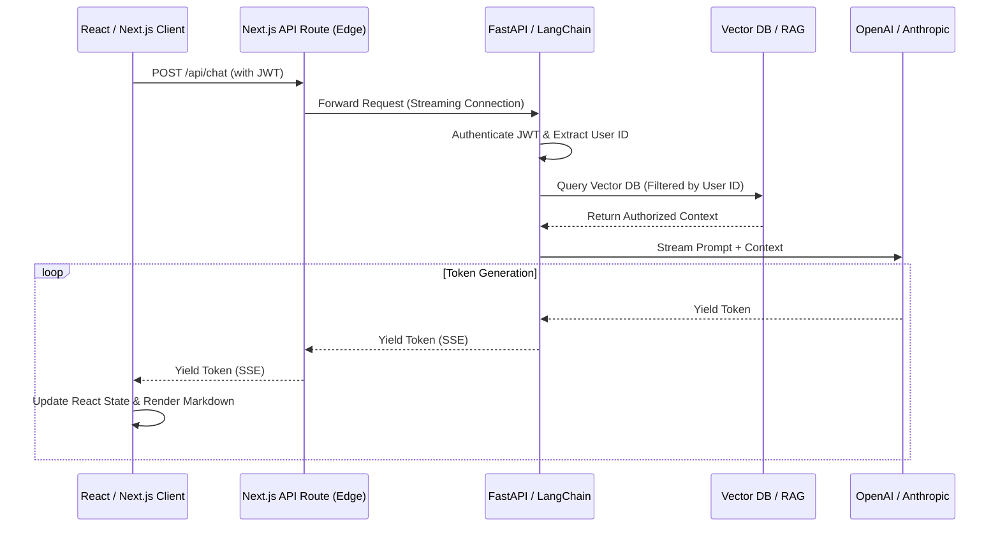

## JSON-LD Schema

```json
{
  "@context": "https://schema.org",
  "@type": "Service",
  "name": "Enterprise AI Chatbot Development",
  "provider": {
    "@type": "Organization",
    "name": "Enterprise Software Architecture"
  },
  "serviceType": "Artificial Intelligence Engineering",
  "description": "Secure, enterprise-grade AI chatbots for web and mobile that utilize Server-Sent Events for real-time streaming and RAG for zero-hallucination answers.",
  "areaServed": "Worldwide"
}
```

## Hero Section

**Headline:** Enterprise AI Chatbot Development  
**Subheadline:** Deploy highly secure, intelligent conversational interfaces. We engineer custom AI chatbots that deeply integrate with your enterprise databases, answer with cryptographic precision, and execute complex backend tasks directly from the chat window.  

**Enterprise Value Proposition:** Forget generic "website widgets" that just link to FAQ pages. We build deeply integrated, React-based chatbot interfaces powered by custom LangGraph state machines. Deliver a ChatGPT-caliber experience tailored securely to your proprietary business logic.

**Primary CTA:** Request a Chatbot Architecture Audit  
**Secondary CTA:** View RAG Chatbot Implementations  

**Trust Indicators:** Streaming SSE Responses | React Server Components | Native CRM Integration | Zero-Trust Data Architecture

## Executive Summary

Enterprise AI Chatbots are secure, context-aware web and mobile interfaces that allow users to interact with your data using natural language. Unlike consumer chatbots, enterprise implementations require strict security boundaries, markdown rendering, interactive UI components (Generative UI), and seamless integration with existing authentication (OAuth/JWT). We specialize in building the complete stack: the high-performance Next.js frontend that streams tokens in real-time, and the robust Python backend that orchestrates the RAG retrieval and tool calling securely.

## Business Problems

- **The "Dumb Bot" Stigma:** Customers actively avoid legacy chatbots (like Intercom's old rules-based bots) because they force users into frustrating loops without actually solving problems.
- **Security & Data Leaks:** Using public SaaS chatbot platforms forces you to upload your proprietary data to a third-party server, creating massive compliance and data sovereignty risks.
- **Poor User Experience:** Chatbots that do not stream responses feel broken. Users stare at a loading spinner for 10 seconds, assume the system crashed, and close the tab.
- **Lack of Authentication:** A standard chatbot cannot access a user's private account details. It cannot say "Your specific invoice #123 is due tomorrow" because it operates outside the application's authenticated session.

## Engineering Solution

We build **Authenticated, Streaming Chat Architectures**.

We deploy custom Next.js frontends utilizing Server-Sent Events (SSE) to stream tokens to the user the millisecond they are generated by the LLM, creating a fast, fluid experience. We pass the user's secure session token (JWT) to the LLM backend. The backend LangGraph agent uses this token to query your REST APIs securely, ensuring the bot can perform highly personalized, account-specific actions while adhering strictly to Row-Level Security permissions.

## Architecture

Our Chatbot architecture emphasizes real-time streaming and Generative UI (rendering React components inside the chat).

### Enterprise Chatbot Streaming Architecture



## Technology Stack

- **Frontend:** Next.js (App Router), React, Tailwind CSS, Framer Motion
- **AI UI Libraries:** Vercel AI SDK, LangChain.js
- **Backend APIs:** Python (FastAPI), Node.js, Server-Sent Events (SSE)
- **State Management:** Redis (Chat History), PostgreSQL (Long-term persistent threads)
- **LLM Inference:** OpenAI (GPT-4o), Anthropic (Claude 3.5 Sonnet)

## Development Process

1. **UX & UI Design:** Designing a custom interface that matches your brand guidelines, including support for dark mode, markdown rendering, tables, and code syntax highlighting.
2. **Backend Orchestration:** Writing the Python FastAPI server that handles the LangChain logic, tool calling, and RAG retrieval.
3. **Streaming Implementation:** Connecting the backend to the Next.js frontend using the Vercel AI SDK to handle the complex edge-case management of Server-Sent Events.
4. **Generative UI Injection:** Programming the LLM to return specific JSON structures that trigger the frontend to render interactive React components (e.g., a dynamic "Pay Invoice" button) directly inside the chat stream.
5. **Session Persistence:** Utilizing Redis to ensure that if a user refreshes the page, their chat history instantly reloads.

## Features

- **Real-Time Streaming:** Zero perceived latency. Users watch the answer type out naturally.
- **Generative UI:** The chatbot doesn't just return text; it can return interactive graphs, maps, date pickers, and checkout buttons dynamically.
- **Markdown & Code Support:** Full support for rendering complex markdown tables, LaTeX mathematics, and syntax-highlighted code blocks.
- **Citation Badges:** When answering from a RAG database, the chatbot automatically appends clickable footnote citations linking directly to the source document.
- **Persistent Memory:** Users can view and resume past chat threads, exactly like the ChatGPT interface.

## Benefits

- **Business:** Deflect high-cost Level 1 and Level 2 support tickets by providing users with an intelligent self-serve resolution engine.
- **Engineering:** Complete control over the codebase. No vendor lock-in to closed-source chatbot providers. You own the frontend code and the backend logic.
- **Operational:** Deep analytics dashboard detailing exactly what users are asking, where the bot succeeded, and where human intervention was required.

## Use Cases

### 1. Secure FinTech Support Bot
**Problem:** A trading platform needed a chatbot to answer user questions about their portfolio, but couldn't use third-party tools due to SEC regulations.
**Implementation:** We built a custom Next.js chatbot deployed on their private AWS VPC. The bot securely passed the user's OAuth token to query the internal portfolio API. 
**Outcome:** Users could ask "Why did my portfolio drop today?" and the bot would dynamically render a React chart showing their specific stock allocations and live market news, all while maintaining absolute compliance.

### 2. Internal Developer Productivity Bot
**Problem:** New engineers took 6 months to onboard due to massive, undocumented legacy codebases.
**Implementation:** We developed an internal chatbot connected to their GitHub repositories via a RAG pipeline. Engineers could ask the bot where specific microservices lived and how to deploy them.
**Outcome:** Onboarding time was cut in half, and senior engineers spent 30% less time answering basic architectural questions on Slack.

## Security & Compliance

- **No Data Training:** By utilizing Enterprise API endpoints (Azure OpenAI, AWS Bedrock), we guarantee that your proprietary chat logs are never used to train foundational models.
- **On-Premise Deployment Options:** For highly secure environments (Defense, Healthcare), we can containerize the entire chatbot backend and deploy it alongside localized open-source models (Llama 3) inside your air-gapped network.
- **Rate Limiting & Abuse Prevention:** We implement strict IP-based and user-based rate limiting using Redis to prevent malicious actors from exhausting your LLM API credits.

## Comparison

### Custom Next.js Chatbot vs. Intercom / Drift
Platforms like Intercom are excellent for live-agent routing but their native AI capabilities are often generic and expensive. A custom Next.js chatbot gives you infinite UI flexibility (Generative UI) and allows you to execute highly complex backend Python orchestrations that closed-SaaS platforms simply do not permit.

## FAQ

**Q: Can the chatbot look exactly like my website?**
Yes. Because we build the frontend using React and Tailwind CSS, we have pixel-perfect control over the design. It will seamlessly match your existing design system, fonts, and branding.

**Q: How do you handle conversation history?**
We stream the user's message to the backend, which appends it to a Redis cache keyed by the user's Session ID. When we send the prompt to the LLM, we automatically inject the last 10 messages from Redis to provide conversational context.

**Q: Can the chatbot transition to a human agent?**
Yes. We build a "Handoff" protocol. If the bot detects frustration or the user types "Speak to an agent," the React frontend pauses the LLM stream, opens a WebSocket connection to your live support desk (e.g., Zendesk), and seamlessly bridges the chat.

**Q: Does it support mobile browsers?**
Absolutely. The Next.js chat interface is fully responsive, supporting mobile keyboard behaviors, safe-area insets, and smooth scrolling on iOS and Android devices.

## Related Services

- **[AI Voice Agent Development](/services/ai-agents/voice-agents):** Take the exact same backend logic powering your chatbot and deploy it over the phone.
- **[Next.js Development](/services/software-engineering/nextjs-architecture):** We build the fast, scalable frontend architectures required to host streaming chat applications.
- **[Backend Engineering](/services/software-engineering/backend-development):** We engineer the Python FastAPI systems that handle the heavy LLM inference.

## Call To Action

**Build a Chatbot your users will actually love.**
Stop relying on frustrating, rigid support widgets. Schedule a Chatbot Architecture Review with our Full-Stack Engineers today. We will design a secure, streaming interface that integrates flawlessly with your enterprise databases.

[Schedule a Chatbot Architecture Review]
