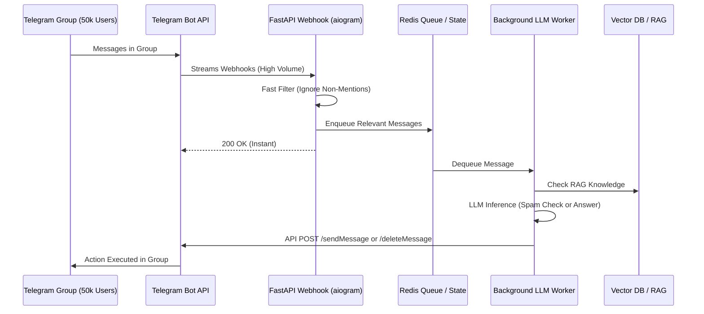

## JSON-LD Schema

```json
{
  "@context": "https://schema.org",
  "@type": "Service",
  "name": "Telegram AI Bot Development",
  "provider": {
    "@type": "Organization",
    "name": "Enterprise Software Architecture"
  },
  "serviceType": "Artificial Intelligence Engineering",
  "description": "High-speed, secure Telegram AI Bots integrated with LLMs and Web3 infrastructure for community moderation, trading, and decentralized workflows.",
  "areaServed": "Worldwide"
}
```

## Hero Section

**Headline:** Telegram AI Bot Development  
**Subheadline:** Build lightning-fast, highly concurrent AI bots for the world's most developer-friendly messenger. We engineer custom Telegram agents for Web3 communities, high-frequency trading alerts, and autonomous group moderation.  

**Enterprise Value Proposition:** Telegram is the operational nervous system for crypto, fintech, and massive online communities. Standard bots are slow and stateless. We architect asynchronous Python (aiogram) infrastructures that process thousands of messages per second, utilizing ultra-fast LLMs to analyze sentiment, execute trades, or moderate toxicity in real-time.

**Primary CTA:** Request a Telegram Bot Audit  
**Secondary CTA:** View Web3 Bot Architectures  

**Trust Indicators:** aiogram Experts | High Concurrency Polling | Web3 & Smart Contract Integration | Sub-100ms API Latency

## Executive Summary

Telegram offers the most robust Bot API of any major messaging platform, providing deep integration into group chats, channels, and inline queries. However, deploying a bot to a Telegram group with 50,000 active members requires massive concurrent processing power. A poorly written script will crash instantly under the webhook load. We specialize in building enterprise-grade, highly available Telegram architectures using asynchronous Python (`asyncio` / `aiogram`), connected to custom LLM orchestration engines capable of handling extreme throughput.

## Business Problems

- **Community Toxicity & Spam:** Large Web3 or gaming Telegram groups are constantly bombarded by spam bots, phishing links, and toxic behavior. Human moderators cannot keep up, resulting in community degradation.
- **Information Overload:** In high-volume trading or logistics channels, users miss critical alerts. They need an intelligent agent capable of summarizing 500 missed messages instantly.
- **Complex UI Limitations:** Typical bots force users to type awkward commands (`/buy 100 eth`). Users want natural language execution ("Buy $100 of ETH if the price drops below 3k").
- **Scaling Bottlenecks:** A simple Python `requests` script will block the event loop, causing the bot to freeze when handling more than 10 simultaneous users.

## Engineering Solution

We build **Asynchronous, Event-Driven Architectures**.

Our Telegram bots are engineered using the `aiogram` framework (Python) deployed via horizontally scaling Webhook servers. The bot acts as a high-speed message router. If a user asks a complex question, the bot immediately passes the payload to an asynchronous Celery worker, freeing the main event loop. The worker triggers the LLM (e.g., Groq for sub-second response times), executes any necessary backend REST/GraphQL API calls, and pushes the final message back to the Telegram API.

## Architecture

To survive massive group chat deployments, the architecture must decouple the ingestion layer from the heavy LLM inference layer.

### High-Concurrency Telegram Pipeline



## Technology Stack

- **Telegram Frameworks:** aiogram (Python 3.11+), Telegraf (Node.js)
- **Backend Infrastructure:** FastAPI, WebSockets, Celery, Redis
- **LLM Inference:** Groq (Llama 3 for extreme speed), OpenAI (GPT-4o)
- **Web3 Integration:** Web3.py, ethers.js, GraphQL (The Graph)
- **Deployment:** Docker, Kubernetes, AWS Fargate

## Development Process

1. **BotFather & API Provisioning:** Securing the bot token, configuring privacy modes, and registering necessary commands (`/start`, `/help`) and Inline Keyboard UI structures.
2. **Asynchronous Scaffolding:** Implementing the `aiogram` router and FastAPI webhooks. Setting up Redis to handle FSM (Finite State Machine) context for multi-step conversations.
3. **LLM Orchestration:** Designing the LangGraph logic that handles intent classification. Is the user asking a support question, or is this a spam message that needs deleting?
4. **Tool Integration:** Connecting the bot to external systems (Stripe, Smart Contracts, internal Postgres databases) to allow real-world execution.
5. **Load Testing:** Bombarding the webhook endpoint with 10,000 simulated requests per second to verify the Celery workers scale properly and the event loop never blocks.

## Features

- **Inline Keyboards & Mini Apps:** We replace clunky text commands with elegant, clickable inline buttons, or integrate full Telegram Mini Apps (Web Apps) directly into the chat interface.
- **RAG for Communities:** The bot ingests your entire GitBook or documentation site. When a user asks a technical question in the group, the bot replies instantly with a cited, perfectly accurate answer.
- **Autonomous Moderation:** Using fine-tuned classifiers and LLMs to analyze context. It doesn't just ban URLs; it analyzes the semantic intent of the message to detect subtle phishing attacks or "pump and dump" schemes.
- **Payment Integration:** Native integration with Telegram Payments API or external Web3 wallets to allow users to purchase subscriptions or digital goods directly in the chat.

## Use Cases

### 1. Web3 Community Sentinel
**Problem:** A DeFi project's Telegram group of 40,000 members was overwhelmed by scammers impersonating admins and linking to fake minting sites.
**Implementation:** We deployed a Sentinel AI Bot. It reads every message silently. We bypassed heavy LLMs for a specialized, ultra-fast embedding model that detects semantic phishing patterns. 
**Outcome:** The bot deletes malicious messages and bans the sender within 300 milliseconds of the message hitting the server, long before human members can click the links.

### 2. High-Frequency Trading Assistant
**Problem:** Traders needed a way to execute trades via natural language while commuting.
**Implementation:** A private Telegram bot connected securely to the user's Binance API keys. The user types: "If BTC drops below 60k, buy 0.1 and set a stop loss at 58k." The LangGraph agent parses the intent, converts it to rigid API parameters, and executes the limit order.
**Outcome:** Complex trading workflows abstracted into conversational commands.

## Security & Compliance

- **State Fencing:** In group chats, it is critical that the bot does not mix conversational context between User A and User B. We use strict Redis FSM structures keyed by `chat_id` and `user_id` to ensure isolated memory.
- **Command Authorization:** For admin-level commands (e.g., `/mute_all`), the bot strictly verifies the Telegram `user_id` against a hardcoded backend PostgreSQL database, preventing authorization bypass attacks.
- **API Key Secrecy:** Telegram Bots designed for trading or backend execution never store API keys in plaintext. All user credentials are encrypted using AES-256 before hitting the database.

## Comparison

### Telegram Bots vs. WhatsApp/Web Chatbots
Telegram offers developers significantly more freedom than WhatsApp or web widgets. It allows for deep group chat integration, silent message observation, custom web apps, and it does not have the stringent 24-hour response window restrictions or expensive template message fees imposed by Meta's WhatsApp Business API. If your target audience accepts Telegram, it is the superior platform for complex, autonomous AI agents.

## FAQ

**Q: Do you use Polling or Webhooks?**
For development and low-traffic bots, polling is acceptable. However, for enterprise production deployments, we exclusively use Webhooks. Webhooks push data directly to our FastAPI servers, minimizing API latency and dramatically reducing server load.

**Q: Can the bot read every message in a group?**
Yes, but only if you disable "Privacy Mode" via the BotFather and grant the bot administrative reading privileges. We use this feature heavily for moderation and RAG-based community support bots.

**Q: What is a Telegram Mini App?**
A Mini App is a full React/Next.js web application that renders *inside* the Telegram UI. We frequently use Mini Apps when a user's task requires complex data entry (like filling out a multi-page form or connecting a crypto wallet) that is too tedious for a text-based chat.

## Related Services

- **[Enterprise AI Chatbots](/services/ai-agents/chatbots):** The core conversational logic used in Telegram can be deployed identically to your website.
- **[Backend Engineering](/services/software-engineering/backend-development):** We engineer the highly concurrent server infrastructure required to process millions of Telegram webhooks.
- **[Workflow Automation](/services/technical-consulting/workflow-automation):** Sync your Telegram bot's data collection seamlessly with your CRM and Slack channels.

## Call To Action

**Command your community.**
Stop relying on slow, rigid scripts to manage your Telegram presence. Schedule a Technical Architecture Review today. We will design a high-speed, asynchronous AI bot capable of scaling to massive group architectures.

[Schedule a Telegram Bot Audit]
