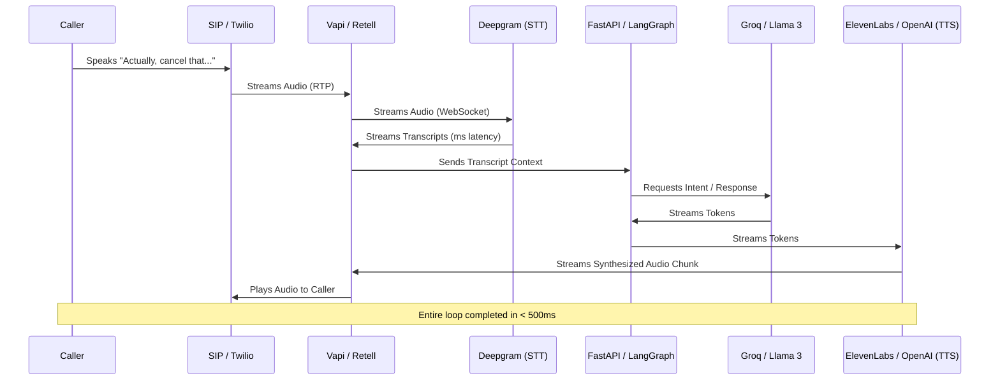

## JSON-LD Schema

```json
{
  "@context": "https://schema.org",
  "@type": "Service",
  "name": "AI Voice Agent Development",
  "provider": {
    "@type": "Organization",
    "name": "Enterprise Software Architecture"
  },
  "serviceType": "Artificial Intelligence Engineering",
  "description": "Develop sub-500ms latency AI Voice Agents that handle interruptions gracefully and execute complex business logic via secure APIs.",
  "areaServed": "Worldwide"
}
```

## Hero Section

**Headline:** AI Voice Agent Development  
**Subheadline:** Build conversational voice AI that feels human. We engineer ultra-low latency voice agents that handle barge-ins (interruptions), understand nuance, and execute complex business logic in real-time over the phone.  

**Enterprise Value Proposition:** Standard voice bots are notoriously slow and robotic. We utilize advanced streaming WebSockets, state-of-the-art Speech-To-Text (STT), and Large Processing Unit (LPU) inference to achieve sub-500ms response times. Your customers won't believe they are talking to an AI.

**Primary CTA:** Hear a Live Demo  
**Secondary CTA:** Schedule a Voice Architecture Review  

**Trust Indicators:** Vapi.ai Integration | Retell AI Partners | Sub-500ms Latency | Seamless Human Handoff

## Executive Summary

AI Voice Agent Development is the most technically demanding frontier of Generative AI. Unlike text-based chatbots where a user will tolerate a 3-second delay, voice conversations require immediate feedback. If an AI takes longer than 800 milliseconds to respond, the human brain perceives it as a dropped call or an awkward silence. We specialize in building the highly concurrent, streaming backend infrastructure required to ingest audio, transcribe it, process the LLM logic, synthesize the voice response, and stream the audio back to the telephony provider—all in less than half a second.

## Business Problems

- **The Latency Trap:** Most companies attempting to build voice AI use standard HTTP requests. The resulting 3-to-5 second delay makes natural conversation impossible, causing callers to hang up in frustration.
- **The "Barge-in" Failure:** When a human interrupts a traditional voice bot, the bot keeps talking. It cannot "listen" while it is "speaking," creating infuriating, overlapping audio clashes.
- **Robotic Monotones:** Utilizing legacy Text-To-Speech (TTS) engines results in automated voices that lack emotion, inflection, and empathy, damaging the brand experience.
- **Disconnected Systems:** Many voice AI platforms are closed ecosystems. They can talk to the user, but they cannot securely execute REST API calls to your internal CRM to actually process a booking or refund.

## Engineering Solution

We engineer **Full-Duplex Streaming Pipelines**.

By maintaining persistent WebSocket connections between the telephony provider (Twilio), the Voice Gateway (Vapi/Retell), and our custom FastAPI backend, data flows continuously. We utilize Deepgram's Nova-2 model for instant transcription. Crucially, we implement **Barge-in Logic**: the STT engine listens continuously. The millisecond it detects the caller speaking, it sends an interrupt signal to the TTS engine, dumping the audio buffer and allowing the AI to listen to the new context immediately.

## Architecture

A production Voice AI system is an orchestra of real-time microservices.

### Ultra-Low Latency Voice Pipeline



## Technology Stack

- **Voice Gateways:** Vapi.ai, Retell AI, LiveKit
- **Telephony (SIP/Trunking):** Twilio, SignalWire, Plivo
- **Speech-to-Text (STT):** Deepgram Nova-2, AssemblyAI, Whisper
- **Text-to-Speech (TTS):** ElevenLabs, OpenAI TTS, Play.ht, Cartesia
- **Inference Engines:** Groq (for Llama 3 speeds), OpenAI (GPT-4o)
- **Backend Architecture:** Python (FastAPI, WebSockets), WebRTC, Node.js

## Development Process

1. **Voice Persona Design:** Selecting the exact TTS voice model, tuning its emotional inflection, and writing the specific system prompt that governs its vocabulary and pacing.
2. **Infrastructure Scaffolding:** Establishing the WebSocket endpoints and configuring the Voice Gateway to handle WebRTC/SIP traffic from your phone numbers.
3. **Tool & API Integration:** Writing the Python endpoints that the LLM will trigger when the user asks it to "check inventory" or "book an appointment."
4. **Latency Tuning:** Optimizing chunk sizes. Instead of sending the full sentence to TTS, we stream 3-word chunks to begin audio playback instantly.
5. **Load Testing:** Simulating concurrent SIP calls to ensure the FastAPI server and WebSocket connections do not drop frames under high load.

## Features

- **Graceful Barge-In:** Perfect interruption handling. The AI stops talking the moment the user interjects.
- **Dynamic Tool Calling:** The agent can place the user on a brief "hold" (playing holding music/filler sounds like "Let me check that for you... hmm..."), query your SQL database, and return with the answer.
- **Multilingual Recognition:** The STT engine automatically detects the caller's language and switches the LLM and TTS output to match instantly.
- **Ambient Noise Filtering:** Advanced audio processing that ignores background television or wind noise, ensuring the STT only transcribes the user's voice.

## Benefits

- **Business:** Offer 24/7, zero-wait-time phone support without hiring a massive overnight call center team.
- **Engineering:** Decoupled architecture means you can swap out STT, LLM, or TTS providers instantly without rewriting your core backend logic.
- **Operational:** Every single call is automatically transcribed, summarized, and logged into your CRM with sentiment analysis attached.

## Use Cases

### 1. Healthcare Appointment Triage
**Problem:** A busy dental clinic misses 30% of incoming calls during peak hours, losing high-value patient bookings.
**Implementation:** We deploy a Voice Agent on their main SIP line. The agent answers instantly, accesses the clinic's internal scheduling API, and negotiates an appointment time with the patient conversationally.
**Outcome:** Zero missed calls. The agent securely texts the patient a confirmation link (via Twilio) before hanging up.

### 2. High-Volume E-Commerce Support
**Problem:** During Black Friday, an e-commerce brand is overwhelmed with "Where is my order?" phone calls.
**Implementation:** The Voice Agent asks for the order number, triggers an API call to Shopify/ShipStation, and reads the tracking status back to the customer.
**Outcome:** 70% of inbound calls are resolved by the AI. Complex disputes are seamlessly transferred to the human queue via SIP transfer.

## Security & Compliance

- **Audio Data Privacy:** We utilize SOC2 and HIPAA compliant STT providers. We can configure the system to immediately discard audio buffers post-transcription.
- **PII Obfuscation:** If a user speaks a credit card number, the STT output is passed through a regex/Presidio filter to redact the numbers before the transcript is saved to the database.
- **Secure API Execution:** The Voice Agent backend verifies all requests using cryptographic signatures to ensure external actors cannot spoof tool-call requests to your servers.

## Comparison

### Custom Voice AI vs. Dialogflow / Amazon Lex
Legacy systems like Dialogflow are highly rigid. They require you to map out every possible intent tree manually. If a user says something unexpected, the bot loops "I didn't understand that." Custom Voice AI using LLMs adapts dynamically. It understands context, sarcasm, and complex multi-part questions without requiring manual intent mapping.

## FAQ

**Q: Can I use my own phone numbers?**
Yes. We connect the Voice Gateway directly to your existing Twilio or SIP provider. You retain complete ownership of your phone numbers and routing logic.

**Q: What is Vapi.ai?**
Vapi is a Voice AI platform that acts as the orchestration layer between Telephony, STT, LLMs, and TTS. We build on top of Vapi because it handles the complex WebRTC audio streaming, allowing our engineers to focus entirely on your business logic and API integrations.

**Q: Does the AI sound like a robot?**
No. By utilizing models like ElevenLabs or Cartesia, the voice includes natural human artifacts like breaths, slight hesitations, and emotional inflection. In blind tests, users frequently cannot distinguish the AI from a human.

**Q: How do you handle angry customers?**
We program sentiment analysis directly into the prompt. If the user uses profanity, raises their volume, or asks for a human, the agent executes an immediate SIP transfer, routing the call to your human support desk along with the full text transcript.

## Related Services

- **[Enterprise AI Chatbots](/services/ai-agents/chatbots):** Deploy the exact same logic engine to your website's text-based chat widget.
- **[RAG Development](/services/ai-engineering/rag-development):** Connect the voice agent to your proprietary knowledge base so it can answer highly technical questions over the phone.
- **[Architecture Review](/services/technical-consulting/architecture-review):** Audit your existing APIs to ensure they are fast enough to support real-time voice calls.

## Call To Action

**Speak to the future.**
Don't let slow, robotic IVR systems damage your brand. Schedule a technical consultation with our Voice AI engineers. We will design an ultra-low latency architecture that scales securely and sounds remarkably human.

[Schedule a Voice AI Consultation]
