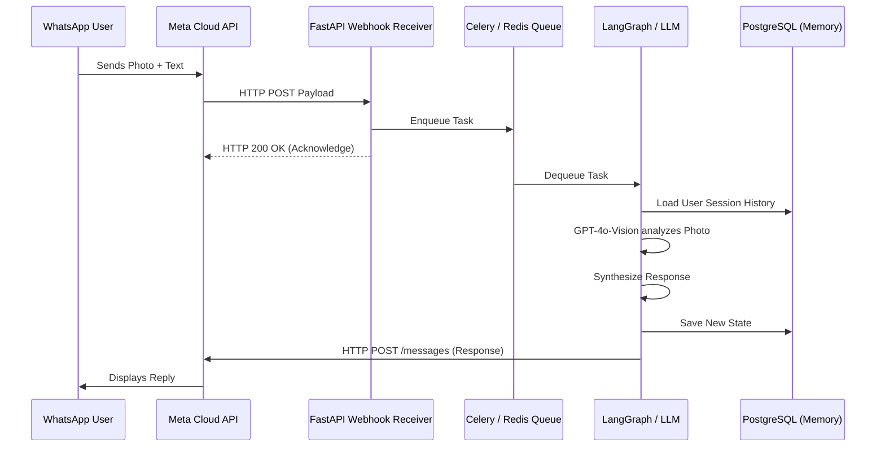

## JSON-LD Schema

```json
{
  "@context": "https://schema.org",
  "@type": "Service",
  "name": "WhatsApp AI Agent Development",
  "provider": {
    "@type": "Organization",
    "name": "Enterprise Software Architecture"
  },
  "serviceType": "Artificial Intelligence Engineering",
  "description": "Secure, asynchronous WhatsApp AI Agents leveraging the Meta Cloud API to handle multimedia support, location sharing, and conversational commerce.",
  "areaServed": "Worldwide"
}
```

## Hero Section

**Headline:** WhatsApp AI Agent Development  
**Subheadline:** Meet your customers where they already are. We engineer enterprise-grade AI Agents natively integrated into the WhatsApp Business API. Handle complex support tickets, accept multimedia uploads, and process transactions entirely within a chat thread.  

**Enterprise Value Proposition:** Customers ignore emails and rarely download dedicated brand apps. WhatsApp has a 98% open rate. We build asynchronous AI state machines that turn your WhatsApp Business number into a 24/7 concierge, capable of parsing audio voice notes, reading uploaded PDFs, and pulling live data from your CRM.

**Primary CTA:** Request a WhatsApp Bot Audit  
**Secondary CTA:** See Conversational Commerce Demos  

**Trust Indicators:** Meta Cloud API Experts | Twilio WhatsApp Partners | Multimedia LLM Support | End-to-End Encryption

## Executive Summary

WhatsApp AI Agent Development requires a fundamentally different architectural approach than web-based chatbots. WhatsApp is highly asynchronous—a user might send a message, walk away for 3 hours, and reply with a photo. The system must maintain infinite session memory, handle asynchronous webhooks flawlessly, and process multi-modal inputs (Voice Notes, Images, Location Pins). We specialize in building robust Python/FastAPI backends connected to the Meta Cloud API or Twilio, powered by multi-modal LLMs (like GPT-4o) to deliver a seamless mobile experience.

## Business Problems

- **Low Email Engagement:** Standard customer support emails sit unread in spam folders. SMS is expensive and lacks rich media. WhatsApp is ubiquitous but notoriously difficult to automate intelligently.
- **The Multimedia Bottleneck:** When a customer has a broken product, they want to send a photo. Standard chatbots cannot process images. Human agents must manually review the photo, causing massive delays in RMAs (Return Merchandise Authorizations).
- **Session Timeout Frustration:** Traditional web chats expire if the user closes the browser. WhatsApp users expect the agent to "remember" what they were talking about yesterday.
- **Lack of Authentication:** A WhatsApp phone number is a weak identifier. Without secure OAuth flows, a bot cannot safely share sensitive account data (like a bank balance) over the channel.

## Engineering Solution

We engineer **Asynchronous, Multi-Modal State Machines**.

Using LangGraph and PostgreSQL, we build persistent agent architectures. When a webhook arrives from WhatsApp, our FastAPI server instantly acknowledges the payload, pushes it to a Celery background queue, and retrieves the user's historical state. If the user sends a Voice Note, we route it to Whisper API. If they send an image, we route it to GPT-4o-Vision. The LangGraph agent synthesizes the multi-modal context, executes any required backend tools (like generating a shipping label), and pushes the text/media response back to the WhatsApp API.

## Architecture

WhatsApp architectures must strictly separate the synchronous webhook receiver from the asynchronous LLM processor to prevent webhook timeouts from Meta.

### Asynchronous WhatsApp Pipeline



## Technology Stack

- **Messaging Infrastructure:** Meta Cloud API, Twilio Messaging API, MessageBird
- **Backend Architecture:** Python (FastAPI, Celery), Redis (Queuing & Caching)
- **Database (Memory):** PostgreSQL, pgvector
- **Multi-Modal AI:** GPT-4o (Vision), Whisper API (Voice Notes), Claude 3.5
- **Agent Orchestration:** LangGraph, LangChain

## Development Process

1. **Meta API Provisioning:** Securing your WhatsApp Business API approval, registering templates, and configuring the webhook endpoints.
2. **Infrastructure Scaffolding:** Building the decoupled architecture: a fast HTTP receiver that immediately acknowledges Meta's webhooks, and a Celery worker pool that processes the heavy LLM inference.
3. **Multi-Modal Integration:** Programming the ingestion layer to detect media types. Routing `.ogg` voice notes to transcription APIs and `.jpg` payloads to Vision models.
4. **Tool Calling & CRM Sync:** Writing the Python tools that allow the agent to fetch tracking numbers, process refunds, or update HubSpot based on the user's phone number.
5. **Interactive Message UI:** Utilizing WhatsApp's native interactive UI elements (Buttons, List Messages, Product Catalogs) instead of relying solely on plain text.

## Features

- **Voice Note Parsing:** Customers can simply speak into WhatsApp. We transcribe the audio, process the intent, and reply.
- **Visual Intelligence:** Users can send a photo of a router with a blinking red light; the AI Agent analyzes the image, cross-references your technical manuals via RAG, and provides troubleshooting steps.
- **Location Processing:** Users can share their live location. The agent calculates the nearest retail store or dispatches a technician.
- **Secure Authentication Links:** The agent can send a unique, expiring JWT link. Once the user authenticates via their browser, the WhatsApp thread is temporarily authorized to discuss secure PII.

## Use Cases

### 1. Retail Concierge & Visual Search
**Problem:** A luxury fashion brand wanted to offer personalized shopping, but customers wouldn't use the website chatbot.
**Implementation:** A WhatsApp Agent powered by GPT-4o-Vision. A user texts a photo of a dress they saw on Instagram and says, "Do you have anything like this?" The agent performs a vector similarity search on the product catalog, returns 3 similar items via WhatsApp Product Cards, and allows instant checkout.
**Outcome:** A 40% increase in mobile conversion rates.

### 2. Automated Insurance Claims
**Problem:** Processing a fender-bender claim required 3 phone calls and 5 emails.
**Implementation:** The user messages the WhatsApp Agent: "I was in an accident." The agent dynamically requests their location pin, asks for photos of the damage, and uses a specialized Vision model to estimate the repair cost. The entire claim packet is pushed to the underwriter dashboard.
**Outcome:** Claim ingestion time reduced from 3 days to 5 minutes.

## Security & Compliance

- **End-to-End Encryption Constraints:** While WhatsApp messages are encrypted between the user and Meta, the webhook payload delivered to your servers is decrypted. We secure this payload behind HTTPS, validate Meta's cryptographic signatures (X-Hub-Signature), and ensure strict VPC boundaries.
- **PII Expiry:** We configure background cron jobs to purge images, voice notes, and PII from the PostgreSQL database after 30 days to comply with GDPR data retention policies.
- **Rate Limit Safeguards:** The Celery queue ensures that a sudden spike in inbound messages (e.g., a viral marketing campaign) does not crash your internal APIs.

## FAQ

**Q: Do I need Twilio or should I use the Meta API directly?**
If you require high throughput and want to avoid third-party markups, we integrate directly with the Meta Cloud API. If you already use Twilio for SMS and want a unified communications layer, we use the Twilio WhatsApp API. We architect for both.

**Q: How does the agent "remember" me from 3 weeks ago?**
Unlike web sessions which use temporary cookies, WhatsApp sessions are tied to a persistent Phone Number. We use this number as the primary key in a PostgreSQL database, storing a sliding window of the last 50 conversational turns so the LLM retains perfect context.

**Q: Can we send proactive outbound messages?**
Yes, but Meta heavily regulates this. Outbound messages initiated by the business (outside the 24-hour customer service window) must use pre-approved "Template Messages." We build the logic to trigger these templates (e.g., sending an automated shipping update).

## Related Services

- **[Enterprise AI Chatbots](/services/ai-agents/chatbots):** Deploy the same logic engine to your Next.js web application.
- **[LLM Orchestration](/services/ai-engineering/llm-orchestration):** The LangGraph architectures that give your WhatsApp bots complex reasoning capabilities.
- **[RAG Development](/services/ai-engineering/rag-development):** Connect your product catalogs or support manuals to the WhatsApp agent.

## Call To Action

**Meet your customers on their terms.**
Stop forcing mobile users to navigate clunky web portals. Schedule a WhatsApp Architecture Review with our messaging engineers today. We will build a secure, multi-modal concierge that lives directly in your customers' pockets.

[Request a WhatsApp Bot Audit]
