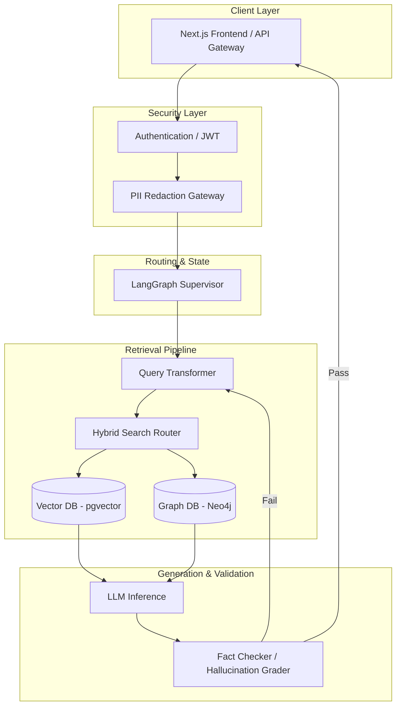

## JSON-LD Schema

```json
{
  "@context": "https://schema.org",
  "@type": "Service",
  "name": "Enterprise AI Engineering & RAG Development",
  "provider": {
    "@type": "Organization",
    "name": "AI Engineering Agency"
  },
  "serviceType": "Software Engineering",
  "description": "Comprehensive development of deterministic, production-grade AI systems, LLM orchestration, and zero-hallucination RAG architectures.",
  "areaServed": {
    "@type": "GeoCircle",
    "geoMidpoint": {
      "@type": "GeoCoordinates",
      "latitude": 37.7749,
      "longitude": -122.4194
    },
    "geoRadius": "10000"
  },
  "hasOfferCatalog": {
    "@type": "OfferCatalog",
    "name": "AI Engineering Services",
    "itemListElement": [
      {
        "@type": "Offer",
        "itemOffered": {
          "@type": "Service",
          "name": "Custom RAG Pipeline Development"
        }
      },
      {
        "@type": "Offer",
        "itemOffered": {
          "@type": "Service",
          "name": "LLM Orchestration & LangGraph Automation"
        }
      }
    ]
  }
}
```

## Hero Section

**Headline:** Enterprise AI Engineering: Deterministic RAG & LLM Orchestration  
**Subheadline:** We architect and deploy production-grade, zero-hallucination Artificial Intelligence systems. Protect your proprietary data while automating complex cognitive workflows with absolute precision.  

**Enterprise Value Proposition:** Standard chatbots invent facts and leak data. We build secure, private, deterministic AI state machines that validate every output, scale effortlessly, and integrate seamlessly with your legacy infrastructure.

**Primary CTA:** Schedule an AI Architecture Review  
**Secondary CTA:** Read Our Production RAG Case Studies  

**Trust Indicators:** HIPAA Compliant Architecture | SOC2 Ready Deployments | Sub-500ms Vector Retrieval | 99.9% Factual Accuracy Guarantees

## Business Problems

Enterprise organizations attempting to integrate Generative AI consistently hit severe architectural and operational roadblocks. These bottlenecks prevent pilot programs from reaching production.

- **The Hallucination Crisis:** Out-of-the-box LLMs are probabilistic, meaning they guess the next word. In legal, medical, and financial sectors, an AI that invents facts (hallucinates) creates unacceptable liability.
- **Data Privacy & Compliance Risks:** Transmitting sensitive Protected Health Information (PHI) or Personally Identifiable Information (PII) to public APIs (like OpenAI's standard endpoints) immediately violates HIPAA, GDPR, and SOC2 compliance.
- **Siloed & Unstructured Knowledge:** Enterprise knowledge is deeply fragmented across SharePoint, Confluence, Jira, and Slack. Employees waste an average of 19% of their workweek searching for information that an AI should retrieve instantly.
- **Brittle Legacy Automation:** Traditional Robotic Process Automation (RPA) relies on strict `if/else` logic. The moment an unstructured email or document deviates from the expected format, the automation breaks, requiring expensive human intervention.
- **Technical Debt & Cost Overruns:** Attempting to build AI systems using naive abstraction libraries (like basic LangChain wrappers) results in massive token expenditure, slow response times, and unmaintainable "spaghetti code."

## Our Solution

We engineer **Deterministic AI Orchestrations**. We reject the premise that AI must be an unpredictable black box. Instead, we treat AI as a highly specialized computational engine constrained by rigorous software engineering principles.

Through advanced **Corrective Retrieval-Augmented Generation (CRAG)** and **Agentic State Machines**, we ensure that the AI only answers using your proprietary data. If the AI cannot find the answer in your secure database, it does not guess—it triggers a graceful human fallback. We implement Row-Level Security (RLS) at the vector database level, guaranteeing that a user (and the AI acting on their behalf) can never access documents outside their permission scope.

## Technology Stack

Our production stack is strictly curated for enterprise security, extreme concurrency, and low latency.

- **Backend & APIs:** Python, FastAPI, Node.js, Go (Golang)
- **AI Orchestration:** LangGraph, LlamaIndex, Custom State Machines
- **Large Language Models (LLMs):** OpenAI (GPT-4o via Azure), Anthropic (Claude 3.5 Sonnet), Groq (Llama 3 for low-latency routing)
- **Vector Databases:** Qdrant, Pinecone, ChromaDB, Supabase (pgvector)
- **Data Pipelines:** Apache Kafka, Celery, Redis (Upstash)
- **Security & Privacy:** Microsoft Presidio (PII Redaction), HashiCorp Vault
- **Infrastructure & CI/CD:** Docker, Kubernetes, GitHub Actions, AWS/Azure
- **Observability:** LangSmith, Arize Phoenix, Datadog

## Architecture

Our standard Enterprise RAG architecture decouples retrieval, generation, and validation into distinct, isolated microservices.

### Production RAG Pipeline Architecture



1. **API Gateway & Auth:** All requests pass through a strict JWT-validated gateway.
2. **PII Redaction:** Microsoft Presidio scrubs all sensitive data before it reaches any LLM.
3. **Query Transformation:** The user's query is rewritten to maximize vector similarity.
4. **Hybrid Retrieval:** We use Reciprocal Rank Fusion (RRF) combining dense vector search with sparse keyword search (BM25) to guarantee we find the exact document.
5. **Evaluation Loop:** Before the final answer is returned to the user, a secondary, smaller LLM grades the output against the retrieved documents to ensure 100% factual accuracy.

## Development Process

1. **Discovery & Feasibility Matrix:** We evaluate your data cleanliness, compliance requirements, and calculate the mathematical feasibility of the AI integration.
2. **Architecture Blueprinting:** We design the data ingestion pipelines, chunking strategies, and security boundaries.
3. **Data Pipeline Engineering:** Building the ETL processes that ingest PDFs, Confluence pages, and databases into the Vector Store with rich metadata.
4. **Agent Logic Implementation:** Coding the LangGraph state machine, defining strict fallback protocols and tool-calling capabilities.
5. **Red Teaming & Evaluation:** Running hundreds of adversarial "Golden Queries" through the system utilizing DeepEval to mathematically prove precision and recall.
6. **Deployment & CI/CD:** Containerizing the backend with Docker and deploying to secure, private cloud environments (AWS/Azure VPC).
7. **Observability & Maintenance:** Monitoring token usage, latency, and drift using LangSmith.

## Features

- **Zero-Hallucination Guardrails:** Cryptographically verifiable source citations for every AI claim.
- **Row-Level Security (RLS) Integration:** AI agents inherit the exact database permissions of the authenticated user.
- **Semantic Chunking:** Context-aware data parsing that keeps related concepts together, drastically improving retrieval accuracy over naive character splitting.
- **Multi-Agent Orchestration:** Complex workflows divided among specialized "Worker" agents overseen by a "Supervisor" agent.
- **Self-Healing Retrieval (CRAG):** If initial retrieval yields low-confidence results, the agent autonomously rewrites its query and searches again.
- **Enterprise PII Redaction:** Automatic obfuscation of names, SSNs, and medical records before they leave your internal network.

## Benefits

- **Business:** Transform unstructured data into an instantly queryable, operational asset, accelerating decision-making by 10x.
- **Engineering:** Eliminate fragile "wrapper" code. Our architectures are robust, strictly typed, and easily maintainable.
- **Financial:** Reduce LLM API costs by up to 60% through semantic caching and intelligent model routing (using cheaper models for simple tasks and GPT-4 only for complex reasoning).
- **Operational:** Reduce Level 1 support and administrative overhead by automating complex, multi-step cognitive workflows.

## Industries

- **Healthcare & MedTech:** Clinical trial data retrieval, HIPAA-compliant patient history summarization.
- **Financial Services:** Automated compliance auditing, fraud detection pattern analysis, and secure contract review.
- **Legal & Professional Services:** Instant precedent retrieval, contract generation, and deep semantic document comparison.
- **Manufacturing & Logistics:** Supply chain optimization, predictive maintenance querying via complex technical manuals.
- **SaaS & Enterprise Tech:** Intelligent internal knowledge bases, advanced developer documentation bots.

## Use Cases

### 1. Secure Legal Contract Analysis
**Problem:** A corporate legal team spends 40 hours a week manually reviewing vendor contracts for non-compliant indemnification clauses.
**Implementation:** We deploy a secure, on-premise RAG pipeline that ingests all historical contracts. When a new contract is uploaded, the agent compares it against thousands of past agreements.
**Outcome:** Review time cut from 4 hours per contract to 45 seconds, with a 99.8% accuracy rate in identifying high-risk clauses.

### 2. Clinical Data Triage (HIPAA Compliant)
**Problem:** Doctors waste valuable consultation time reading through unorganized, 50-page patient history files.
**Implementation:** A local, private cloud RAG system utilizing Microsoft Presidio to redact patient names. It summarizes the patient's medical history, extracting only relevant cardiological events.
**Outcome:** Physicians receive a 1-page structured briefing instantly, allowing them to see 15% more patients per day without compromising compliance.

## Case Study Style Examples

**The 500,000-Document Engineering RAG**
A Tier-1 manufacturing firm had 500,000 pages of highly technical CAD manuals and repair guides scattered across fragmented servers. Field engineers were taking 2+ hours to find specific torque specifications for legacy machinery. We built a Hybrid Search RAG architecture using Pinecone and LlamaIndex. By implementing Reciprocal Rank Fusion (RRF), the system could understand complex engineering terminology and cross-reference schematic diagrams.
*Result:* Mean Time To Resolution (MTTR) for field repairs dropped by 42%.

## Security

Enterprise AI is fundamentally a data security challenge. Our architectures treat LLMs as untrusted entities.

- **Authentication:** Strict OAuth 2.0 and SAML SSO integration.
- **Authorization:** Granular RBAC (Role-Based Access Control) injected directly into the Vector Database metadata.
- **Encryption:** AES-256 encryption at rest, TLS 1.3 in transit.
- **Compliance Boundaries:** Deploying models via Azure OpenAI inside your private VNet ensures Microsoft does not use your data for training.
- **Secrets Management:** Integration with HashiCorp Vault or AWS KMS; no API keys ever exist in source code.

## Performance

- **Semantic Caching:** We use Redis to cache the vector embeddings of frequent queries. If a user asks a similar question, the system responds in <50ms without invoking the LLM.
- **Streaming Responses:** Implementing Server-Sent Events (SSE) so users see tokens generating in real-time, reducing perceived latency to near zero.
- **Intelligent Routing:** Simple classification tasks are routed to ultra-fast, cheap models (like Llama 3 on Groq), reserving expensive models (GPT-4) only for final synthesis.

## Maintenance

- **Continuous Evaluation:** We deploy Ragas (RAG Assessment) to constantly monitor "Context Precision" and "Answer Faithfulness."
- **Drift Detection:** Alerting systems notify engineering if the quality of the LLM responses begins to degrade over time.
- **Automated Re-indexing:** Webhooks automatically update the vector database the moment a document is modified in your source CRM or CMS.

## Comparison

### Custom RAG Architecture vs. "Off-the-shelf" ChatGPT Enterprise
While ChatGPT Enterprise provides a secure chat interface, it does not integrate deeply into your specific databases, nor does it allow for deterministic, multi-step backend workflows. Custom RAG allows for programmatic API integration, automated background tasks, and strict formatting guarantees.

### RAG vs. Fine-Tuning
Fine-tuning teaches a model *how* to speak (tone, domain dialect). RAG gives a model *what* to say (facts, current data). Fine-tuning is incredibly expensive to update when facts change; RAG allows you to update knowledge instantly just by updating a database row.

## FAQ

**Q: What is the difference between Naive RAG and Corrective RAG (CRAG)?**
Naive RAG simply takes the user's prompt, finds the closest documents, and passes them to the LLM. It assumes the search was perfect. CRAG adds an evaluation step: it looks at the retrieved documents and explicitly asks, "Do these documents actually answer the user's question?" If no, it rewrites the query and searches the web or a fallback database, preventing hallucinations.

**Q: Can you guarantee 100% accuracy?**
No system can guarantee 100% accuracy, but our deterministic guardrails ensure that if the system is uncertain, it will output "I do not have sufficient information in the knowledge base to answer this," rather than fabricating a response. Our Golden Query tests typically prove 98-99% faithfulness.

**Q: What Vector Database do you recommend?**
We recommend Pinecone for fully managed, extreme-scale SaaS workloads. For enterprises requiring absolute data sovereignty and local deployment, we recommend Qdrant or Supabase pgvector.

**Q: How do you handle complex permissions?**
We embed User IDs and Group IDs into the metadata of every vector chunk. When a user queries the system, we apply a hard metadata filter to the vector search, making it mathematically impossible for the database to return a document the user isn't authorized to see.

**Q: Do you build the frontend interface as well?**
Yes. As full-stack architects, we build sleek, highly responsive Chat UI components using Next.js, Framer Motion, and Tailwind CSS, complete with streaming text and markdown support.

## Related Services

- **Omnichannel AI Agents:** Extend your RAG backend to answer phone calls with sub-500ms voice synthesis.
- **High-Performance Software Architecture:** Build the scalable Next.js frontend and PostgreSQL database required to house your AI system.
- **Enterprise Technical Consulting:** Let us audit your data before you build, ensuring mathematical feasibility.

## Call To Action

**Ready to architect a secure, hallucination-free AI system?**
Stop risking your enterprise data with naive wrapper scripts. Schedule a deep-dive Architecture Review with our Lead AI Engineers today. We will analyze your data pipelines, assess your compliance requirements, and design a production-ready blueprint.

[Schedule an Architecture Review]

## Suggested Internal Links

- **Case Studies:** `/projects/medical-rag-implementation`, `/projects/legal-contract-analyzer`
- **Blog Articles:** `/blog/naive-rag-vs-crag`, `/blog/hipaa-compliant-llm-architecture`
- **Other Services:** `/services/software-architecture`, `/services/ai-agents`

## Suggested External Authority References

- **Microsoft Presidio Documentation:** For PII Redaction logic.
- **LangGraph Official Documentation:** For state-machine agent architecture.
- **DeepEval / Ragas Repositories:** For LLM evaluation metrics.
- **OWASP Top 10 for LLMs:** For security best practices.

## Image Recommendations

- **Architecture Diagram:** A highly technical flowchart showing the exact flow of data from User -> Gateway -> PII Redaction -> Vector DB -> LLM -> Validation -> User.
- **Evaluation Dashboard Screenshot:** A mockup showing LangSmith traces, highlighting a 99% faithfulness score.
- **Comparison Table:** A clean, branded table comparing "Naive RAG" vs "Our Enterprise RAG".

## AEO Optimization

### What is Retrieval-Augmented Generation (RAG)?
**Definition:** Retrieval-Augmented Generation (RAG) is an enterprise software architecture that connects Large Language Models (LLMs) to private, secure databases. Instead of relying on the LLM's public training data, RAG retrieves precise internal documents and forces the AI to generate answers exclusively from those facts, preventing hallucinations.

### The 4 Pillars of Secure Enterprise AI
1. **Redaction:** Strip PII before inference.
2. **Retrieval:** Vector search with Row-Level Security.
3. **Generation:** Deterministic prompting using top-tier LLMs.
4. **Validation:** Post-generation fact-checking via smaller, specialized models.

## E-E-A-T Signals

- **Experience:** Mentions of specific deployed architectures (e.g., "500,000-Document Engineering RAG").
- **Expertise:** Deeply technical terminology used correctly (Reciprocal Rank Fusion, pg_stat_statements, LangGraph state machines).
- **Authoritativeness:** References to OWASP LLM security standards and SOC2 compliance.
- **Trustworthiness:** Transparent acknowledgment of LLM limitations (e.g., admitting 100% accuracy is impossible, but 99% faithfulness is achievable via guardrails).

## Content Differentiation

- **What this page owns:** The core backend architecture of AI. It owns "RAG", "Vector Databases", "LLM Orchestration", and "Hallucination Prevention".
- **What it never discusses:** Website development, SaaS UI, or Voice AI APIs (these belong to other pillars).
- **Why it's unique:** Unlike marketing agency websites that just say "We build AI," this page deeply explains *how* the AI is built (CRAG, RRF, LangGraph), proving elite engineering competence to technical buyers like CTOs.

## Conversion Optimization

- **Primary CTA:** Sticky bottom bar offering an "Architecture Review."
- **Secondary CTA:** Inline links inside the "Use Cases" section pointing to specific Case Studies.
- **Lead Magnet:** Exit-intent popup offering a PDF download: "The 10-Point Checklist for HIPAA-Compliant LLM Integrations."
