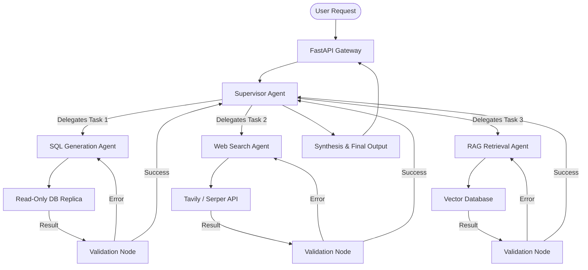

## JSON-LD Schema

```json
{
  "@context": "https://schema.org",
  "@type": "Service",
  "name": "Enterprise LLM Orchestration Services",
  "provider": {
    "@type": "Organization",
    "name": "Enterprise Software Architecture"
  },
  "serviceType": "Artificial Intelligence Engineering",
  "description": "Deterministic, multi-agent LLM orchestrations using LangGraph and LangChain to automate complex enterprise operations securely.",
  "areaServed": {
    "@type": "GeoCircle",
    "geoMidpoint": {
      "@type": "GeoCoordinates",
      "latitude": 37.7749,
      "longitude": -122.4194
    },
    "geoRadius": "10000"
  }
}
```

## Hero Section

**Headline:** Enterprise LLM Orchestration & Multi-Agent Development  
**Subheadline:** Move beyond simple chatbots. We architect deterministic, self-correcting AI state machines using LangGraph. Automate your most complex operational workflows with AI agents that plan, execute, verify, and fall back securely.  

**Enterprise Value Proposition:** General-purpose LLMs cannot execute multi-step logic reliably. We engineer autonomous "Supervisor" and "Worker" agent networks that break down massive enterprise tasks, utilizing external APIs, executing Python code safely, and mathematically verifying their own work before reporting back.

**Primary CTA:** Schedule an Orchestration Architecture Review  
**Secondary CTA:** Read Our Multi-Agent Case Studies  

**Trust Indicators:** LangGraph Experts | SOC2 Ready | Fault-Tolerant Architectures | Predictable Execution

## Executive Summary

Enterprise LLM Orchestration is the discipline of wrapping probabilistic AI models inside highly deterministic software architectures. While a standard LLM call simply generates text, an orchestrated LLM system acts as a reasoning engine within a state machine. It can decide *which* tools to use, *when* to query a database, and *how* to recover from API failures. We specialize in building these advanced graphs using frameworks like LangGraph, enabling enterprises to automate complex workflows (e.g., supply chain triage, financial auditing, code review) with the reliability of traditional software.

## Business Problems

- **The Limitation of Linear Scripts:** Traditional RPA (Robotic Process Automation) and Zapier pipelines break instantly when they encounter unstructured data (like a humanly written email). They lack cognitive flexibility.
- **Brittle LLM Pipelines:** Companies that attempt to chain LLM prompts together using naive Python scripts find that a hallucination at Step 1 destroys the output of Step 5. There is no autonomous error recovery.
- **Context Window Exhaustion:** Complex tasks (like analyzing a 500-page financial disclosure) exceed LLM context windows. Standard systems cannot break these massive tasks into parallel sub-tasks.
- **Security & Execution Risks:** Allowing an AI to execute code or write to a database autonomously introduces catastrophic security risks if the system lacks human-in-the-loop (HITL) approval gates.

## Engineering Solution

We engineer **Stateful, Multi-Agent Architectures**.

Instead of writing linear scripts, we model your business process as a Directed Cyclic Graph (DCG) using LangGraph. We deploy highly specialized "Worker" agents (e.g., an agent strictly trained to write SQL, another strictly trained to summarize legal risk). A central "Supervisor" agent receives the user's request, drafts an execution plan, delegates sub-tasks to the workers in parallel, aggregates their results, and grades the final output. If a worker fails, the supervisor forces it to retry.

## Architecture

Our orchestration architecture heavily relies on graph-based state management and asynchronous task queues.

### Multi-Agent Orchestration Flow



1. **State Injection:** Every node in the graph reads from and writes to a centralized "State" object, maintaining exact memory of what has been accomplished.
2. **Tool Execution:** Agents do not interact with your production database. They interact with secure, stateless REST APIs or Docker-sandboxed Python interpreters.
3. **Cyclic Correction:** If a generated SQL query fails, the error message is passed back to the SQL Generation Agent, which autonomously rewrites and re-executes the query up to a predefined limit.

## Technology Stack

- **Orchestration:** LangGraph, LangChain, AutoGen
- **Languages:** Python (FastAPI, Celery), TypeScript (Node.js)
- **State Management:** Redis, PostgreSQL, SQLite (for local graph state)
- **LLMs:** OpenAI (GPT-4o), Anthropic (Claude 3.5 Sonnet for advanced coding/reasoning), Groq (Llama 3 for sub-second classification)
- **Tools & APIs:** Tavily (Search), E2B (Sandboxed Code Execution), Custom Webhooks
- **Observability:** LangSmith, Datadog

## Development Process

1. **Workflow Decomposition:** We break your complex human workflow into discrete, measurable sub-tasks.
2. **Agent Persona Design:** We engineer specific system prompts and tool constraints for each Worker agent.
3. **Graph Construction:** We write the LangGraph nodes and edges, defining exactly how state flows and where the cyclic evaluation loops exist.
4. **Human-in-the-Loop Integration:** We implement breakpoint nodes where the graph pauses execution, sending a Slack/Teams message to a human manager to approve a high-risk action (like sending an email or executing a database write).
5. **Load Testing:** Simulating thousands of parallel agent executions using Celery and Redis to ensure the system scales without dropping state.

## Security

- **Sandboxed Execution:** When agents write and execute Python code to analyze data, the execution happens inside ephemeral, network-isolated Docker containers (e.g., using E2B). They cannot access the host machine.
- **Read-Only Database Access:** SQL-generating agents are provided with connection strings to read-only replicas, mathematically preventing accidental `DROP TABLE` or `UPDATE` statements.
- **Human-in-the-Loop (HITL):** LangGraph allows us to define "interrupt" points. The state machine halts and serializes its memory to Postgres. It waits indefinitely for a human JWT token to approve the next edge traversal.

## Performance & Scalability

- **Parallel Processing:** The Supervisor agent utilizes Python `asyncio` and Celery workers to execute independent sub-tasks concurrently. If analyzing 50 documents, it spawns 50 parallel worker agents.
- **State Serialization:** By saving the graph's state to Redis after every node execution, the orchestration can survive server crashes. If the server reboots, the graph resumes exactly where it left off.
- **Model Routing:** We route simple formatting tasks to extremely fast, cheap models (Llama 3 8B), and reserve heavy reasoning tasks for GPT-4o, cutting API costs by up to 70%.

## Industries

- **Finance:** Autonomous agents that ingest quarterly reports, extract specific financial metrics, execute Python pandas scripts to calculate ratios, and generate executive summaries.
- **Logistics:** Supply chain triage agents that read unstructured emails from vendors about delays, query the ERP system for impacted orders, and draft mitigation plans for human approval.
- **Software Engineering:** Autonomous code review agents that read GitHub PRs, run static analysis tools, and suggest architectural improvements inline.

## Case Studies

### The Financial Audit Multi-Agent System
**Problem:** A Big-4 accounting firm required 12 hours of associate time to audit a single corporate client's unstructured expense reports against their SQL compliance database.
**Implementation:** We deployed a LangGraph architecture with three agents: An OCR/RAG Agent to read receipts, a SQL Agent to query the internal compliance rules, and a Synthesis Agent to write the audit report. 
**Outcome:** Audit time was reduced to 4 minutes per client. The system correctly flagged 99.4% of non-compliant expenses, and all "flagged" items were routed to a human dashboard for final approval.

## FAQs

**Q: Why use LangGraph over standard LangChain?**
Standard LangChain focuses on linear chains (A -> B -> C). If B fails, the chain dies. LangGraph introduces cycles and state. If B fails, the graph can loop back to A, ask it to fix the input, and try B again. It allows for autonomous error recovery, which is mandatory for production.

**Q: Are these agents fully autonomous?**
They are as autonomous as you allow them to be. For read-only tasks, they run completely autonomously. For write-heavy or high-risk tasks, we enforce Human-in-the-loop (HITL) breakpoints.

**Q: How do you prevent infinite loops?**
We implement strict recursion limits (e.g., `recursion_limit=5`). If the SQL agent fails to write a valid query 5 times in a row, the graph halts and gracefully escalates to a human engineer.

**Q: Can you orchestrate different models in the same workflow?**
Yes. This is highly recommended. We frequently use Claude 3.5 Sonnet for writing code, GPT-4o for logical synthesis, and Llama 3 for fast, simple JSON formatting within the exact same graph.

## Related Services

- **[RAG Development](/services/ai-engineering/rag-development):** Often integrated as a "tool" that Worker agents can query to fetch enterprise knowledge.
- **[Prompt Engineering](/services/ai-engineering/prompt-engineering):** The foundational layer of giving Worker agents their specific personas and constraints.
- **[Backend Engineering](/services/software-engineering/backend-development):** Developing the FastAPI endpoints that expose the LangGraph state machine to your Next.js frontend.

## Call To Action

**Automate the impossible.**
Stop relying on fragile scripts. Schedule an Orchestration Architecture Review with our Lead AI Engineers. We will analyze your complex human workflows and design a deterministic, multi-agent state machine that scales infinitely.

[Schedule an Orchestration Review]
