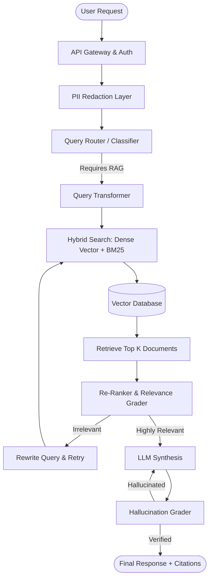

## JSON-LD Schema

```json
{
  "@context": "https://schema.org",
  "@type": "Service",
  "name": "Custom RAG Development Services",
  "provider": {
    "@type": "Organization",
    "name": "Enterprise Software Architecture"
  },
  "serviceType": "Artificial Intelligence Engineering",
  "description": "Production-grade Retrieval-Augmented Generation (RAG) development ensuring zero hallucinations, strict data security, and sub-500ms retrieval latencies.",
  "areaServed": {
    "@type": "GeoCircle",
    "geoMidpoint": {
      "@type": "GeoCoordinates",
      "latitude": 37.7749,
      "longitude": -122.4194
    },
    "geoRadius": "10000"
  }
}
```

## Hero Section

**Headline:** Enterprise RAG Development Company  
**Subheadline:** Build deterministic, zero-hallucination AI systems. We architect production-grade Retrieval-Augmented Generation (RAG) pipelines that securely connect top-tier LLMs directly to your proprietary enterprise data.  

**Enterprise Value Proposition:** General-purpose AI invents facts and hallucinates. We engineer custom RAG state machines that mathematically guarantee factual accuracy by retrieving context exclusively from your private databases, while enforcing strict Row-Level Security.

**Primary CTA:** Schedule a RAG Architecture Review  
**Secondary CTA:** View RAG Production Case Studies  

**Trust Indicators:** SOC2 Ready Deployments | Sub-500ms Retrieval Latency | Advanced CRAG Architecture | Pinecone & Qdrant Integration

## Business Problem

Generative AI adoption is stalling at the enterprise level because standard Large Language Models (LLMs) are fundamentally incompatible with high-stakes business logic.

- **The Hallucination Liability:** In fields like healthcare, finance, and legal tech, a chatbot that "hallucinates" (fabricates facts or citations) is not just annoying—it creates catastrophic legal liability.
- **The Data Silo Crisis:** Enterprise knowledge is deeply fragmented. An organization's truth lives scattered across Confluence pages, Jira tickets, PDF manuals, and PostgreSQL databases. Standard AI cannot access this data securely.
- **The Context Window Limitation:** You cannot simply paste a 10,000-page operational manual into ChatGPT. The context window is too small, and the token cost would be astronomically expensive.
- **Data Privacy Violations:** Sending raw customer PII or patient PHI to a public OpenAI endpoint immediately violates HIPAA, GDPR, and internal security policies.

## Why Existing Solutions Fail

- **Naive Abstraction Libraries:** Many agencies rely on basic "out-of-the-box" LangChain wrapper tutorials. These "Naive RAG" systems blindly retrieve the top 3 vector matches and pass them to the LLM. If the retrieval is poor, the LLM hallucinates anyway.
- **Poor Chunking Strategies:** Standard systems split documents arbitrarily by character count (e.g., every 1,000 characters). This splits sentences in half, destroys semantic meaning, and results in catastrophic retrieval failures.
- **Lack of Evaluation Loops:** Prototype RAG systems have no way of knowing if they answered the user's question correctly. They lack the autonomous evaluation loops necessary for self-correction.

## Our Solution

We build **Deterministic RAG Architectures** (specifically Corrective RAG or CRAG). 

We do not treat AI as a black box; we treat it as a heavily constrained software component within a larger, deterministic state machine. By deploying sophisticated embedding models, semantic chunking strategies, and Reciprocal Rank Fusion (RRF), we guarantee that the vector database surfaces the mathematically exact document required. We then force the LLM to synthesize an answer strictly bound by that retrieved context.

## Technology Stack

We exclusively utilize enterprise-grade, production-ready infrastructure:

- **Vector Databases:** Pinecone, Qdrant, ChromaDB, Supabase (pgvector)
- **Orchestration Frameworks:** LangGraph, LlamaIndex, LangChain
- **Embedding Models:** OpenAI `text-embedding-3-large`, Cohere, BGE-M3
- **LLM Inference:** OpenAI (GPT-4o), Anthropic (Claude 3.5 Sonnet), Groq (Llama 3 for fast routing)
- **Backend & APIs:** Python, FastAPI, Go (Golang)
- **Security & Redaction:** Microsoft Presidio (PII redaction)
- **Evaluation & Observability:** Ragas, DeepEval, LangSmith, Arize Phoenix

## Architecture

Our production RAG pipeline decouples the system into highly observable, isolated microservices.

### The Corrective RAG (CRAG) Pipeline



1. **Query Transformation:** The user's prompt is rewritten to maximize vector similarity against the specific embedding space of the database.
2. **Hybrid Retrieval:** We query both a dense Vector Database (semantic meaning) and a sparse index like BM25 (exact keyword matching), fusing the results using Reciprocal Rank Fusion (RRF).
3. **Re-ranking:** A cross-encoder model re-ranks the retrieved documents to push the most relevant context to the top.
4. **Validation Loop:** A secondary evaluator LLM grades the final output against the source documents to guarantee faithfulness before responding to the user.

## Development Process

1. **Discovery & Data Auditing:** We analyze your proprietary data formats (PDFs, SQL databases, APIs) and define the schema for metadata filtering.
2. **Chunking & Ingestion Strategy:** We design semantic chunking algorithms that respect document structure (headers, paragraphs, tables) rather than arbitrary character limits.
3. **Pipeline Construction:** Engineering the retrieval pipeline, integrating the embedding models, and establishing the Vector Database infrastructure.
4. **Agent Logic (LangGraph):** Building the state machine that handles routing, tool calling, and fallback mechanisms.
5. **Red Teaming & Ragas Evaluation:** We generate hundreds of adversarial "Golden Queries" to mathematically prove the system's Precision, Recall, and Faithfulness.
6. **Deployment:** Containerizing the backend via Docker and deploying to your secure cloud (AWS/Azure) behind strict VPC perimeters.

## Benefits

- **Business Outcomes:** Automate complex knowledge-retrieval tasks, allowing employees to make data-driven decisions in seconds rather than hours.
- **Engineering Reliability:** Stop dealing with brittle, unpredictable chatbot scripts. Our deterministic pipelines fail gracefully and log every decision path.
- **Financial Efficiency:** Radically reduce token costs by caching semantic queries using Redis, bypassing expensive LLM inference for repeat questions.
- **Compliance:** Keep your data private. By deploying open-source embedding models and utilizing Azure's private endpoints, your data is never used to train public models.

## Use Cases

### 1. Corporate Policy & HR Triage
**Problem:** HR teams waste 40% of their day answering repetitive questions about PTO, benefits, and compliance protocols hidden inside a 500-page employee handbook.
**Implementation:** A RAG agent ingests the entire corporate intranet. When an employee asks, "How many weeks of paternity leave do I get in California?", the system uses metadata filtering to isolate California-specific policies and returns an exact, cited answer.
**Outcome:** HR support tickets reduced by 75%; employee resolution time drops to 3 seconds.

### 2. Engineering Maintenance Manuals
**Problem:** Field technicians spend hours searching through thousands of legacy PDF schematics to find the correct torque specifications for industrial machinery.
**Implementation:** We implement a Hybrid Search RAG system capable of understanding complex alphanumeric part numbers (BM25 search) while understanding the semantic context of the repair (Vector search).
**Outcome:** Technicians instantly query the manuals via a mobile interface, dropping Mean Time To Resolution (MTTR) by 40%.

## Security

Enterprise RAG fundamentally alters the attack surface of your application. We mitigate these vectors at the architectural level.

- **Prompt Injection Defense:** We isolate the user's query from the system prompt, utilizing specific parser frameworks to sanitize inputs before they hit the LLM.
- **Row-Level Security (RLS):** We embed User IDs and Tenant IDs directly into the vector metadata. The vector database performs a hard filter *before* semantic search, guaranteeing the AI cannot retrieve a document the user is unauthorized to read.
- **PII Obfuscation:** Using Microsoft Presidio, we automatically redact Social Security Numbers, credit cards, and names from the prompt before it ever reaches the embedding model.

## FAQ

**Q: Why do I need a Custom RAG system instead of just uploading a PDF to ChatGPT?**
ChatGPT's PDF upload feature is severely limited in context size, does not update automatically, and violates enterprise data privacy policies. A custom RAG system continuously synchronizes with your live databases, scales to millions of documents, and keeps your data strictly within your private cloud.

**Q: What is Semantic Chunking?**
LLMs have limited context windows, so large documents must be split into "chunks" before being saved to a vector database. Standard chunking splits text blindly (e.g., every 500 words), which often cuts a crucial sentence in half. Semantic chunking uses NLP to split text logically at the end of paragraphs or sections, preserving the core meaning.

**Q: Can RAG systems read tables and images?**
Yes. Advanced RAG architectures use multi-modal embedding models (like CLIP) or specialized table-extraction OCR to parse structured data and graphs, storing their semantic meaning alongside standard text.

**Q: How do you prevent hallucinations?**
We use Corrective RAG (CRAG). The agent is strictly instructed to answer *only* using the retrieved context. We then insert an evaluation node in our LangGraph state machine that explicitly grades the answer against the source text. If the answer contains facts not present in the source, the system rejects it and rewrites the query.

## Related Services

- **[LLM Engineering](/services/ai-engineering/llm-engineering):** Fine-tune specific models to understand your highly specialized industry jargon.
- **[Backend Engineering](/services/software-engineering/backend-engineering):** Develop the highly concurrent APIs required to serve RAG requests to millions of users.
- **[AI Feasibility Study](/services/technical-consulting/ai-feasibility-study):** Let us audit your dataset mathematically before you commit capital to full RAG development.

## Call To Action

**Stop prototyping. Start deploying.**
Naive RAG tutorials won't survive enterprise production. Schedule a technical architecture review with our Lead AI Engineers. We will assess your data silos, design a high-precision retrieval pipeline, and build a hallucination-free AI system that your legal team will actually approve.

[Schedule a RAG Architecture Review]
