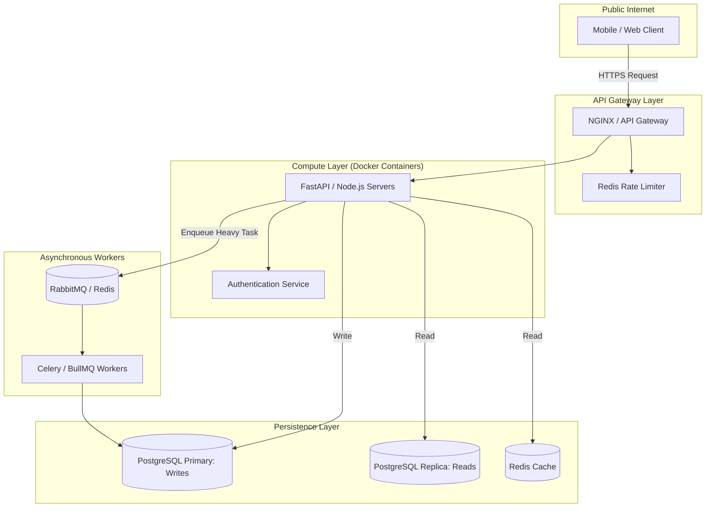

## JSON-LD Schema

```json
{
  "@context": "https://schema.org",
  "@type": "Service",
  "name": "Backend Engineering & API Development",
  "provider": {
    "@type": "Organization",
    "name": "Enterprise Software Architecture"
  },
  "serviceType": "Software Engineering",
  "description": "High-concurrency REST and GraphQL API architectures built in Python, Go, and Node.js, designed to handle massive throughput and strict data integrity.",
  "areaServed": "Worldwide"
}
```

## Hero Section

**Headline:** Enterprise Backend Engineering  
**Subheadline:** The invisible engine powering your business. We build highly concurrent, fault-tolerant backend architectures and REST/GraphQL APIs that process millions of requests without dropping a single connection.  

**Enterprise Value Proposition:** A beautiful frontend is useless if the backend takes 5 seconds to query the database. We architect robust server logic using Python (FastAPI), Go, and Node.js. We implement strict connection pooling, asynchronous task queues, and master/replica database architectures to guarantee extreme scalability and sub-100ms response times.

**Primary CTA:** Request a Backend Architecture Audit  
**Secondary CTA:** Review API Case Studies  

**Trust Indicators:** Sub-100ms API Latency | PostgreSQL Experts | Asynchronous Task Queues | Strict JWT/OAuth Security

## Executive Summary

Backend Engineering is the science of data modeling, security, and concurrency. As your application grows, the bottleneck always shifts to the server layer: slow SQL queries, RAM exhaustion, and blocking HTTP calls. We specialize in decoupling monolithic backends into scalable microservices or highly optimized modular monoliths. We design APIs that act as impenetrable, high-speed gateways between your user-facing applications and your proprietary databases, ensuring that data is never corrupted, leaked, or bottlenecked.

## Business Problems

- **The Database Bottleneck:** Applications crash during traffic spikes not because the server dies, but because the database maxes out its connection limit. Unoptimized ORM queries drag down the entire system.
- **Blocking Operations:** When a user uploads a video or requests a PDF report, a poorly designed API blocks the main thread while processing the file, causing all other users on the platform to experience a frozen application.
- **Inconsistent Data States:** In e-commerce or fintech applications, race conditions (two users clicking "Buy" at the exact same millisecond) can result in negative inventory or double-billing if the backend lacks strict transactional locking.
- **API Sprawl:** Undocumented, version-less APIs make it impossible for external clients or mobile app teams to integrate with your system without breaking code.

## Engineering Solution

We build **Asynchronous, Horizontally Scalable Architectures**.

We eliminate blocking operations by utilizing background task queues (Celery, BullMQ, RabbitMQ). If a task takes longer than 500ms, the API immediately returns an HTTP 202 (Accepted) and processes the work in the background. We utilize strict OpenAPI (Swagger) specifications for REST, or GraphQL schemas, ensuring that frontend teams have mathematically precise documentation of exactly what the backend expects and returns.

## Architecture

A production-grade backend isolates public traffic from internal state and heavy compute.

### High-Concurrency Backend Architecture



## Technology Stack

- **Languages & Frameworks:** Python (FastAPI, Django), Go (Golang), Node.js (NestJS, Express), TypeScript
- **Databases (RDBMS):** PostgreSQL, MySQL, Amazon Aurora
- **Databases (NoSQL):** MongoDB, DynamoDB, Cassandra
- **In-Memory & Queues:** Redis, RabbitMQ, Apache Kafka, Celery
- **API Paradigms:** RESTful APIs, GraphQL, gRPC, WebSockets
- **Infrastructure:** Docker, Kubernetes, AWS ECS, Serverless Framework

## Development Process

1. **Entity Relationship Diagram (ERD) Modeling:** We design normalized database schemas (3NF) to guarantee data integrity, carefully adding indexes to heavily queried columns.
2. **API Contract Definition:** We write the OpenAPI spec *first*. Frontend and mobile teams can immediately mock the API while backend engineers build the actual logic.
3. **Authentication & Middleware:** Implementing JWT token validation, CORS policies, global error handling, and IP rate-limiting at the middleware level.
4. **Business Logic Implementation:** Writing the complex data transformations, ensuring that external API calls (e.g., Stripe, SendGrid) are handled gracefully with exponential backoff retries.
5. **Load Testing:** Utilizing tools like Locust or k6 to bombard the API with thousands of concurrent requests, profiling the server to identify and rewrite slow SQL queries.

## Security & Compliance

- **SQL Injection Prevention:** We strictly utilize parameterized queries via enterprise-grade ORMs (Prisma, SQLAlchemy, GORM) to mathematically eliminate SQL injection vulnerabilities.
- **Row-Level Security (RLS):** For multi-tenant SaaS applications, we implement tenant isolation at the database level. A bug in the application code can never accidentally return Company A's data to Company B.
- **Zero-Trust Networking:** The database and worker nodes sit in private subnets with no public IP addresses. They are completely inaccessible from the outside internet, protected by strict AWS Security Groups.

## Performance & Scalability

- **Database Connection Pooling:** We use tools like PgBouncer to multiplex thousands of API connections down to a handful of actual database connections, preventing memory exhaustion on the database server.
- **Read Replicas:** 90% of web traffic is "read" traffic. We route `GET` requests to geographically distributed read-replica databases, reserving the primary database exclusively for `POST/PUT` write operations.
- **Aggressive Caching:** We cache expensive query results in Redis. If a dashboard takes 2 seconds to compute, we compute it once, cache it for 5 minutes, and serve it to subsequent users in 10 milliseconds.

## Use Cases

### 1. High-Frequency Delivery Logistics
**Problem:** A logistics startup's legacy Ruby on Rails backend crashed every Friday night because 5,000 delivery drivers pinged the server with GPS coordinates simultaneously.
**Implementation:** We rewrote the ingestion service in Go (Golang). Go's lightweight goroutines allowed the server to absorb 50,000 WebSockets concurrently with less than 2GB of RAM. The coordinates were buffered in Redis before being batch-written to PostgreSQL.
**Outcome:** Zero downtime during peak hours and a 80% reduction in AWS EC2 hosting costs.

### 2. FinTech Ledger Modernization
**Problem:** A payment application suffered from race conditions. Users clicking "Transfer" twice rapidly would sometimes duplicate the transaction.
**Implementation:** We implemented strict ACID-compliant database transactions using PostgreSQL `SELECT ... FOR UPDATE` locking. 
**Outcome:** Race conditions mathematically eliminated. Financial data integrity secured.

## FAQ

**Q: Should we use REST or GraphQL?**
REST is excellent for standard, predictable data models and offers superior HTTP-level caching. GraphQL is superior for complex frontend dashboards where the client needs to pull deeply nested relationships (e.g., a User, their Orders, and the Order Items) in a single, bandwidth-efficient request. We build both based on your requirements.

**Q: Why do you recommend Python FastAPI?**
FastAPI leverages modern Python asynchronous capabilities (`async/await`) and Pydantic type validation. It is exceptionally fast, auto-generates Swagger documentation, and integrates flawlessly with the data-science and AI ecosystems.

**Q: Can you rescue our existing messy backend?**
Yes. We perform [Architecture Reviews](/services/technical-consulting/architecture-review) to identify the "strangler fig" pattern. Instead of a massive, risky rewrite, we slowly migrate endpoints one-by-one to a modern microservice until the old legacy monolith can be safely deleted.

## Related Services

- **[Next.js Development](/services/software-engineering/nextjs-development):** We build the beautiful, high-speed frontends that consume these backend APIs.
- **[SaaS Development](/services/software-engineering/saas-development):** We package these robust APIs into fully functional B2B products.
- **[LLM Orchestration](/services/ai-engineering/llm-orchestration):** Advanced AI Agents require highly secure REST APIs to interact with your enterprise data.

## Call To Action

**Build a foundation that won't crack.**
Stop dealing with random 500 errors and slow page loads. Schedule an API architecture review with our Backend Engineers. We will design a decoupled, asynchronous system capable of scaling to millions of requests.

[Schedule a Backend Architecture Audit]
