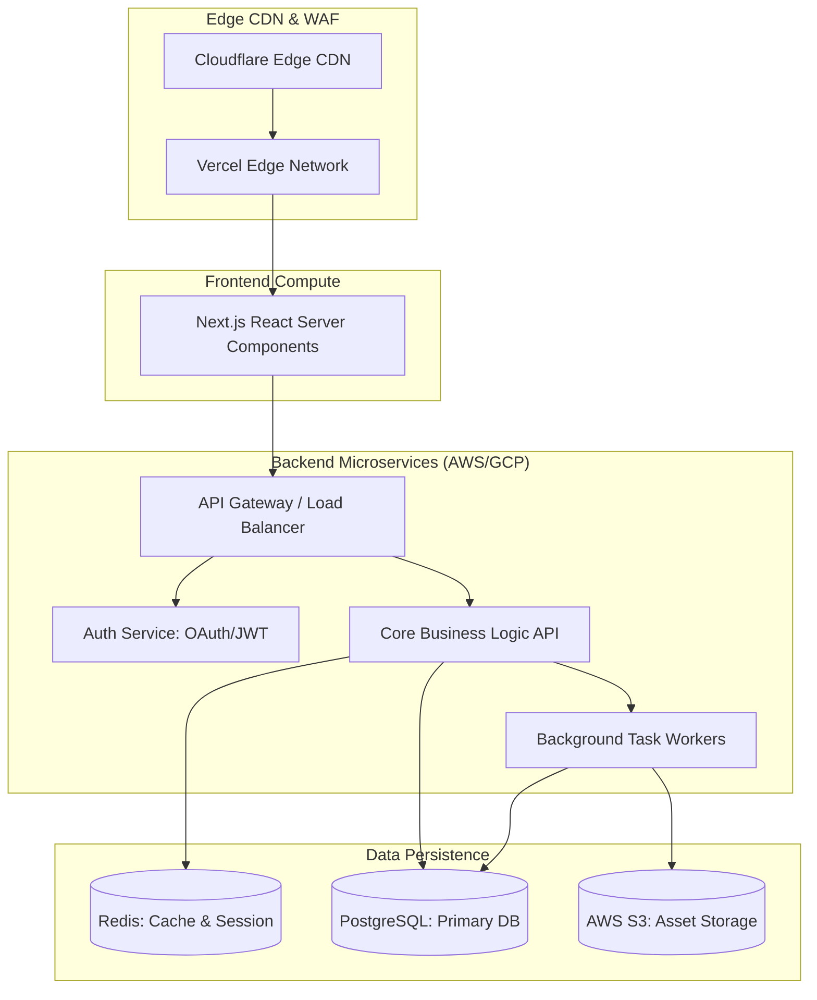

## JSON-LD Schema

```json
{
  "@context": "https://schema.org",
  "@type": "Service",
  "name": "Enterprise Software Engineering Services",
  "provider": {
    "@type": "Organization",
    "name": "Enterprise Software Architecture"
  },
  "serviceType": "Software Engineering",
  "description": "High-performance enterprise software engineering and architecture consulting. We build scalable SaaS platforms and backend systems.",
  "areaServed": "Worldwide",
  "hasOfferCatalog": {
    "@type": "OfferCatalog",
    "name": "Software Engineering Solutions",
    "itemListElement": [
      {
        "@type": "Offer",
        "itemOffered": {
          "@type": "Service",
          "name": "Backend Engineering Services",
          "url": "https://maziz.me/services/software-engineering/backend-engineering"
        }
      },
      {
        "@type": "Offer",
        "itemOffered": {
          "@type": "Service",
          "name": "Next.js Development Company",
          "url": "https://maziz.me/services/software-engineering/nextjs-development"
        }
      }
    ]
  }
}
```

## Hero Section

**Headline:** Enterprise Software Engineering  
**Subheadline:** Build software that scales infinitely and fails gracefully. We architect high-performance, fault-tolerant web applications and microservices for enterprises that cannot afford downtime.  

**Enterprise Value Proposition:** Freelancers build features; we build systems. A poorly architected application collapses under the weight of its own technical debt. We bring rigorous, tier-1 engineering principles to your custom software, ensuring your codebase remains highly maintainable, testable, and completely secure as you scale from 1,000 to 1,000,000 users.

**Primary CTA:** Discuss Your Software Architecture  
**Secondary CTA:** Review Our Enterprise Deployments  

**Trust Indicators:** Next.js App Router Experts | Asynchronous Python Backends | Zero-Downtime Deployments | SOC2 Infrastructure

## Executive Summary

Enterprise Software Engineering goes far beyond writing syntax. It is the discipline of managing complexity. As an application grows, the distance between the frontend user interface and the backend database creates latency, security vulnerabilities, and state-management nightmares. We approach software development holistically. We build robust [Next.js Frontends](/services/software-engineering/nextjs-development) that render instantly at the edge, backed by highly concurrent [Python & Go APIs](/services/software-engineering/backend-engineering) that process millions of background jobs without dropping connections. 

## Business Problems

- **Technical Debt Paralysis:** Startups often race to MVP (Minimum Viable Product) by hardcoding logic and ignoring architecture. Two years later, adding a simple feature takes three weeks because the codebase is a fragile monolith.
- **The Scalability Wall:** An application that runs perfectly for 100 concurrent users will crash catastrophically at 10,000 users due to unoptimized database queries, memory leaks, and blocking API calls.
- **Vendor Lock-in:** Relying heavily on closed-source "BaaS" (Backend as a Service) providers like Firebase or Bubble makes migrating off them nearly impossible when their pricing suddenly quadruples.
- **Security Vulnerabilities:** Hand-rolling authentication or failing to sanitize user inputs leads directly to SQL injection attacks, Cross-Site Scripting (XSS), and catastrophic data breaches.

## Engineering Solution

We build **Modular, Decoupled Architectures**.

We separate the presentation layer (Frontend) from the business logic layer (Backend). By utilizing REST/GraphQL contracts, we ensure that your Next.js web app, iOS application, and third-party API consumers all read from the exact same centralized truth. We enforce strict typed contracts (using TypeScript and OpenAPI) to guarantee that frontend and backend engineers never break each other's code.

## Architecture

A resilient enterprise application requires caching at the edge, horizontal scaling at the compute layer, and connection pooling at the database layer.

### Enterprise Web Architecture



## Technology Stack

- **Frontend:** Next.js (App Router), React, TypeScript, Tailwind CSS, Framer Motion
- **Backend:** Node.js (Express/NestJS), Python (FastAPI, Django), Go (Golang)
- **Database:** PostgreSQL, MySQL, MongoDB, Redis
- **Infrastructure:** Docker, Kubernetes, AWS (EC2, ECS, Lambda), GCP, Terraform
- **CI/CD:** GitHub Actions, GitLab CI, Vercel Deployments
- **Observability:** Datadog, Sentry, Prometheus, Grafana

## Our Software Engineering Services

We provide deep technical expertise across the entire full-stack spectrum.

### [Backend Engineering Services](/services/software-engineering/backend-engineering)
The invisible engines that power your business. We architect highly concurrent, secure REST and GraphQL APIs using Node.js, Python, and Go, backed by heavily optimized PostgreSQL databases.

### [Next.js Development Company](/services/software-engineering/nextjs-development)
Blazing fast, SEO-optimized frontends. We are experts in React Server Components, Edge computing, and state-of-the-art UI/UX implementations that load in milliseconds.

### [SaaS Application Development](/services/software-engineering/saas-development)
End-to-end multi-tenant product development. We build complete B2B software products with built-in subscription billing (Stripe), Role-Based Access Control (RBAC), and admin dashboards.

## Development Process

1. **Architecture & Schema Design:** We do not write code until the database schema (ERD) and API contracts are fully documented and approved.
2. **Infrastructure as Code (IaC):** We configure your AWS/GCP staging and production environments using Terraform to ensure deployments are perfectly reproducible.
3. **Agile Sprints:** We deliver functional software every two weeks. You have direct access to a staging URL to physically test the features as they are built.
4. **Automated Testing:** We mandate high code coverage. Every Git pull request triggers a suite of Unit, Integration, and End-to-End (Cypress/Playwright) tests.
5. **Security & Penetration Testing:** Before production launch, the application undergoes automated vulnerability scanning (OWASP ZAP) and manual review for logical exploits.

## Security & Reliability

- **Zero-Downtime Deployments:** By utilizing rolling Kubernetes updates or Vercel's immutable deployments, we push massive feature updates to production without dropping a single active user connection.
- **Strict Typing:** We enforce strict TypeScript across the entire monorepo. If a backend engineer renames a database column, the frontend build immediately fails in CI, preventing runtime errors in production.
- **RBAC & Zero Trust:** We implement granular Role-Based Access Control. A user's JWT token is cryptographically verified at the API Gateway level on every single request.

## Case Studies

**The Fintech Dashboard Refactor**
A financial analytics company was running a legacy React dashboard that took 12 seconds to render a user's portfolio due to massive client-side JavaScript bundles. We refactored the platform to Next.js 14 App Router, moving the heavy data-fetching logic to React Server Components. 
*Outcome:* First Contentful Paint (FCP) dropped to 0.8 seconds. Client-side memory usage dropped by 60%, drastically reducing browser crashes for users on older machines.

## Comparison

### Custom Engineering vs. Low-Code/No-Code
Low-code tools (Bubble, Webflow) are excellent for prototyping an idea in 30 days. However, if your application requires processing complex mathematical algorithms, securing PII/HIPAA data, or handling 5,000 requests per second, low-code platforms will fail catastrophically. Custom engineering provides total ownership of the intellectual property, infinite scalability, and the ability to deploy on secure, private VPCs.

## FAQ

**Q: Do we own the source code?**
Absolutely. We operate under a strict work-for-hire agreement. Upon final payment, 100% of the Intellectual Property and Git repositories are transferred entirely to your organization.

**Q: Will the application be SEO friendly?**
Yes. For public-facing pages, we utilize Next.js Static Site Generation (SSG) and Server-Side Rendering (SSR). This ensures that search engine crawlers read fully populated HTML, rather than empty JavaScript shells.

**Q: How do you handle project management?**
We use Jira or Linear. You will have direct access to the kanban board, complete transparency into every engineer's daily commits, and a dedicated Slack/Teams channel for instant communication.

## Related Services

- **[Technical Consulting](/services/technical-consulting):** Before we write code, let us audit your existing architecture to see if a rewrite is actually necessary.
- **[AI Integration](/services/ai-engineering/rag-development):** We seamlessly blend Generative AI capabilities directly into the core SaaS applications we build.

## Call To Action

**Stop patching technical debt.**
Build it correctly the first time. Schedule an architecture review with our Principal Engineers today. We will analyze your business requirements and design a software system that scales alongside your revenue.

[Schedule a Software Architecture Review]
