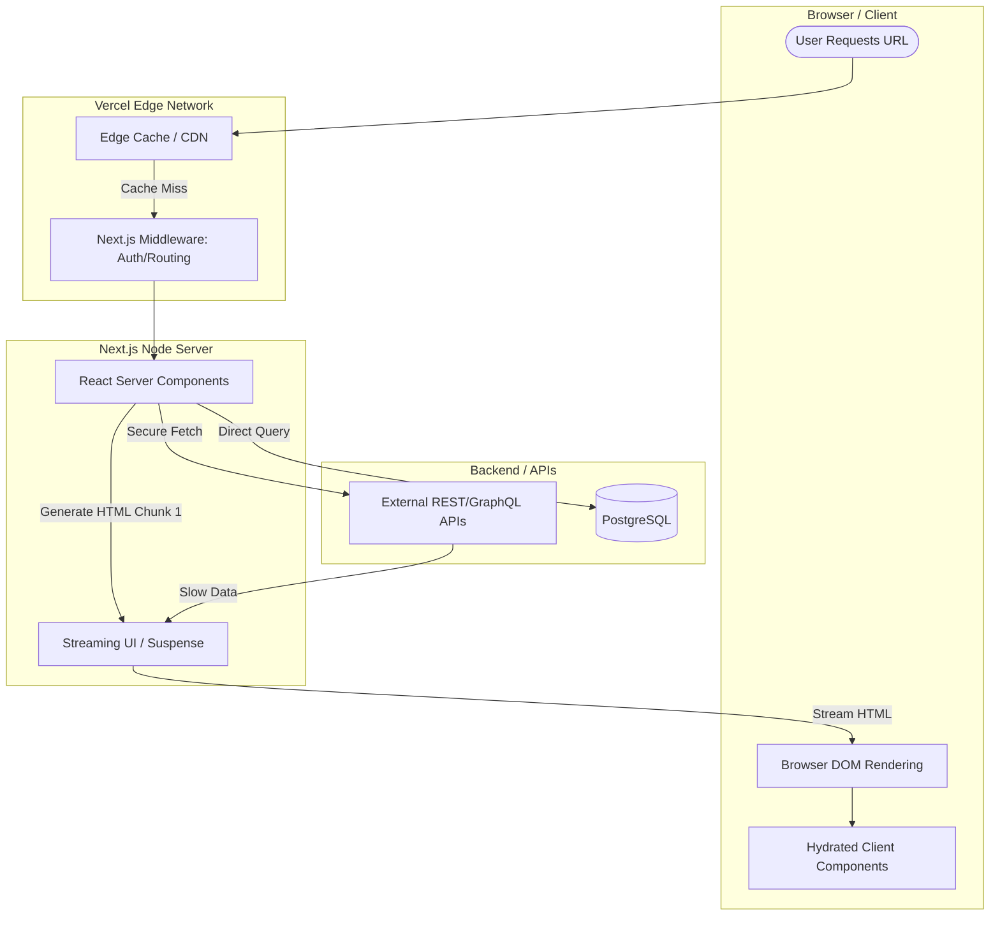

## JSON-LD Schema

```json
{
  "@context": "https://schema.org",
  "@type": "Service",
  "name": "Enterprise Next.js Development",
  "provider": {
    "@type": "Organization",
    "name": "Enterprise Software Architecture"
  },
  "serviceType": "Software Engineering",
  "description": "Lightning-fast, SEO-optimized web applications utilizing Next.js 14, React Server Components, and edge-rendering for maximum performance.",
  "areaServed": "Worldwide"
}
```

## Hero Section

**Headline:** Enterprise Next.js Development Company  
**Subheadline:** Build the fastest web applications on the internet. We architect enterprise-grade Next.js frontends utilizing React Server Components (RSC) to deliver instant page loads, flawless technical SEO, and highly interactive user interfaces.  

**Enterprise Value Proposition:** Standard React applications (SPAs) ship massive bundles of JavaScript to the browser, resulting in slow load times and terrible Google rankings. We engineer Next.js architectures that render heavy compute on the server, shipping only pure HTML and minimal interactive JavaScript to the client. The result is a premium, application-like experience that dominates search engine results.

**Primary CTA:** Review Your Frontend Architecture  
**Secondary CTA:** See Next.js Performance Demos  

**Trust Indicators:** Next.js 14 App Router Experts | React Server Components | 99+ Core Web Vitals | Vercel Edge Integrations

## Executive Summary

The frontend landscape has experienced a paradigm shift. With the release of Next.js App Router, the boundary between the server and the client has blurred. Next.js is no longer just a "React framework"; it is a full-stack architecture that requires deep understanding of server-side data fetching, edge caching, and streaming UI. We specialize in rescuing bloated legacy React applications and rebuilding them into highly optimized, strictly typed Next.js applications that load instantly on mobile networks and pass Google's Core Web Vitals with perfect scores.

## Business Problems

- **The SEO Black Hole:** Standard Single Page Applications (SPAs) like Create React App load as a blank white page until megabytes of JavaScript finish executing. Google's crawlers often penalize or completely ignore these pages, destroying your organic traffic.
- **Terrible Core Web Vitals:** High Largest Contentful Paint (LCP) and Cumulative Layout Shift (CLS) scores directly impact your Google Ads Quality Score, forcing you to pay more for every click.
- **Dashboard Freezes:** Complex B2B SaaS dashboards that fetch 10 different API endpoints from the browser experience race conditions and UI freezing, leading to high user churn.
- **Component Chaos:** Without a strict design system and TypeScript interfaces, a frontend codebase devolves into hundreds of duplicated, slightly different button components, making UI updates a nightmare.

## Engineering Solution

We engineer **Server-First React Architectures**.

We default to React Server Components (RSC). We fetch data directly from the database or internal APIs on the secure server, rendering the heavy UI components into pure HTML. We only use "Client Components" (`"use client"`) for the specific micro-interactions that require browser APIs (like an onClick handler or a Framer Motion animation). This drastically reduces the JavaScript bundle size shipped to your users.

## Architecture

Modern Next.js applications require sophisticated rendering strategies to balance dynamic data with instant load times.

### Next.js Rendering Architecture



## Technology Stack

- **Framework:** Next.js (App Router, v14+)
- **UI Library:** React 18+ (Server Components, Suspense)
- **Styling:** Tailwind CSS, CSS Modules
- **Animation:** Framer Motion, GSAP
- **State Management:** Zustand, Jotai, React Context
- **Data Fetching:** React Query (TanStack), SWR, native `fetch()` with Next.js caching
- **Type Safety:** TypeScript, Zod (Schema Validation)
- **Deployment:** Vercel, AWS Amplify, Docker

## Development Process

1. **Design System & Tokens:** We translate Figma designs into a strict Tailwind configuration, establishing typography, color variables, and spacing constraints to guarantee visual consistency.
2. **Component Architecture:** Building reusable, accessible (a11y) primitive components (Buttons, Inputs, Modals) using Radix UI or custom implementations.
3. **Server vs. Client Separation:** Carefully planning the component tree to maximize Server Components. We push Client Components down to the very leaves of the tree to prevent "poisoning" the server rendering.
4. **Data Fetching & Caching:** Implementing Next.js `fetch` with specific cache tags (`revalidateTag`). This allows the application to serve pages instantly from cache, but instantly re-render if a user modifies database data.
5. **Streaming & Suspense:** Wrapping slow API calls in `<Suspense>` boundaries. The user instantly sees the page shell and skeleton loaders, and the heavy data streams into the browser milliseconds later without blocking the UI.

## Features & Capabilities

- **Dynamic SEO Metadata:** We dynamically generate `<title>`, `<meta>`, and JSON-LD schema based on the specific route data (e.g., rendering specific OpenGraph images for every unique product in an e-commerce store).
- **Internationalization (i18n):** Sub-path routing (`/en/about`, `/fr/about`) with completely localized content rendered statically at build time.
- **Edge Middleware:** We execute logic *before* the page even begins rendering. E.g., checking an Auth token at the edge to instantly redirect unauthorized users without hitting the main server.
- **Server Actions:** We eliminate the need to write separate API routes for simple forms. A user submits a form, and a Next.js Server Action securely mutates the database and revalidates the UI cache in a single round-trip.

## Use Cases

### 1. High-Traffic E-Commerce Migration
**Problem:** A Shopify headless storefront built on standard React took 6 seconds to load on mobile. Their conversion rate was plummeting.
**Implementation:** We rebuilt the storefront using Next.js Incremental Static Regeneration (ISR). The 10,000 product pages were statically generated. If a price changed, a webhook triggered a background revalidation, updating the specific page cache in milliseconds.
**Outcome:** Page load times dropped to 0.6 seconds. Organic traffic increased by 150%, and mobile conversion rates doubled.

### 2. Complex B2B SaaS Dashboard
**Problem:** A healthcare analytics dashboard was fetching 20 megabytes of JSON to the browser and calculating statistics client-side, causing browsers to freeze.
**Implementation:** We moved all data fetching and statistical aggregation to React Server Components. The browser received only the final calculated numbers and the lightweight HTML structure.
**Outcome:** Dashboard rendering time reduced by 85%. Absolute data security maintained, as the raw JSON never left the server.

## Security & Performance

- **Environment Variable Secrecy:** Because React Server Components execute on the server, we can securely query databases using private API keys. These keys are never bundled or exposed to the browser.
- **Image & Font Optimization:** We utilize `next/image` and `next/font` to automatically convert images to WebP formats, prevent Cumulative Layout Shift (CLS), and self-host Google Fonts to eliminate third-party network requests.

## Comparison

### Next.js vs. Create React App (CRA) / Vite
CRA and Vite are excellent for building traditional Single Page Applications (where SEO does not matter, like an internal admin tool). However, for any public-facing product, Next.js is objectively superior. Next.js provides out-of-the-box routing, server-side rendering, and image optimization that would take months to configure manually in a Vite architecture.

## FAQ

**Q: Can you migrate my old React app to Next.js?**
Yes. We specialize in incremental migrations. We can set up Next.js to run alongside your existing application, slowly moving routes over one by one using Next.js "Rewrites" to avoid a risky "big bang" release.

**Q: Why use Tailwind CSS?**
Tailwind enforces a strict design system and eliminates "dead CSS." When Next.js compiles the project, Tailwind scans the code and ships only the exact CSS classes used, resulting in CSS files that are often under 10kb.

**Q: What is a React Server Component?**
It is a component that renders exclusively on the server and never ships JavaScript to the browser. It allows you to write secure, asynchronous code (`async/await`) directly inside the React component to fetch data from a database.

## Related Services

- **[Backend Engineering](/services/software-engineering/backend-engineering):** We build the high-speed Python or Go APIs that your Next.js application will consume.
- **[Enterprise AI Chatbots](/services/ai-agents/chatbots):** We seamlessly integrate streaming LangGraph chatbots directly into your Next.js interface using Server-Sent Events.
- **[Architecture Review](/services/technical-consulting/architecture-review):** We audit your existing React codebase for performance bottlenecks and upgrade paths.

## Call To Action

**Stop losing users to slow load times.**
Speed is revenue. Schedule a Frontend Architecture Review with our Next.js specialists. We will analyze your Core Web Vitals, audit your React component tree, and design an architecture that delivers instant performance.

[Request a Next.js Performance Audit]
