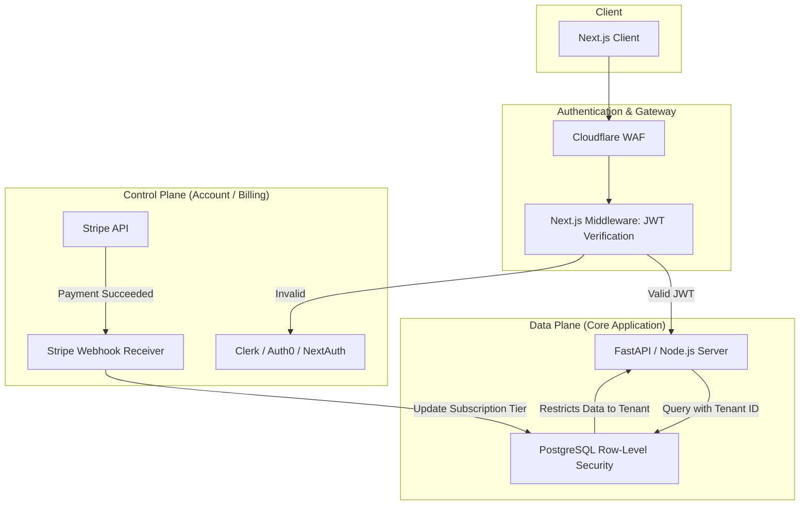

## JSON-LD Schema

```json
{
  "@context": "https://schema.org",
  "@type": "Service",
  "name": "SaaS Application Development Services",
  "provider": {
    "@type": "Organization",
    "name": "Enterprise Software Architecture"
  },
  "serviceType": "Software Engineering",
  "description": "End-to-end B2B SaaS development featuring secure multi-tenant architectures, Stripe subscription billing, and Role-Based Access Control.",
  "areaServed": "Worldwide"
}
```

## Hero Section

**Headline:** Enterprise SaaS Development Services  
**Subheadline:** Turn your industry expertise into a scalable B2B software platform. We build end-to-end multi-tenant SaaS applications engineered for high availability, strict data isolation, and rapid feature iteration.  

**Enterprise Value Proposition:** Building a SaaS product is not just about writing code; it is about building a business engine. You need robust subscription billing, granular team permissions (RBAC), secure tenant data isolation, and admin observability. We architect the entire product lifecycle from the ground up, delivering a highly secure, market-ready SaaS application that investors will actually fund.

**Primary CTA:** Discuss Your SaaS Idea  
**Secondary CTA:** View SaaS Case Studies  

**Trust Indicators:** Multi-Tenant Architecture Experts | Stripe Billing Integration | SOC2 Ready Backends | Role-Based Access Control

## Executive Summary

Software as a Service (SaaS) development requires a fundamentally different architecture than standard web development. A SaaS application must safely host data for thousands of competing companies (Tenants) within the same database without data leakage. It requires complex lifecycle management: onboarding, subscription tier gating, seat-based billing, user invitations, and account offboarding. We specialize in building robust B2B SaaS architectures using Next.js and Python/Go, ensuring your platform is scalable, secure, and ready for extreme enterprise procurement scrutiny.

## Business Problems

- **Cross-Tenant Data Leaks:** A poorly designed database schema might accidentally show Company A's confidential invoices to Company B. This is a fatal security flaw that destroys B2B trust instantly.
- **Billing Logic Nightmares:** Implementing seat-based billing, pro-rated upgrades, grandfathered pricing, and failed payment dunning logic manually is incredibly error-prone and often leads to massive revenue leakage.
- **The MVP Trap:** Freelancers often build SaaS MVPs using low-code tools (Bubble) or monolithic architectures (Firebase) that cannot scale. When you hit 500 paying users, the platform slows to a crawl, forcing a complete rewrite.
- **Lacking Enterprise Features:** Selling B2B requires features that standard apps don't have: Single Sign-On (SAML/SSO), Audit Logs, explicit Role-Based Access Control (Admin vs. Manager vs. Viewer), and API access for their own internal developers.

## Engineering Solution

We engineer **Multi-Tenant SaaS Architectures**.

We build "Hard Multi-Tenancy" at the database level using PostgreSQL Row-Level Security (RLS) or logical schema separation, mathematically guaranteeing data isolation. We integrate Stripe Billing via secure webhooks for complex subscription management. We build secure Next.js frontends protected by strict JWT/OAuth authentication middleware, ensuring that an unauthorized user is blocked at the edge network before their request even hits the main server.

## Architecture

A robust SaaS architecture separates the Control Plane (user management/billing) from the Data Plane (core application logic).

### Multi-Tenant SaaS Architecture



## Technology Stack

- **Frontend:** Next.js (App Router), React, Tailwind CSS, Shadcn UI
- **Backend:** Python (FastAPI), Node.js, Go (Golang)
- **Database:** PostgreSQL (with Row-Level Security), Redis (Caching)
- **Authentication:** NextAuth.js, Clerk, Auth0, Kinde
- **Billing:** Stripe (Checkout, Billing, Connect)
- **Infrastructure:** Docker, AWS (ECS/RDS), Vercel

## Development Process

1. **Product Discovery & ERD:** We map the business logic, defining the exact data models (Organizations, Users, Roles, Subscriptions).
2. **Infrastructure Scaffolding:** Setting up the CI/CD pipelines, Docker containers, and the PostgreSQL database with strict RLS policies.
3. **Core SaaS Mechanics:** Building the non-negotiables: User Authentication, Organization/Workspace creation, User Invitations, and the Stripe integration via webhooks.
4. **Feature Implementation:** Developing the actual value-providing features of the SaaS (e.g., the analytics dashboard, the AI orchestration, the workflow builder).
5. **Admin Dashboard:** Building a secure internal tool for your team to manage users, process refunds, and monitor platform health.
6. **Penetration Testing:** Rigorous security auditing to ensure Tenant A cannot physically access Tenant B's data via URL manipulation or IDOR (Insecure Direct Object Reference) attacks.

## Core SaaS Features Included

- **Role-Based Access Control (RBAC):** Granular permissions. Admins can view billing; Managers can edit data; Viewers have read-only access.
- **Seat-Based Billing:** Automated Stripe integration that charges the customer proportionately when they invite a new team member to their workspace.
- **Audit Logging:** Every critical action (`POST`, `PUT`, `DELETE`) is logged to the database with the User ID, timestamp, and IP address for SOC2 compliance tracking.
- **Public API Generation:** We can expose specific parts of your backend via REST API, generating secure API Keys for your B2B customers so they can build their own custom integrations.

## Use Cases

### 1. Logistics Management SaaS
**Problem:** A logistics consultancy wanted to productize their custom spreadsheets into a software product they could sell to trucking companies.
**Implementation:** We built a multi-tenant Next.js and FastAPI application. Each trucking company (Tenant) had an isolated workspace. We integrated Mapbox for live fleet tracking and Stripe for monthly per-truck billing.
**Outcome:** The consultancy successfully pivoted to a SaaS model, generating $50k MRR within the first 6 months of launch.

### 2. AI Copywriting Platform
**Problem:** A marketing agency wanted to white-label their prompt-engineering expertise into an AI SaaS platform.
**Implementation:** We built the SaaS layer around their core LangChain logic. We implemented a "Credit-Based" billing system in Stripe, where users purchase blocks of AI generation credits. The Next.js dashboard tracked credit usage in real-time.
**Outcome:** A highly scalable, automated software business that monetized their internal AI prompts.

## Security & Compliance

- **PostgreSQL Row-Level Security (RLS):** We configure the database so every SQL query requires a `tenant_id`. Even if a backend engineer writes a flawed `SELECT * FROM invoices`, the database engine intercepts it and returns only the invoices belonging to the active user.
- **SSO / SAML Readiness:** If you are selling to Enterprise companies, they will mandate Single Sign-On (Okta, Azure AD). We architect the authentication layer to support SAML natively.

## Comparison

### Custom SaaS vs. White-Label Solutions
Buying an off-the-shelf "white-label" product limits you to their feature set and their pricing model. If your competitors are using the same white-label tool, you have no competitive moat. Custom SaaS development gives you total ownership of the intellectual property. You can build highly proprietary, defensible algorithms (like custom AI agents) directly into the core product.

## FAQ

**Q: Do you use a SaaS boilerplate?**
We have internal, heavily audited architectural patterns and infrastructure-as-code templates (Terraform) that accelerate development, but we do not use rigid open-source boilerplates that force you into bad technical decisions. Your business logic is custom engineered.

**Q: How do you handle failed Stripe payments?**
We implement robust webhook listeners. If Stripe sends an `invoice.payment_failed` event, our backend automatically demotes the Organization to a "Free/Suspended" tier, locking access to premium features until the user updates their credit card.

**Q: Can you help with the MVP phase?**
Yes. We strongly advocate for "Scope Reduction." We will aggressively consult with you to strip away "nice-to-have" features and focus engineering effort purely on the core value proposition to get your SaaS to market and generating revenue as fast as possible.

## Related Services

- **[Next.js Development](/services/software-engineering/nextjs-development):** The framework we use to build the fast, responsive SaaS dashboards.
- **[Backend Engineering](/services/software-engineering/backend-engineering):** The complex data modeling and REST APIs powering the application.
- **[AI Integration](/services/ai-engineering/llm-orchestration):** Embed advanced multi-agent workflows directly into your SaaS product to differentiate it from legacy competitors.

## Call To Action

**Turn your expertise into recurring revenue.**
Stop prototyping and start building. Schedule a Product Architecture Review with our SaaS engineers. We will map out your database schema, design your multi-tenant architecture, and build a production-ready software product.

[Discuss Your SaaS Idea]
