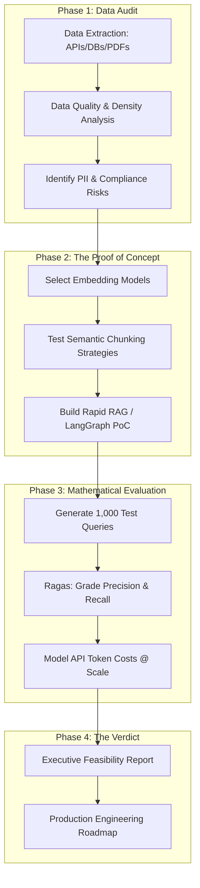

## JSON-LD Schema

```json
{
  "@context": "https://schema.org",
  "@type": "Service",
  "name": "AI Feasibility Studies & Due Diligence",
  "provider": {
    "@type": "Organization",
    "name": "Enterprise Software Architecture"
  },
  "serviceType": "Technical Consulting",
  "description": "Executive AI Feasibility Studies to mathematically evaluate data quality, project token economics, and build rapid proofs-of-concept before committing capital to enterprise AI development.",
  "areaServed": "Worldwide"
}
```

## Hero Section

**Headline:** Enterprise AI Feasibility Studies  
**Subheadline:** Don't build an AI product on bad data. We provide mathematically rigorous AI Feasibility Studies, evaluating your proprietary datasets, projecting API token economics, and building rapid Proofs-of-Concept (PoCs) to validate ROI before you write a single check for enterprise development.  

**Enterprise Value Proposition:** 80% of enterprise AI initiatives fail in production because they were scoped purely on hype. Generative AI is not magic; it is constrained by the statistical quality of the underlying data and the hard limitations of LLM context windows. We act as your technical defense. We audit your data silos, measure hallucination risks, and calculate exact unit economics to determine if an AI project is technically possible and financially viable.

**Primary CTA:** Request an AI Feasibility Audit  
**Secondary CTA:** Read Our AI Evaluation Methodology  

**Trust Indicators:** Ragas Evaluation Framework | Token Economics Modeling | Rapid PoC Prototyping | Unbiased Advisory

## Executive Summary

An AI Feasibility Study is a time-boxed, highly technical engagement designed to mitigate the immense financial risk of building custom AI systems. Executives frequently demand "AI integration," but engineering teams struggle to quantify the feasibility. If your corporate data is stored as messy, un-OCR'd PDFs, a million-dollar RAG system will still hallucinate. Our service answers three critical questions: **1) Is your data clean enough for AI? 2) Can the current generation of LLMs solve your specific logical problem? 3) What will the cloud infrastructure and token inference cost at scale?**

## Business Problems

- **The "Garbage In, Garbage Out" Trap:** Attempting to build an AI chatbot over a poorly documented, highly contradictory Confluence wiki results in an AI that confidently gives users the wrong answers.
- **Unpredictable Unit Economics:** Prototyping an AI agent locally costs $0.10. Deploying it to 10,000 daily active users might cost $40,000 a month in OpenAI API fees. Companies fail to model these token costs before committing to the product.
- **Hallucination Liability:** In regulated industries (Legal, Medical, Finance), deploying an AI that fabricates a compliance rule creates massive legal liability. If the hallucination rate cannot be mathematically suppressed below 0.1%, the project must be abandoned.
- **The "Perpetual Prototype":** Companies spend 6 months building a LangChain prototype in a Jupyter Notebook, only to discover it relies on non-deterministic behavior that cannot be secured in a production web application.

## Engineering Solution

We provide the **Mathematical Proof of Concept**.

We deploy a structured 3-to-4 week engagement. We extract a subset of your data (e.g., 500 documents) and run it through advanced embedding models and OCR pipelines to quantify its density. We build a rapid, throwaway LangGraph/RAG pipeline and bombard it with 1,000 adversarial queries. We then utilize the Ragas framework (Retrieval Augmented Generation Assessment) to generate a mathematical score for Context Precision, Answer Relevancy, and Faithfulness. 

## Audit Methodology

Our feasibility studies remove emotion and rely entirely on data.

### The AI Evaluation Lifecycle



## Feasibility Dimensions

We grade your proposed AI initiative across 4 critical pillars:

### 1. Data Readiness Assessment
- **Format Consistency:** Can your data be parsed deterministically? (e.g., Markdown vs. scanned images).
- **Semantic Density:** Does the data contain enough context for an embedding model to distinguish between Document A and Document B during a vector search?
- **Data Governance:** Mapping where PII (Personally Identifiable Information) lives and determining if it requires an expensive redaction pipeline before hitting the LLM.

### 2. Model & Architecture Selection
- **Open-Source vs. Closed-Source:** Determining if you actually need GPT-4o, or if a fine-tuned, self-hosted open-source model (like Llama 3 8B) can achieve the same accuracy for 1/10th the cost.
- **Pipeline Complexity:** Deciding if a simple RAG implementation is sufficient, or if the problem requires a complex, multi-agent [LLM Orchestration](/services/ai-engineering/llm-orchestration) state machine.

### 3. Mathematical Evaluation (Ragas)
We run the PoC output against automated evaluator LLMs to generate strict metrics:
- **Faithfulness:** Does the answer directly derive from the source data, or did the LLM hallucinate external facts?
- **Answer Relevancy:** Did the AI actually answer the user's question, or did it dodge it with a generic summary?
- **Context Precision:** Did the vector database return the correct document in the #1 position, or the #8 position?

### 4. Unit Economics & ROI
- **Token Modeling:** We calculate exact Input/Output token estimates. "If 5,000 users ask 3 questions a day, your Azure OpenAI bill will be exactly $4,200/month."
- **Latency Projections:** Predicting Time-to-First-Token (TTFT) to determine if the AI is fast enough for real-time voice or if it must be relegated to asynchronous web chat.

## The Deliverable

At the conclusion of the 3-to-4 week sprint, you receive:

1. **The Feasibility Report:** A definitive "GO / NO-GO" recommendation. We will explicitly tell you if your data is too poor to support the project.
2. **The Economic Model:** A detailed spreadsheet outlining projected cloud hosting and API token costs at 1k, 10k, and 100k Monthly Active Users.
3. **The Prototype:** Access to a secure web environment where your executives can physically interact with the rapid Proof of Concept.
4. **The Engineering Blueprint:** If the project is a "GO", we provide the exact architectural specifications, timeline, and budget required to move the PoC into enterprise production.

## Security & Confidentiality

- **Isolated Sandboxes:** We conduct feasibility studies in highly secure, isolated AWS VPCs. 
- **Zero Training Policies:** We strictly utilize enterprise API endpoints (Azure OpenAI, AWS Bedrock) that guarantee your proprietary test data is never used to train the provider's foundational models.
- **Data Destruction:** If the project is a "NO-GO", we execute a cryptographic wipe of all test data, vector databases, and cached prompt histories.

## FAQ

**Q: Why pay for a study? Can't we just build it?**
You can, but building an enterprise RAG system costs upwards of $100,000 in engineering time. If you discover in Month 4 that your PDFs cannot be parsed accurately, that capital is lost. A Feasibility Study costs a fraction of that and identifies fatal flaws in Month 1.

**Q: We don't have our data cleaned yet. Can you still do the study?**
Yes. Part of the study is evaluating exactly how "dirty" the data is. We will build a data-cleaning pipeline (OCR, parsing) during the PoC to determine the exact engineering effort required to clean the remaining 99% of your dataset.

**Q: What happens if the verdict is "NO-GO"?**
We provide a remediation roadmap. For example, we might recommend pausing the AI initiative and executing a 6-month [Software Engineering](/services/software-engineering) project to migrate your legacy data into a structured PostgreSQL database. Once the data is structured, the AI initiative becomes a "GO".

## Related Services

- **[RAG Development](/services/ai-engineering/rag-development):** If the study is successful, we execute this service to build the production system.
- **[Architecture Review](/services/technical-consulting/architecture-review):** If your current software cannot support an AI integration, we audit the core system first.
- **[Prompt Engineering](/services/ai-engineering/prompt-engineering):** Refining the system instructions developed during the PoC for maximum production security.

## Call To Action

**Validate before you build.**
Stop relying on marketing hype to dictate your engineering strategy. Schedule an AI Feasibility Consultation today. We will assess your data, run the math, and provide the objective truth about what Generative AI can actually do for your business.

[Request an AI Feasibility Audit]
