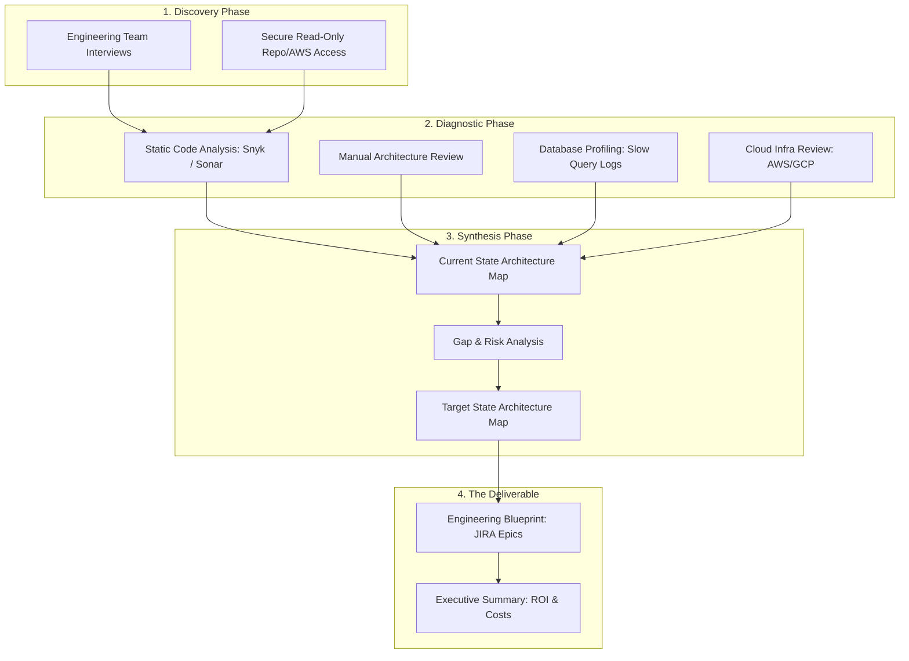

## JSON-LD Schema

```json
{
  "@context": "https://schema.org",
  "@type": "Service",
  "name": "Software Architecture Review & Code Audits",
  "provider": {
    "@type": "Organization",
    "name": "Enterprise Software Architecture"
  },
  "serviceType": "Technical Consulting",
  "description": "Comprehensive architectural audits identifying database bottlenecks, unmaintainable code patterns, and security vulnerabilities with an actionable refactoring roadmap.",
  "areaServed": "Worldwide"
}
```

## Hero Section

**Headline:** Software Architecture Review & Code Audits  
**Subheadline:** Diagnose the root cause of your technical debt. We conduct rigorous, unbiased audits of your entire software stack—from the Next.js frontend to the PostgreSQL database—delivering a definitive blueprint for scalability, security, and performance.  

**Enterprise Value Proposition:** Your application crashes under load, your AWS bills are inexplicably high, and pushing a simple feature update takes weeks. You cannot refactor what you do not understand. We embed as Principal Engineers to map your legacy monolith, profile the bottlenecks, and provide a mathematically sound, step-by-step roadmap to migrate to a high-performance modern architecture without causing business downtime.

**Primary CTA:** Request a Code Audit  
**Secondary CTA:** See Our Audit Methodology  

**Trust Indicators:** Principal Engineer Led | Technical Due Diligence | Security & Scalability Focus | Zero-Downtime Migration Strategies

## Executive Summary

A Software Architecture Review is a forensic analysis of your codebase and cloud infrastructure. Startups and scaling enterprises accumulate technical debt rapidly as they rush to market. Eventually, this debt manifests as slow page loads, database deadlocks, and severe security vulnerabilities. Our code audit service is not an automated scan; it is a deep, manual investigation by senior architects. We evaluate your system against industry-standard heuristics (Clean Architecture, SOLID principles, OWASP Top 10) to determine exactly what needs to be rewritten, what can be salvaged, and how to sequence the remediation.

## Business Problems

- **Feature Velocity Death Spiral:** The codebase has become so tangled (Spaghetti Code) that touching one file breaks three unrelated features. Engineers spend 80% of their time fixing bugs and 20% building new value.
- **The Scalability Ceiling:** The platform works perfectly during normal hours but collapses completely during a marketing push (e.g., Black Friday) because the database architecture lacks connection pooling or proper indexing.
- **Security & Compliance Risk:** The system lacks proper JWT validation, relies on outdated open-source libraries with known CVEs, or accidentally exposes Customer PII (Personally Identifiable Information) via insecure GraphQL endpoints.
- **Infrastructure Cost Bloat:** You are paying $10,000 a month for AWS EC2 instances because your application is a massive memory hog, when a properly optimized serverless or containerized architecture would cost $800.

## Engineering Solution

We provide the **Architectural Refactoring Blueprint**.

We analyze the four pillars of your application: **Compute (Code), Persistence (Database), Infrastructure (Cloud), and Operations (CI/CD)**. We document the current state architecture. We then design the "Target State" architecture (e.g., migrating from a Ruby monolith to a decoupled Next.js + Python FastAPI system). Most importantly, we design the "Transition Architecture"—the exact sequence of steps (like the Strangler Fig pattern) required to safely migrate the application while it remains live in production.

## Architecture & Analysis Scope

Our audit covers the complete request lifecycle.

### The Code Audit Lifecycle



## Audit Dimensions

We evaluate your software system across 5 critical dimensions:

### 1. Codebase Quality & Maintainability
- **Coupling & Cohesion:** Is the business logic tightly coupled to the UI framework? We look for strict separation of concerns (MVC or Clean Architecture).
- **Type Safety:** Evaluating the strictness of TypeScript implementations. Are there `any` types masking critical runtime errors?
- **Test Coverage:** Analyzing the ratio of Unit to Integration to E2E tests. A lack of automated testing guarantees that future refactoring will cause regressions.

### 2. Database & Data Modeling
- **Schema Normalization:** Is the database 3NF compliant? Are there redundant data duplications causing race conditions?
- **Query Optimization:** We run `EXPLAIN ANALYZE` on your most frequent endpoints to identify missing B-Tree indexes or slow `JOIN` operations.
- **Concurrency Locks:** Analyzing how the database handles simultaneous writes (e.g., preventing double-billing in payment systems).

### 3. Performance & Scalability
- **Core Web Vitals:** Measuring the Next.js/React frontend for Time to First Byte (TTFB) and Largest Contentful Paint (LCP) issues caused by huge JavaScript bundles.
- **API Latency:** Identifying blocking, synchronous operations in the backend that should be offloaded to an asynchronous message queue (e.g., Celery/RabbitMQ).

### 4. Security Posture
- **Authentication/Authorization:** Verifying that JWT tokens are properly signed and that endpoint-level Role-Based Access Control (RBAC) is strictly enforced to prevent IDOR attacks.
- **Input Sanitization:** Ensuring all REST/GraphQL endpoints validate input (e.g., using Pydantic or Zod) to prevent SQL Injection and XSS.

### 5. Infrastructure & CI/CD
- **Deployment Mechanics:** Do you have zero-downtime deployments? Is your infrastructure managed manually or via Infrastructure as Code (Terraform)?
- **Observability:** Do you have Datadog/Sentry configured to trace a request end-to-end, or do your engineers have to manually parse text logs when the server crashes?

## The Deliverable

You receive a comprehensive, dual-layered document:

1. **The Executive Brief:** Designed for the CEO/CTO. A high-level summary of the existential risks, the financial cost of the technical debt (wasted AWS spend, wasted developer hours), and the estimated budget/timeline to execute the refactoring.
2. **The Engineering Blueprint:** Designed for the Lead Engineers. A highly technical document containing specific code snippets, SQL queries to add indexes, proposed Next.js file-routing structures, and a prioritized list of JIRA epics ready to be imported into your sprint planning.

## Security & Confidentiality

- **Strict NDAs:** We treat your source code as your most valuable intellectual property. We sign comprehensive Non-Disclosure Agreements before requesting access.
- **Read-Only Access:** We only require "Read" access to your GitHub repositories and "Viewer" roles in your AWS/GCP environments. We do not modify production systems during an audit.
- **Secure Data Destruction:** Upon completion of the audit and delivery of the report, all local clones of your codebase and infrastructure configurations are securely wiped from our systems.

## FAQ

**Q: Do we have to stop development during the audit?**
No. The audit runs parallel to your normal development cycle. We pull a branch of the codebase at the start of the engagement and conduct our static and manual analysis against that snapshot.

**Q: Will you force us to rewrite the entire application?**
Rarely. "Big Bang" rewrites are notoriously dangerous and often fail. We strongly advocate for the **Strangler Fig Pattern**, where we recommend slowly strangling the legacy monolith by routing new features to modern microservices, retiring the old code incrementally over 12 months.

**Q: Can you help us fix the problems you find?**
Yes. Following the delivery of the Architecture Review, many clients immediately retain us under a [Backend Engineering](/services/software-engineering/backend-engineering) or [Next.js Development](/services/software-engineering/nextjs-development) contract to execute the most difficult architectural refactoring tasks on their behalf.

## Related Services

- **[Technical Consulting Overview](/services/technical-consulting):** Explore our other executive advisory services, including AI Feasibility Studies.
- **[Software Engineering](/services/software-engineering):** The dedicated engineering teams required to implement the audit's findings.
- **[SaaS Development](/services/software-engineering/saas-development):** Upgrading your legacy web app into a true multi-tenant SaaS platform.

## Call To Action

**Illuminate your technical debt.**
Don't guess why the system is failing. Schedule an Architecture Review with our Principal Engineers. We will analyze your codebase, identify the critical bottlenecks, and provide the exact roadmap needed to scale your application reliably.

[Request an Architecture Review]
