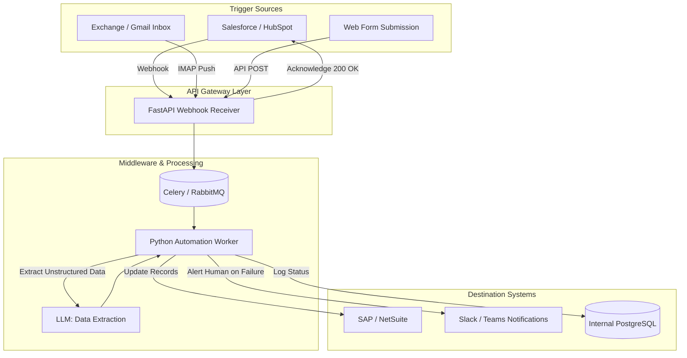

## JSON-LD Schema

```json
{
  "@context": "https://schema.org",
  "@type": "Service",
  "name": "Enterprise Workflow Automation Services",
  "provider": {
    "@type": "Organization",
    "name": "Enterprise Software Architecture"
  },
  "serviceType": "Technical Consulting",
  "description": "Custom business process automation utilizing Python, webhooks, and LangGraph to eliminate manual data entry and securely connect siloed enterprise systems.",
  "areaServed": "Worldwide"
}
```

## Hero Section

**Headline:** Enterprise Workflow Automation  
**Subheadline:** Stop paying humans to act like APIs. We map complex operational bottlenecks and engineer robust, custom integrations utilizing Python, Webhooks, and AI Agents to securely automate your most tedious business processes.  

**Enterprise Value Proposition:** When a company scales, operations inevitably fragment across a dozen different SaaS platforms (Salesforce, Jira, Slack, QuickBooks). Employees waste 30% of their day manually copying data between these disconnected systems. We do not just configure simple Zapier triggers; we act as Systems Architects. We audit your operational logic and write custom, fault-tolerant integration layers that execute millions of background tasks seamlessly.

**Primary CTA:** Request an Operations Audit  
**Secondary CTA:** View Automation Case Studies  

**Trust Indicators:** Custom Python Integrations | Fault-Tolerant Webhooks | REST/GraphQL Experts | Enterprise Zapier/Make Architecture

## Executive Summary

Enterprise Workflow Automation (or Business Process Automation) is the bridge between Technical Consulting and Backend Engineering. A company might not need a completely new SaaS product built from scratch; instead, they need their existing CRM to "talk" securely to their ERP system. We specialize in mapping out these undocumented human workflows, identifying the exact REST APIs required, and building asynchronous middleware that handles data transformation, error logging, and retry logic. Whether utilizing enterprise iPaaS (Make.com/Zapier) or writing custom Python microservices on AWS, we engineer the glue that holds modern operations together.

## Business Problems

- **The Data Entry Tax:** Highly paid professionals (lawyers, doctors, engineers) wasting hours manually re-typing information from a PDF invoice into an internal database.
- **Siloed SaaS Systems:** The Sales team uses Salesforce, the Support team uses Zendesk, and the Engineering team uses Jira. When a VIP customer reports a bug, the communication chain relies entirely on humans remembering to send Slack messages, leading to massive delays and lost context.
- **Brittle "No-Code" Zaps:** A non-technical manager attempts to automate a process using a 50-step Zapier workflow. When an API changes slightly, the Zap breaks silently, and data is lost for three weeks before anyone notices.
- **Human Error & Compliance:** Manually executing complex onboarding or offboarding checklists inevitably results in missed steps—such as forgetting to revoke an ex-employee's AWS access, causing a severe security vulnerability.

## Engineering Solution

We engineer **Fault-Tolerant Integration Middleware**.

We replace brittle visual workflows with robust, version-controlled software architecture. If an automation connects to a legacy system without an API, we build custom web-scrapers or secure database connectors. Most importantly, we implement **Idempotency** and **Dead-Letter Queues**. If an automation tries to create an invoice in QuickBooks and the QuickBooks API is down, our system does not fail silently. It logs the error, waits 5 minutes, and retries the request autonomously.

## Architecture

A robust automation system relies heavily on asynchronous event-driven architecture rather than scheduled batch polling.

### Event-Driven Automation Pipeline



## Technology Stack

- **Integration Platforms (iPaaS):** Zapier (Enterprise), Make.com, n8n, Tray.io
- **Custom Middleware:** Python (FastAPI, Celery), Node.js, Go
- **Queue & Message Brokers:** RabbitMQ, Redis, AWS SQS
- **AI Processing:** OpenAI API, Anthropic, LangChain (for unstructured data parsing)
- **Monitoring & Alerting:** Datadog, Sentry, PagerDuty

## Development Process

1. **Workflow Mapping (Consulting):** We sit with your operations team and map out the exact "If This, Then That" logic of the human workflow using BPMN (Business Process Model and Notation) flowcharts.
2. **API Feasibility Audit:** We verify that the target SaaS platforms actually possess the REST/GraphQL endpoints and Webhook capabilities required to automate the process.
3. **Middleware Architecture:** Deciding whether the workflow can be safely handled by an iPaaS (Make.com) or if it requires a custom Python microservice due to complexity or security constraints.
4. **Implementation & Transformation:** Writing the code to map the data schemas. (e.g., converting a Stripe `customer_id` into a Salesforce `ContactID` using a lookup table).
5. **Resilience Engineering:** Implementing exponential backoff retries, rate-limit management, and detailed error logging.
6. **Parallel Testing:** Running the automation silently alongside the human workers for two weeks to verify output accuracy before fully replacing the manual process.

## Features

- **Unstructured Data Extraction:** Combining standard APIs with LLMs. We can intercept a vendor email, use an LLM to read the attached PDF invoice, extract the line items into JSON, and push that structured data directly into your accounting software.
- **Webhooks over Polling:** We configure systems to react instantly. Instead of checking a database every 5 minutes ("Polling"), we configure the database to trigger our server the millisecond a row is updated ("Webhooks"), reducing latency to zero.
- **Human-in-the-Loop (HITL) Pauses:** For high-risk automations (like refunding a customer $5,000), the automation pauses, sends an interactive Slack message to a manager with "Approve" or "Deny" buttons, and waits for cryptographic approval before continuing.

## Use Cases

### 1. Employee Onboarding/Offboarding Automation
**Problem:** When an enterprise hired a new engineer, HR spent 3 hours manually creating accounts in Google Workspace, Jira, GitHub, AWS, and Slack.
**Implementation:** We built a custom Python microservice triggered by a single HR form submission. The service securely hit the REST APIs of all 5 platforms, provisioned the accounts, assigned the correct security groups, and DM'd the manager the temporary passwords.
**Outcome:** Onboarding time reduced from 3 hours to 45 seconds. Security compliance increased to 100%.

### 2. Multi-Channel Lead Triage
**Problem:** A real estate agency received leads via Zillow, their website, and Facebook Ads. Leads were frequently lost or duplicated in their CRM.
**Implementation:** We engineered a unified webhook receiver on AWS Lambda. Regardless of where the lead originated, the data was normalized, checked against the CRM for duplicates, assigned to a realtor via a round-robin algorithm, and the realtor was alerted instantly via SMS (Twilio).
**Outcome:** Zero dropped leads. Lead response time dropped from hours to minutes.

## Security & Compliance

- **API Key Rotation & Secrets Management:** Automation scripts require highly privileged API keys. We never hardcode these. We utilize AWS Secrets Manager or HashiCorp Vault to inject credentials at runtime securely.
- **VPC Isolation:** For enterprise clients, we deploy the custom Python middleware entirely within your private cloud network. The automation scripts can access internal databases without exposing those databases to the public internet.
- **Audit Trails:** Every execution of an automated workflow is logged. If an automation modifies a customer's billing address, you will have a permanent, searchable database record of exactly when and why the change occurred.

## FAQ

**Q: Should we use Zapier/Make or custom Python scripts?**
It depends entirely on the scale and complexity. For simple, linear tasks ("When I get an email, save the attachment to Google Drive"), Make.com is faster and cheaper. For complex logic requiring heavy data loops, custom retry logic, or strict SOC2 compliance, custom Python microservices are mandatory. We implement both appropriately.

**Q: What if an API changes and breaks the automation?**
This is the reality of software. Unlike visual builders which fail silently, our custom architectures include robust alerting via Sentry. If an endpoint deprecates, our engineers are instantly notified, often fixing the integration before your operations team even notices the failure.

**Q: Can you automate a legacy system that has no API?**
Yes. We employ advanced techniques like Database Triggers (listening to the raw SQL database), custom web-scraping (using Playwright to navigate a UI autonomously), or OCR data extraction to bridge the gap for legacy systems.

## Related Services

- **[Backend Engineering](/services/software-engineering/backend-engineering):** For when the automation requires building completely new REST APIs.
- **[LLM Orchestration](/services/ai-engineering/llm-orchestration):** Upgrading simple logic workflows into advanced, reasoning AI agents using LangGraph.
- **[AI Call Agents](/services/ai-agents/ai-call-agents):** Triggering high-concurrency outbound phone calls as a direct result of an automated workflow.

## Call To Action

**Eliminate operational friction.**
Stop paying humans to do the work of machines. Schedule an Operations Audit with our systems architects. We will identify your most expensive bottlenecks and engineer a resilient, automated data pipeline.

[Request an Operations Audit]
